# EDUMASTER VĂN — TÀI LIỆU FLOW NGHIỆP VỤ TOÀN HỆ THỐNG

> **Hệ thống:** EduMaster Văn — Literature Teaching Workspace  
> **Đối tượng chính:** Giáo viên Ngữ văn THPT  
> **Phạm vi:** Truy cập thẳng, không yêu cầu đăng nhập/xác thực  
> **Nguyên tắc:** Một nguồn dữ liệu xuyên Reader, KHBD, Slides, Questions, Matrix, Exam và Rubric

---

# 1. ACTOR

## Giáo viên Ngữ văn
Actor phần mềm chính:
- chọn/tạo bài dạy;
- đọc/chú giải văn bản;
- phân tích thể loại/thi pháp;
- xây KHBD;
- tạo slide;
- xây ma trận/bản đặc tả;
- tạo câu hỏi;
- ráp đề;
- xây rubric/hướng dẫn chấm;
- export.

## Học sinh
Trong scope hiện tại chưa phải software actor trực tiếp.
- xem slide trên lớp;
- trả lời quiz ngoài hệ thống;
- làm đề được giáo viên xuất.

## Tổ trưởng/BGH
External stakeholder:
```text
Giáo viên
→ Export hồ sơ
→ Gửi file
→ Tổ trưởng/BGH thẩm định bên ngoài hệ thống
```

## System Engine
- AppState;
- autosave;
- restore;
- validation;
- export;
- schema migration.

---

# 2. FLOW TỔNG THỂ

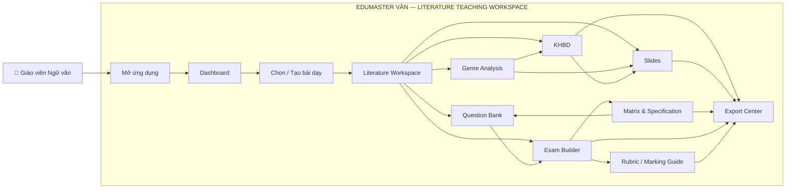

---

# 3. STARTUP

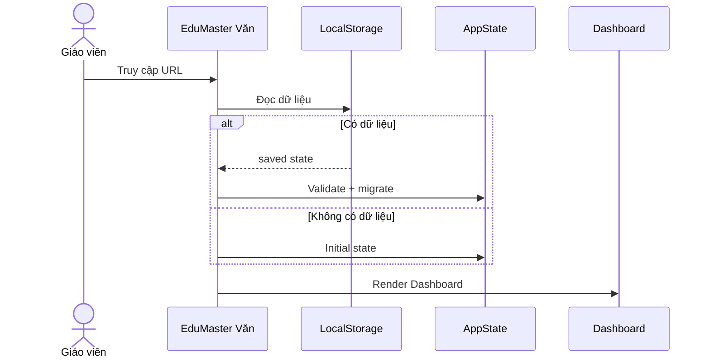

Không có:
- Login
- Register
- Token
- Session

---

# 4. DASHBOARD

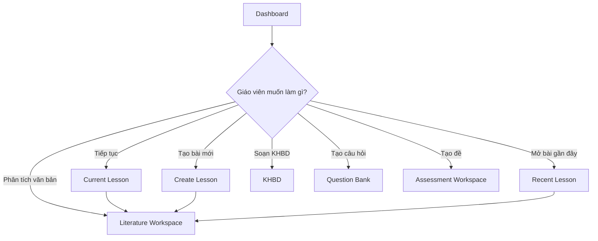

---

# 5. CREATE LESSON

Input:
```text
Khối/Lớp
Chủ đề/Bài học
Tên tác phẩm
Tác giả
Thể loại
Bộ sách
Số tiết
YCCĐ
Trọng tâm kiến thức
Ngữ liệu
Tài liệu tham khảo
```

Output:
```text
LiteratureLesson
├── metadata
├── sourceText
├── annotations
├── genreAnalysis
├── argumentMap
├── khbd
├── slides
├── questions
├── assessmentPlan
├── exam
└── rubric
```

---

# 6. LITERATURE WORKSPACE

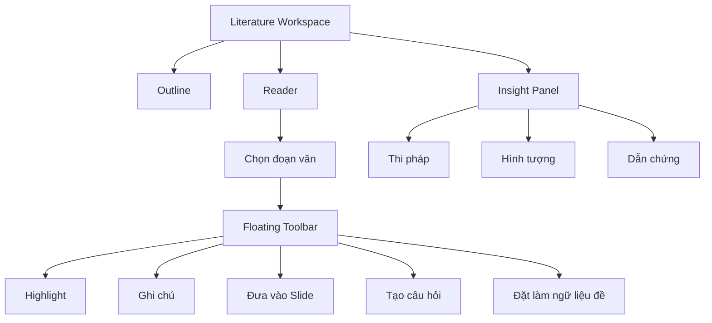

---

# 7. GENRE ANALYSIS

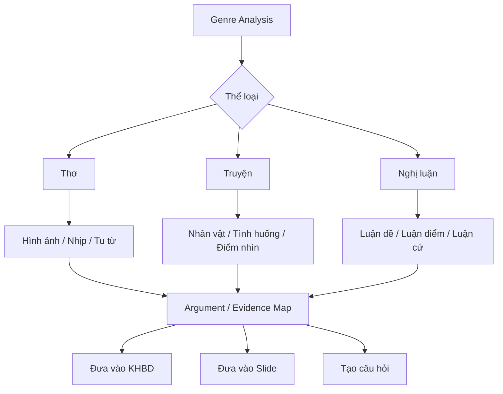

---

# 8. KHBD

```text
Activity
├── Tên hoạt động
├── Thời lượng
├── Mục tiêu
├── Nội dung
├── Sản phẩm
├── Thiết bị/Học liệu
├── Phương pháp/Hình thức
└── Tổ chức thực hiện
    ├── 1. Chuyển giao nhiệm vụ
    ├── 2. Thực hiện nhiệm vụ
    ├── 3. Báo cáo/Thảo luận
    └── 4. Kết luận/Nhận định
```

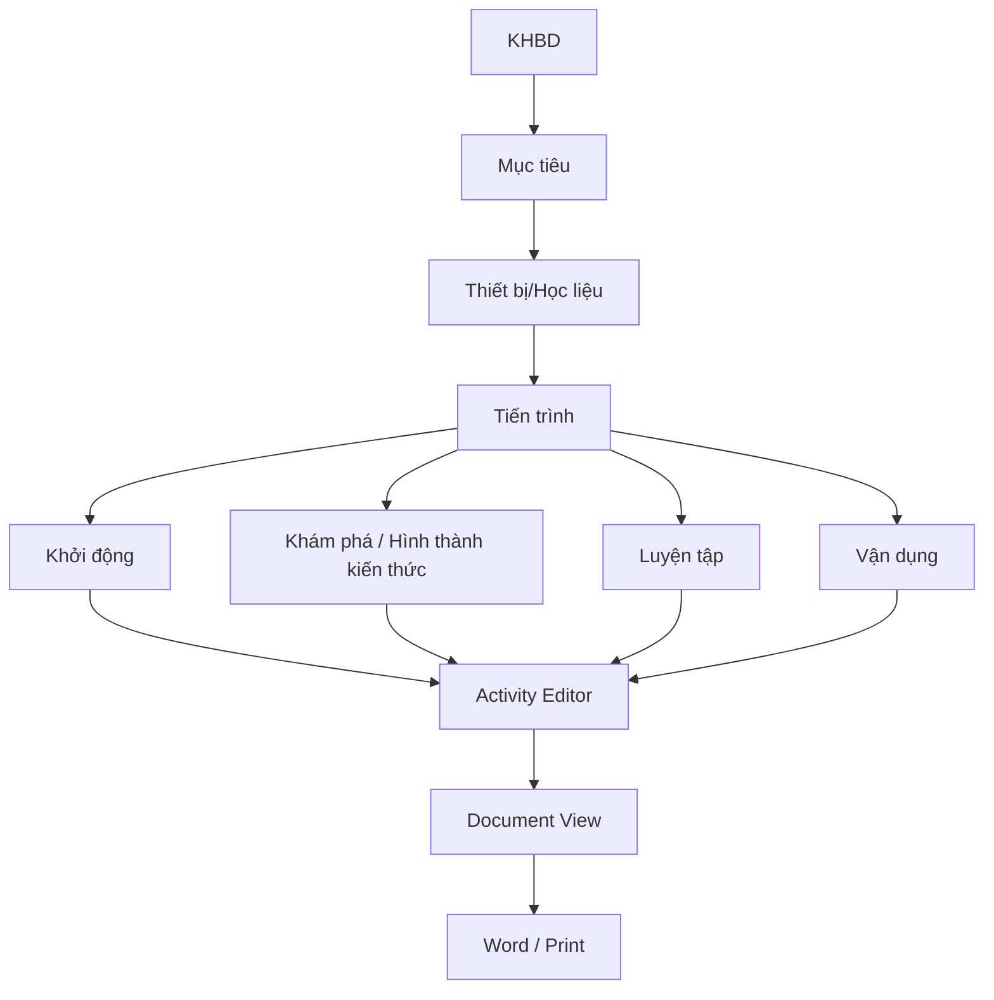

---

# 9. KHBD → SLIDE

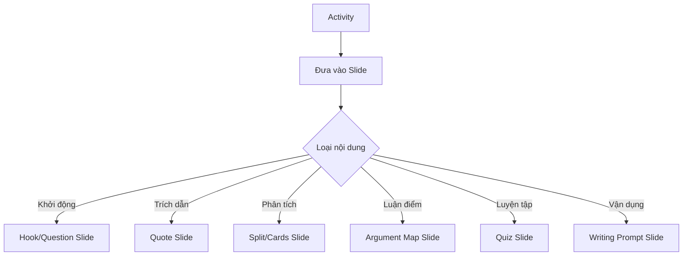

---

# 10. SLIDES

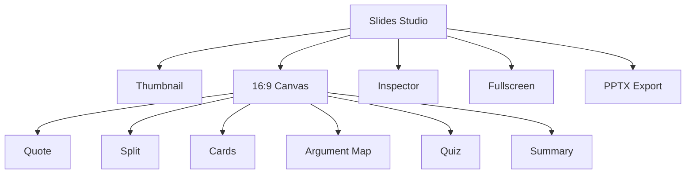

---

# 11. ASSESSMENT — MATRIX FIRST

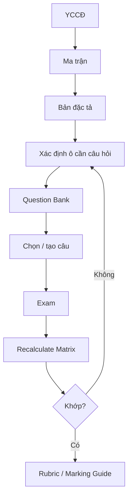

---

# 12. QUESTION BANK

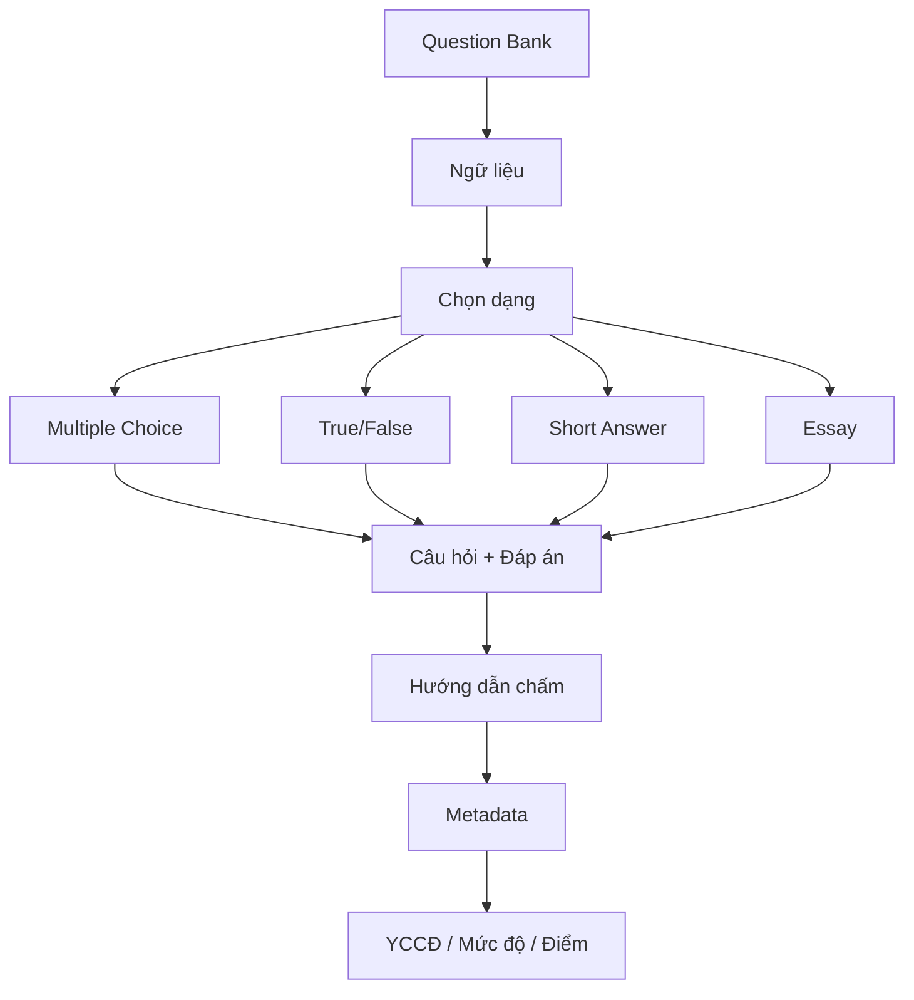

---

# 13. EXAM

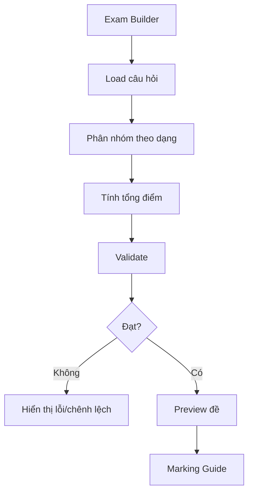

Không hard-code số câu nếu nguồn yêu cầu không bắt buộc.

---

# 14. RUBRIC

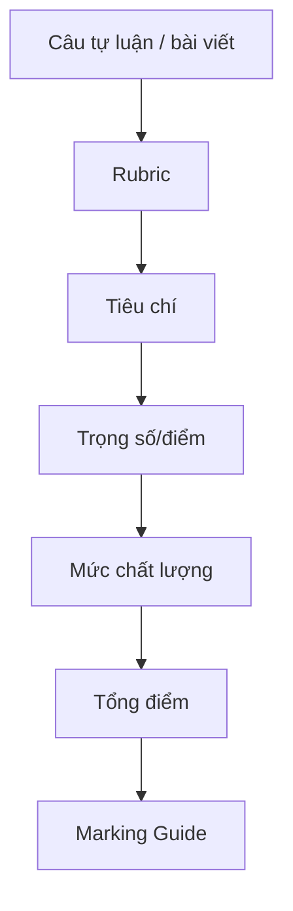

---

# 15. EXPORT

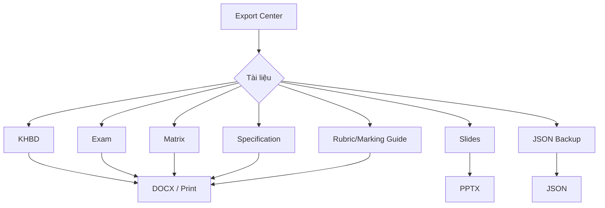

---

# 16. AUTOSAVE

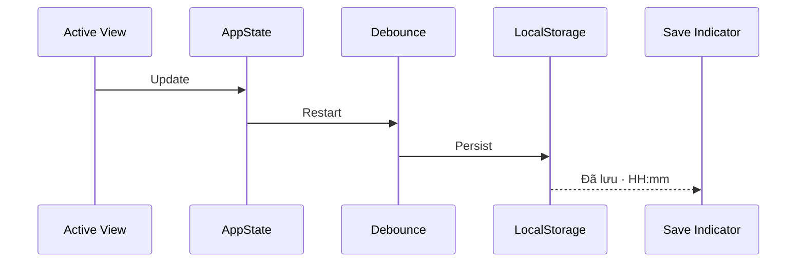

---

# 17. RESTORE JSON

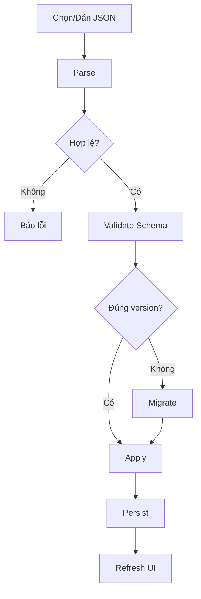

---

# 18. END-TO-END

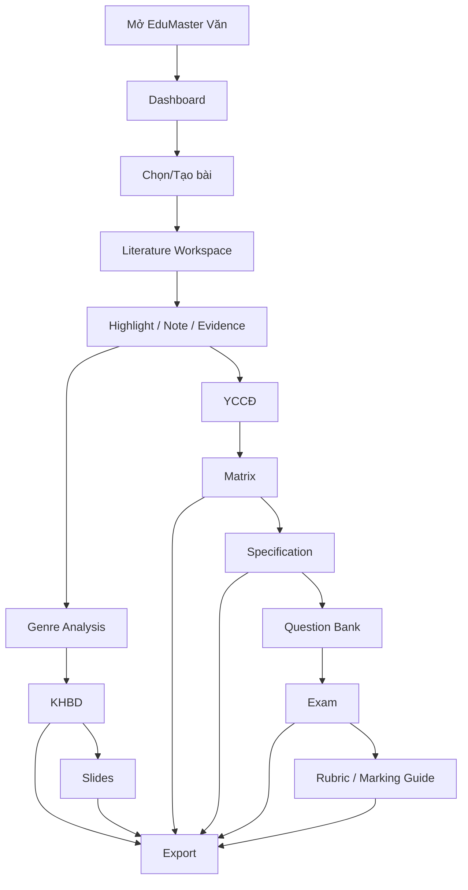

---

# 19. NGUYÊN TẮC TRIỂN KHAI

1. Giáo viên Ngữ văn là actor chính.
2. Không có authentication trong scope hiện tại.
3. Học sinh chưa phải app user.
4. BGH/Tổ trưởng là external stakeholder.
5. Literature Workspace là trung tâm nội dung.
6. Genre Analysis hỗ trợ KHBD, Slide, Question.
7. Matrix/Specification đứng trước Question/Exam khi thiết kế đánh giá.
8. Exam cập nhật ngược Matrix để validate.
9. Rubric dùng cho tự luận/bài viết.
10. Autosave độc lập Export.
11. Backup độc lập LocalStorage.
12. Dữ liệu dùng chung qua AppState.