# EDUMATH — TÀI LIỆU FLOW NGHIỆP VỤ TOÀN HỆ THỐNG

> **Hệ thống:** EduMath — Mathematics Teaching Workspace  
> **Đối tượng chính:** Giáo viên Toán THCS  
> **Phạm vi hiện tại:** Ứng dụng phục vụ giáo viên; truy cập thẳng, không yêu cầu đăng nhập/xác thực  
> **Mục tiêu:** Soạn bài → KHBD → Slide → Câu hỏi → Ma trận/Bản đặc tả → Đề kiểm tra → Đáp án/Hướng dẫn chấm → Xuất bản  
> **Nguyên tắc:** Một nguồn dữ liệu dùng xuyên suốt; không nhập lại cùng nội dung ở nhiều phân hệ

---

# 1. PHẠM VI VÀ NGUYÊN TẮC HỆ THỐNG

## 1.1. Actor chính

### Giáo viên Toán
Là actor phần mềm chính, trực tiếp:
- tạo/chọn bài dạy;
- biên soạn kiến thức;
- tạo công thức, ví dụ, bài tập, lời giải;
- xây dựng KHBD;
- tạo slide;
- xây dựng ma trận, bản đặc tả;
- tạo ngân hàng câu hỏi;
- lắp ráp đề kiểm tra;
- tạo đáp án/hướng dẫn chấm;
- xuất Word/PPTX/PDF/JSON.

### Học sinh
Trong phạm vi hiện tại **không phải software actor trực tiếp**.

Học sinh:
- quan sát slide trên lớp;
- trả lời câu hỏi bằng lời hoặc theo hoạt động do giáo viên điều khiển;
- làm bài kiểm tra từ tài liệu giáo viên xuất ra.

Nếu sau này có Student Portal thì mới bổ sung flow đăng nhập/làm bài trực tuyến.

### Tổ trưởng chuyên môn / BGH
Trong phạm vi hiện tại là **external stakeholder**, không đăng nhập EduMath.

Flow:
```text
Giáo viên
→ Xuất KHBD / Đề / Ma trận / Bản đặc tả
→ Gửi hồ sơ
→ Tổ trưởng / BGH thẩm định bên ngoài hệ thống
```

### System Engine
Tự động:
- quản lý AppState;
- autosave;
- restore LocalStorage;
- validate dữ liệu;
- tính tổng điểm;
- đồng bộ Matrix/Exam;
- render công thức;
- xuất tài liệu;
- kiểm tra schema khi import JSON.

---

# 2. SƠ ĐỒ FLOW TỔNG THỂ

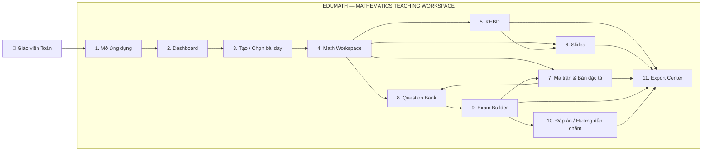
```mermaid
flowchart LR
    T["👤 Giáo viên Toán"]

    subgraph EduMath["EDUMATH — MATHEMATICS TEACHING WORKSPACE"]
        A["1. Mở ứng dụng"]
        B["2. Dashboard"]
        C["3. Tạo / Chọn bài dạy"]
        D["4. Math Workspace"]
        E["5. KHBD"]
        F["6. Slides"]
        G["7. Ma trận & Bản đặc tả"]
        H["8. Question Bank"]
        I["9. Exam Builder"]
        J["10. Đáp án / Hướng dẫn chấm"]
        K["11. Export Center"]
    end

    T --> A
    A --> B
    B --> C
    C --> D

    D --> E
    D --> F
    D --> H

    E --> F

    D --> G
    G --> H
    H --> I
    I --> G
    I --> J

    E --> K
    F --> K
    G --> K
    I --> K
    J --> K
```

---

# 3. FLOW 01 — KHỞI ĐỘNG ỨNG DỤNG

## Mục tiêu
Giáo viên mở EduMath và vào thẳng Dashboard mà không qua Login.

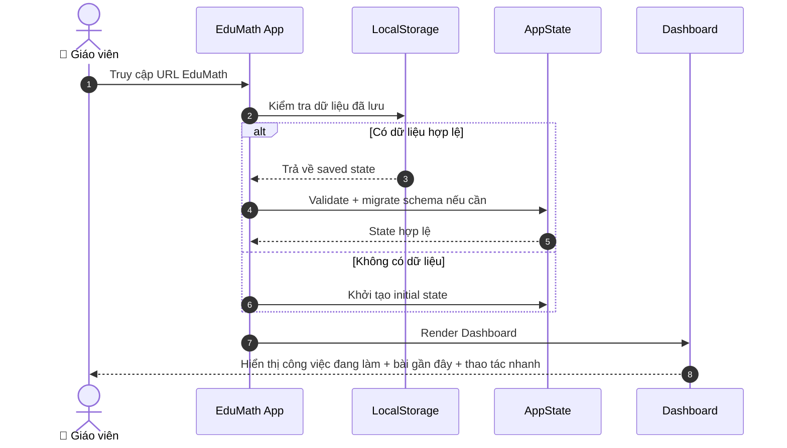
```mermaid
sequenceDiagram
    autonumber
    actor T as 👤 Giáo viên
    participant App as EduMath App
    participant Storage as LocalStorage
    participant State as AppState
    participant Dash as Dashboard

    T->>App: Truy cập URL EduMath
    App->>Storage: Kiểm tra dữ liệu đã lưu
    alt Có dữ liệu hợp lệ
        Storage-->>App: Trả về saved state
        App->>State: Validate + migrate schema nếu cần
        State-->>App: State hợp lệ
    else Không có dữ liệu
        App->>State: Khởi tạo initial state
    end
    App->>Dash: Render Dashboard
    Dash-->>T: Hiển thị công việc đang làm + bài gần đây + thao tác nhanh
```

## Không có trong flow
- Login
- Register
- Password
- Token
- Session
- Role-based authentication

---

# 4. FLOW 02 — DASHBOARD & TIẾP TỤC CÔNG VIỆC

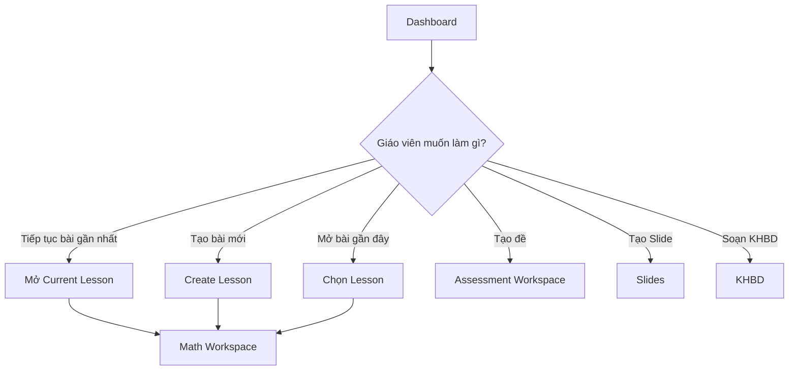
```mermaid
flowchart TD
    A["Dashboard"] --> B{"Giáo viên muốn làm gì?"}

    B -->|Tiếp tục bài gần nhất| C["Mở Current Lesson"]
    B -->|Tạo bài mới| D["Create Lesson"]
    B -->|Mở bài gần đây| E["Chọn Lesson"]
    B -->|Tạo đề| F["Assessment Workspace"]
    B -->|Tạo Slide| G["Slides"]
    B -->|Soạn KHBD| H["KHBD"]

    C --> I["Math Workspace"]
    D --> I
    E --> I
```

Dashboard hiển thị:
- bài đang làm;
- tiến độ KHBD;
- tiến độ Slide;
- tiến độ Đề;
- lần lưu cuối;
- danh sách bài gần đây;
- quick actions.

---

# 5. FLOW 03 — TẠO BÀI DẠY MỚI

## Input

```text
Môn: Toán
Khối/Lớp
Chương
Tên bài
Bộ sách
Số tiết
Thời lượng
Yêu cầu cần đạt
Kiến thức trọng tâm
Dạng bài trọng tâm
Tài liệu tham khảo
Yêu cầu bổ sung
```

## Output

```text
MathLesson
├── metadata
├── learningOutcomes
├── knowledgeBlocks
├── examples
├── exercises
├── applications
├── khbd
├── slides
├── questions
├── assessmentPlan
└── exam
```

## Flow

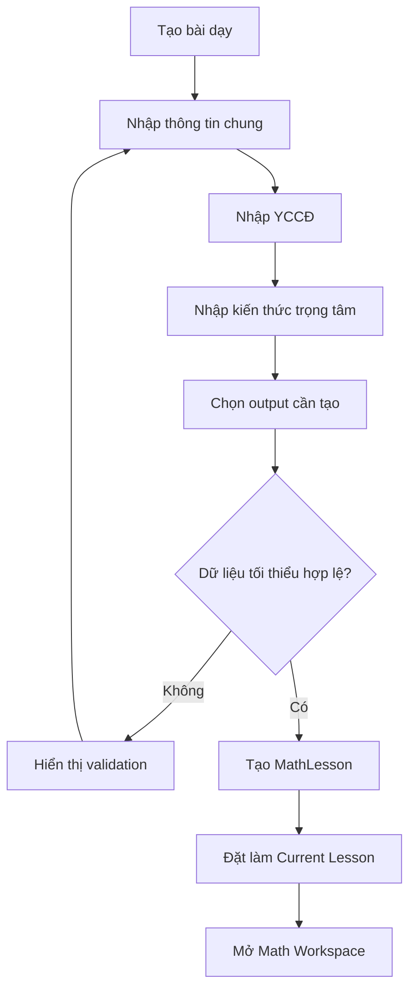
```mermaid
flowchart TD
    A["Tạo bài dạy"] --> B["Nhập thông tin chung"]
    B --> C["Nhập YCCĐ"]
    C --> D["Nhập kiến thức trọng tâm"]
    D --> E["Chọn output cần tạo"]
    E --> F{"Dữ liệu tối thiểu hợp lệ?"}

    F -->|Không| G["Hiển thị validation"]
    G --> B

    F -->|Có| H["Tạo MathLesson"]
    H --> I["Đặt làm Current Lesson"]
    I --> J["Mở Math Workspace"]
```

---

# 6. FLOW 04 — MATH WORKSPACE

Math Workspace là nguồn nội dung trung tâm.

## Các block

```text
Text
Concept
Definition
Theorem
Formula
Example
Solution
Exercise
Graph
Geometry
Table
Application
Question
Note
```

## Flow

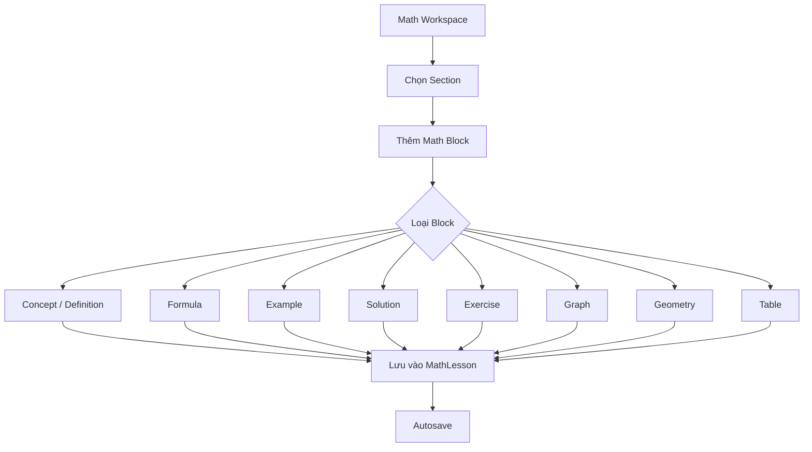
```mermaid
flowchart TD
    A["Math Workspace"] --> B["Chọn Section"]
    B --> C["Thêm Math Block"]
    C --> D{"Loại Block"}

    D --> E["Concept / Definition"]
    D --> F["Formula"]
    D --> G["Example"]
    D --> H["Solution"]
    D --> I["Exercise"]
    D --> J["Graph"]
    D --> K["Geometry"]
    D --> L["Table"]

    E --> M["Lưu vào MathLesson"]
    F --> M
    G --> M
    H --> M
    I --> M
    J --> M
    K --> M
    L --> M

    M --> N["Autosave"]
```

---

# 7. FLOW 05 — CÔNG THỨC TOÁN

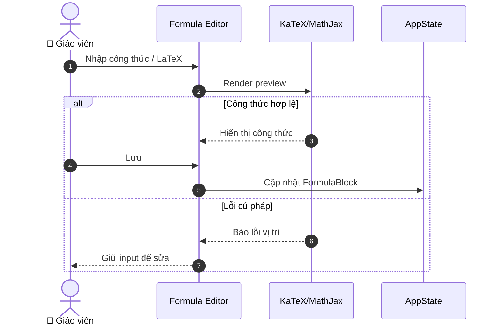
```mermaid
sequenceDiagram
    autonumber
    actor T as 👤 Giáo viên
    participant Editor as Formula Editor
    participant Renderer as KaTeX/MathJax
    participant State as AppState

    T->>Editor: Nhập công thức / LaTeX
    Editor->>Renderer: Render preview
    alt Công thức hợp lệ
        Renderer-->>Editor: Hiển thị công thức
        T->>Editor: Lưu
        Editor->>State: Cập nhật FormulaBlock
    else Lỗi cú pháp
        Renderer-->>Editor: Báo lỗi vị trí
        Editor-->>T: Giữ input để sửa
    end
```

---

# 8. FLOW 06 — VÍ DỤ & LỜI GIẢI TỪNG BƯỚC

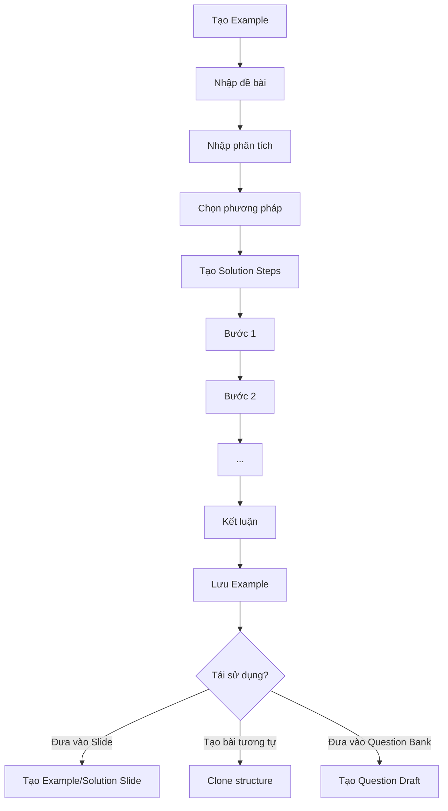
```mermaid
flowchart TD
    A["Tạo Example"] --> B["Nhập đề bài"]
    B --> C["Nhập phân tích"]
    C --> D["Chọn phương pháp"]
    D --> E["Tạo Solution Steps"]

    E --> F["Bước 1"]
    F --> G["Bước 2"]
    G --> H["..."]
    H --> I["Kết luận"]

    I --> J["Lưu Example"]
    J --> K{"Tái sử dụng?"}

    K -->|Đưa vào Slide| L["Tạo Example/Solution Slide"]
    K -->|Tạo bài tương tự| M["Clone structure"]
    K -->|Đưa vào Question Bank| N["Tạo Question Draft"]
```

---

# 9. FLOW 07 — GRAPH / HÌNH / BẢNG

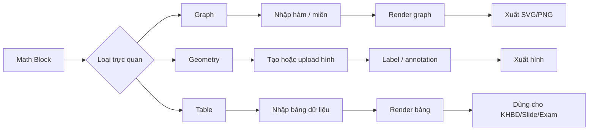
```mermaid
flowchart LR
    A["Math Block"] --> B{"Loại trực quan"}

    B --> C["Graph"]
    B --> D["Geometry"]
    B --> E["Table"]

    C --> C1["Nhập hàm / miền"]
    C1 --> C2["Render graph"]
    C2 --> C3["Xuất SVG/PNG"]

    D --> D1["Tạo hoặc upload hình"]
    D1 --> D2["Label / annotation"]
    D2 --> D3["Xuất hình"]

    E --> E1["Nhập bảng dữ liệu"]
    E1 --> E2["Render bảng"]
    E2 --> E3["Dùng cho KHBD/Slide/Exam"]
```

---

# 10. FLOW 08 — KHBD

## Cấu trúc mỗi Activity

```text
Activity
├── Tên hoạt động
├── Thời lượng
├── Mục tiêu
├── Nội dung
├── Sản phẩm
├── Thiết bị/Học liệu
├── Phương pháp/Hình thức
└── Tổ chức thực hiện
    ├── Bước 1: Chuyển giao nhiệm vụ
    ├── Bước 2: Thực hiện nhiệm vụ
    ├── Bước 3: Báo cáo/Thảo luận
    └── Bước 4: Kết luận/Nhận định
```

**Không được nhầm**:
- Mục tiêu / Nội dung / Sản phẩm / Tổ chức thực hiện
với
- 4 bước tổ chức thực hiện.

## Flow

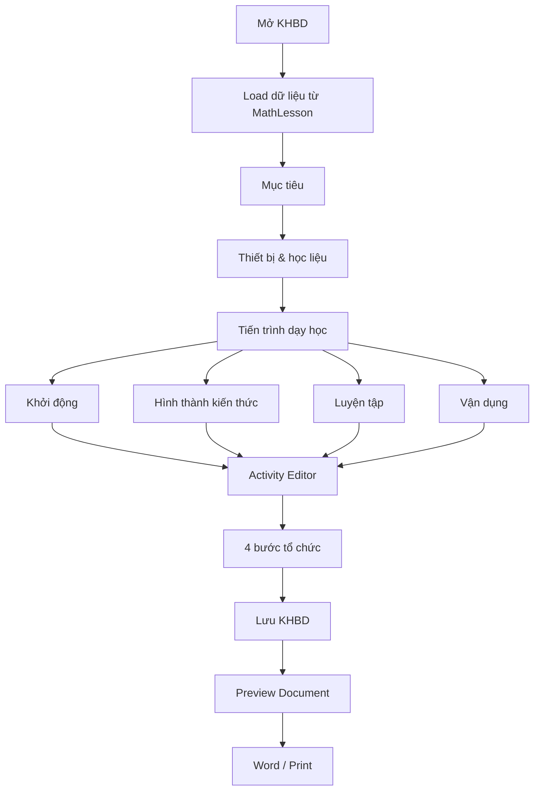
```mermaid
flowchart TD
    A["Mở KHBD"] --> B["Load dữ liệu từ MathLesson"]
    B --> C["Mục tiêu"]
    C --> D["Thiết bị & học liệu"]
    D --> E["Tiến trình dạy học"]

    E --> F["Khởi động"]
    E --> G["Hình thành kiến thức"]
    E --> H["Luyện tập"]
    E --> I["Vận dụng"]

    F --> J["Activity Editor"]
    G --> J
    H --> J
    I --> J

    J --> K["4 bước tổ chức"]
    K --> L["Lưu KHBD"]
    L --> M["Preview Document"]
    M --> N["Word / Print"]
```

---

# 11. FLOW 09 — KHBD → SLIDE

Không copy nguyên giáo án sang slide.

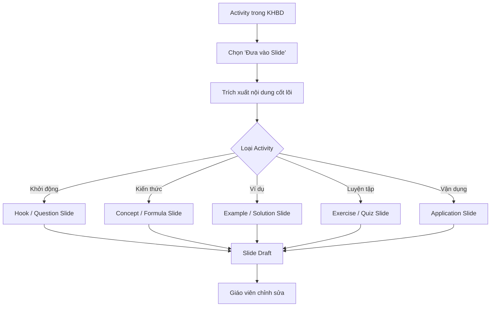
```mermaid
flowchart TD
    A["Activity trong KHBD"] --> B["Chọn 'Đưa vào Slide'"]
    B --> C["Trích xuất nội dung cốt lõi"]
    C --> D{"Loại Activity"}

    D -->|Khởi động| E["Hook / Question Slide"]
    D -->|Kiến thức| F["Concept / Formula Slide"]
    D -->|Ví dụ| G["Example / Solution Slide"]
    D -->|Luyện tập| H["Exercise / Quiz Slide"]
    D -->|Vận dụng| I["Application Slide"]

    E --> J["Slide Draft"]
    F --> J
    G --> J
    H --> J
    I --> J

    J --> K["Giáo viên chỉnh sửa"]
```

---

# 12. FLOW 10 — SLIDE BUILDER

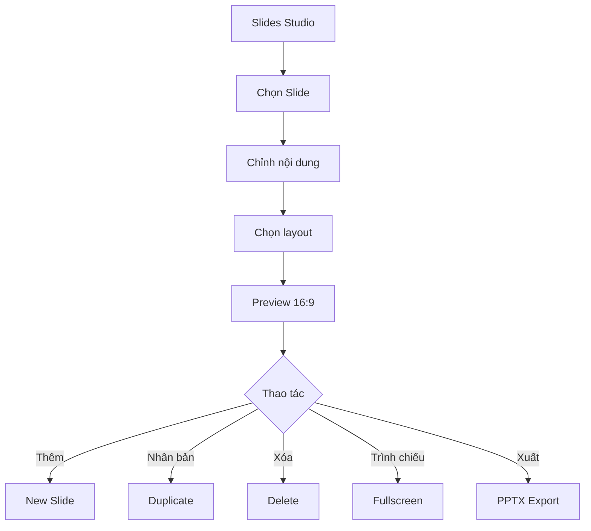
```mermaid
flowchart TD
    A["Slides Studio"] --> B["Chọn Slide"]
    B --> C["Chỉnh nội dung"]
    C --> D["Chọn layout"]
    D --> E["Preview 16:9"]
    E --> F{"Thao tác"}

    F -->|Thêm| G["New Slide"]
    F -->|Nhân bản| H["Duplicate"]
    F -->|Xóa| I["Delete"]
    F -->|Trình chiếu| J["Fullscreen"]
    F -->|Xuất| K["PPTX Export"]
```

Slide types:
- Cover
- Objective
- Concept
- Formula
- Theorem
- Example
- Solution
- Graph
- Geometry
- Exercise
- Quiz
- Summary

---

# 13. FLOW 11 — TRÌNH CHIẾU TRÊN LỚP

Học sinh không thao tác trực tiếp vào hệ thống ở scope hiện tại.

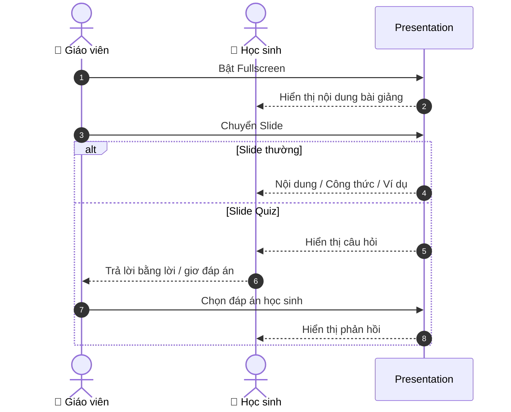
```mermaid
sequenceDiagram
    autonumber
    actor T as 👤 Giáo viên
    actor S as 👥 Học sinh
    participant P as Presentation

    T->>P: Bật Fullscreen
    P-->>S: Hiển thị nội dung bài giảng
    T->>P: Chuyển Slide
    alt Slide thường
        P-->>S: Nội dung / Công thức / Ví dụ
    else Slide Quiz
        P-->>S: Hiển thị câu hỏi
        S-->>T: Trả lời bằng lời / giơ đáp án
        T->>P: Chọn đáp án học sinh
        P-->>S: Hiển thị phản hồi
    end
```

---

# 14. FLOW 12 — THIẾT KẾ ĐÁNH GIÁ: MATRIX-FIRST

Đây là flow khảo thí chính.

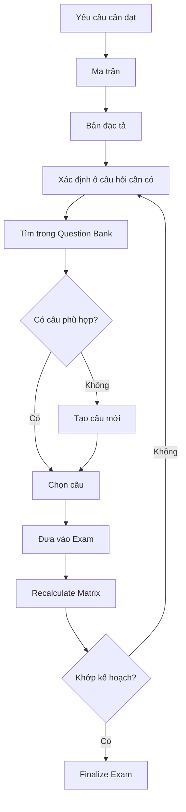
```mermaid
flowchart TD
    A["Yêu cầu cần đạt"] --> B["Ma trận"]
    B --> C["Bản đặc tả"]
    C --> D["Xác định ô câu hỏi cần có"]
    D --> E["Tìm trong Question Bank"]

    E --> F{"Có câu phù hợp?"}
    F -->|Có| G["Chọn câu"]
    F -->|Không| H["Tạo câu mới"]

    H --> G
    G --> I["Đưa vào Exam"]
    I --> J["Recalculate Matrix"]
    J --> K{"Khớp kế hoạch?"}

    K -->|Không| D
    K -->|Có| L["Finalize Exam"]
```

Matrix vừa là:
- đầu vào thiết kế;
- công cụ kiểm tra ngược sau khi ráp đề.

---

# 15. FLOW 13 — MA TRẬN

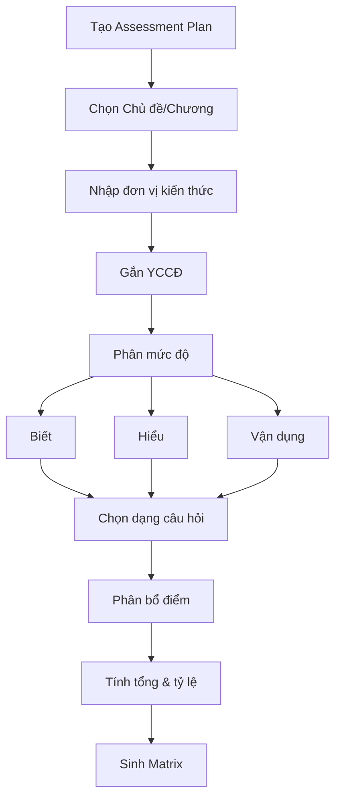
```mermaid
flowchart TD
    A["Tạo Assessment Plan"] --> B["Chọn Chủ đề/Chương"]
    B --> C["Nhập đơn vị kiến thức"]
    C --> D["Gắn YCCĐ"]
    D --> E["Phân mức độ"]

    E --> F["Biết"]
    E --> G["Hiểu"]
    E --> H["Vận dụng"]

    F --> I["Chọn dạng câu hỏi"]
    G --> I
    H --> I

    I --> J["Phân bổ điểm"]
    J --> K["Tính tổng & tỷ lệ"]
    K --> L["Sinh Matrix"]
```

---

# 16. FLOW 14 — BẢN ĐẶC TẢ

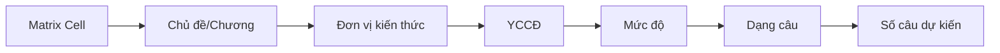
```mermaid
flowchart LR
    A["Matrix Cell"] --> B["Chủ đề/Chương"]
    B --> C["Đơn vị kiến thức"]
    C --> D["YCCĐ"]
    D --> E["Mức độ"]
    E --> F["Dạng câu"]
    F --> G["Số câu dự kiến"]
```

Bản đặc tả phải liên kết cùng `assessmentPlan`, không nhập tay lại dữ liệu đã có.

---

# 17. FLOW 15 — QUESTION BANK

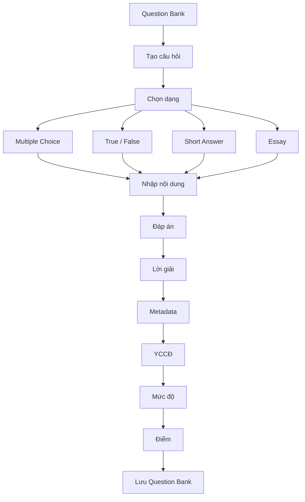
```mermaid
flowchart TD
    A["Question Bank"] --> B["Tạo câu hỏi"]
    B --> C["Chọn dạng"]

    C --> D["Multiple Choice"]
    C --> E["True / False"]
    C --> F["Short Answer"]
    C --> G["Essay"]

    D --> H["Nhập nội dung"]
    E --> H
    F --> H
    G --> H

    H --> I["Đáp án"]
    I --> J["Lời giải"]
    J --> K["Metadata"]
    K --> L["YCCĐ"]
    L --> M["Mức độ"]
    M --> N["Điểm"]
    N --> O["Lưu Question Bank"]
```

Metadata:
- grade;
- chapter;
- topic;
- knowledge unit;
- learning outcome;
- cognitive level;
- type;
- skill/competency;
- score;
- expected time.

---

# 18. FLOW 16 — ĐÚNG / SAI

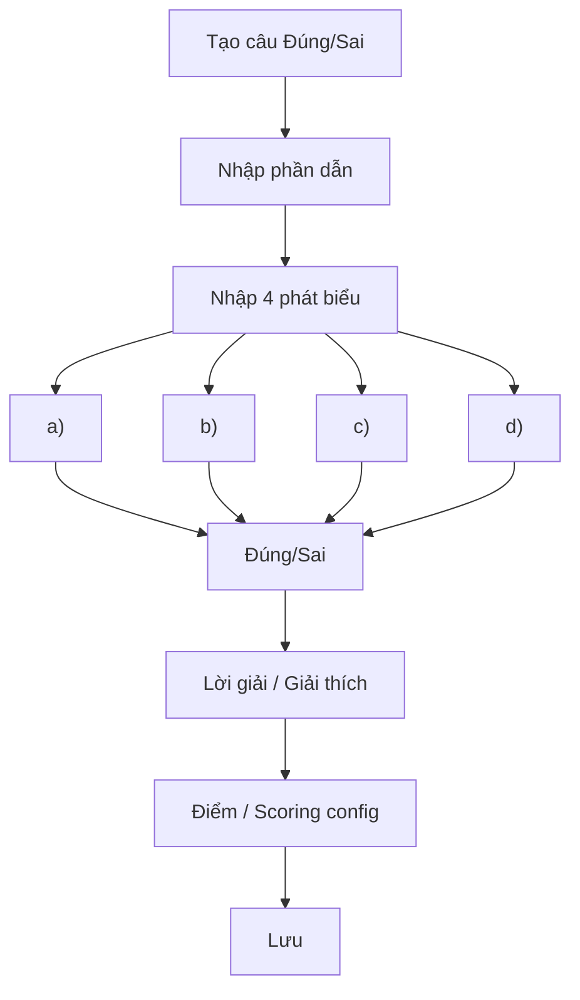
```mermaid
flowchart TD
    A["Tạo câu Đúng/Sai"] --> B["Nhập phần dẫn"]
    B --> C["Nhập 4 phát biểu"]
    C --> D["a)"]
    C --> E["b)"]
    C --> F["c)"]
    C --> G["d)"]

    D --> H["Đúng/Sai"]
    E --> H
    F --> H
    G --> H

    H --> I["Lời giải / Giải thích"]
    I --> J["Điểm / Scoring config"]
    J --> K["Lưu"]
```

Không hard-code quy tắc chấm điểm ngoài cấu hình được xác nhận.

---

# 19. FLOW 17 — ĐẨY CÂU HỎI VÀO ĐỀ

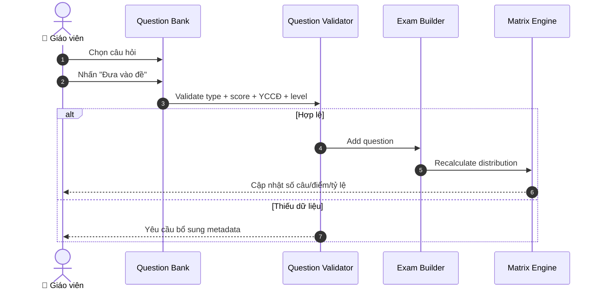
```mermaid
sequenceDiagram
    autonumber
    actor T as 👤 Giáo viên
    participant QB as Question Bank
    participant Validator as Question Validator
    participant Exam as Exam Builder
    participant Matrix as Matrix Engine

    T->>QB: Chọn câu hỏi
    T->>QB: Nhấn "Đưa vào đề"
    QB->>Validator: Validate type + score + YCCĐ + level
    alt Hợp lệ
        Validator->>Exam: Add question
        Exam->>Matrix: Recalculate distribution
        Matrix-->>T: Cập nhật số câu/điểm/tỷ lệ
    else Thiếu dữ liệu
        Validator-->>T: Yêu cầu bổ sung metadata
    end
```

---

# 20. FLOW 18 — EXAM BUILDER

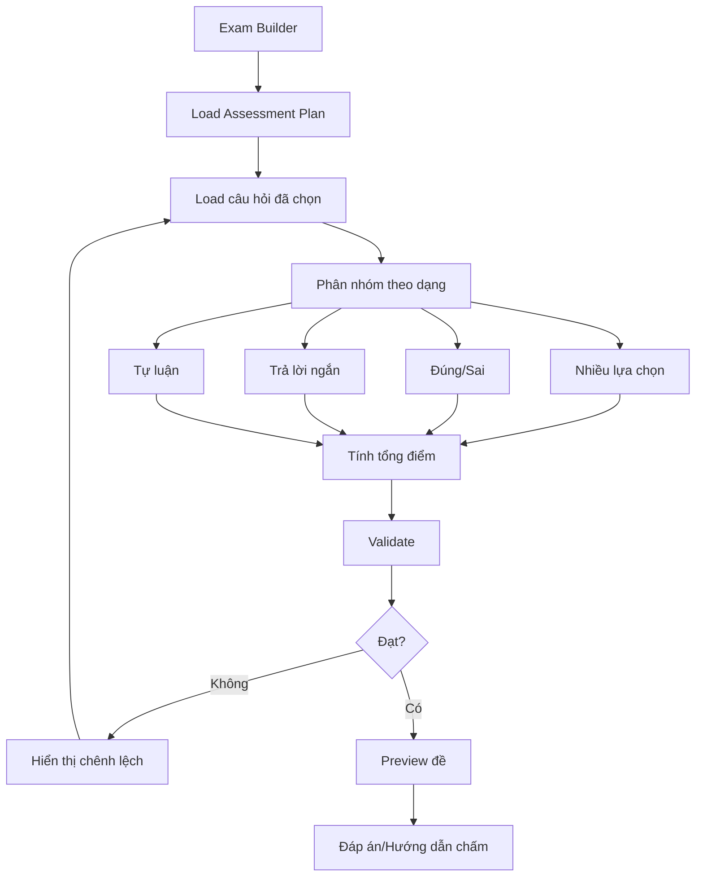
```mermaid
flowchart TD
    A["Exam Builder"] --> B["Load Assessment Plan"]
    B --> C["Load câu hỏi đã chọn"]
    C --> D["Phân nhóm theo dạng"]
    D --> E["Nhiều lựa chọn"]
    D --> F["Đúng/Sai"]
    D --> G["Trả lời ngắn"]
    D --> H["Tự luận"]

    E --> I["Tính tổng điểm"]
    F --> I
    G --> I
    H --> I

    I --> J["Validate"]
    J --> K{"Đạt?"}

    K -->|Không| L["Hiển thị chênh lệch"]
    L --> C

    K -->|Có| M["Preview đề"]
    M --> N["Đáp án/Hướng dẫn chấm"]
```

Không hard-code số lượng câu nếu cấu hình không yêu cầu.

---

# 21. FLOW 19 — ĐÁP ÁN & HƯỚNG DẪN CHẤM

Một nguồn dữ liệu duy nhất.

```text
Question
├── answer
├── solution
└── scoringGuide
```

## Flow

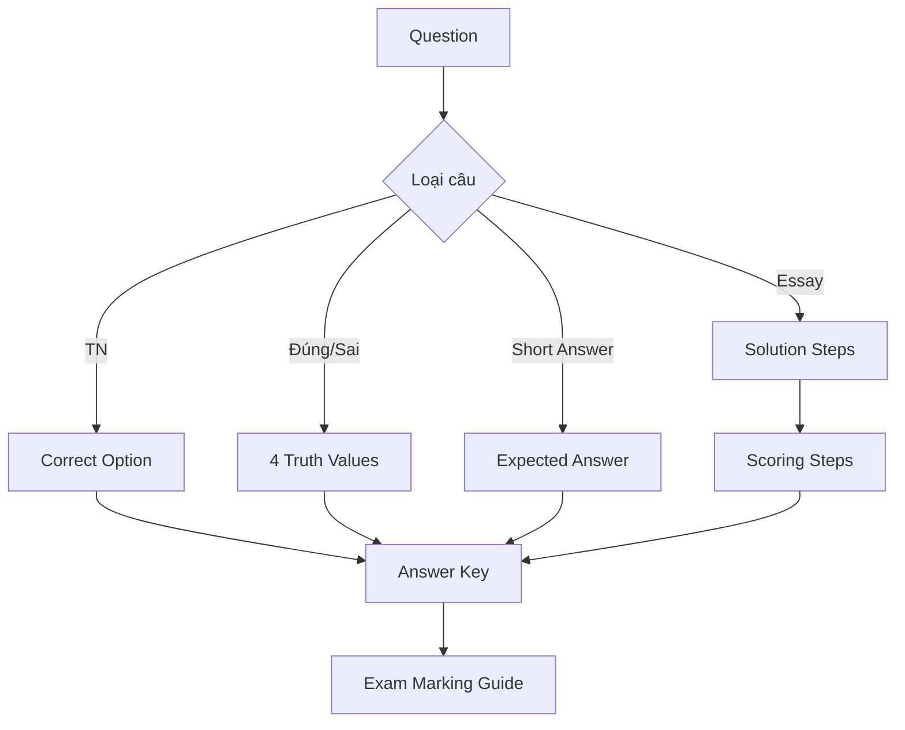
```mermaid
flowchart TD
    A["Question"] --> B{"Loại câu"}

    B -->|TN| C["Correct Option"]
    B -->|Đúng/Sai| D["4 Truth Values"]
    B -->|Short Answer| E["Expected Answer"]
    B -->|Essay| F["Solution Steps"]

    F --> G["Scoring Steps"]
    C --> H["Answer Key"]
    D --> H
    E --> H
    G --> H

    H --> I["Exam Marking Guide"]
```

Không tạo Rubric riêng nếu cùng một câu đã có scoring guide.

---

# 22. FLOW 20 — VALIDATE ĐỀ VỚI MA TRẬN

```mermaid
flowchart TD
    A["Exam"] --> B["Matrix Engine"]
    B --> C["So sánh theo Chủ đề"]
    B --> D["So sánh theo Mức độ"]
    B --> E["So sánh theo Dạng câu"]
    B --> F["So sánh theo Điểm"]

    C --> G["Validation Result"]
    D --> G
    E --> G
    F --> G

    G --> H{"Có sai lệch?"}
    H -->|Có| I["Highlight ô lệch"]
    H -->|Không| J["Assessment Ready"]
```

---

# 23. FLOW 21 — EXPORT CENTER

Export Center là service chung, không nhân bản logic export.

```mermaid
flowchart TD
    A["Export Center"] --> B{"Chọn tài liệu"}

    B --> C["KHBD"]
    B --> D["Slides"]
    B --> E["Exam"]
    B --> F["Matrix"]
    B --> G["Specification"]
    B --> H["Answer / Scoring"]
    B --> I["JSON Backup"]

    C --> J["DOCX / Print"]
    D --> K["PPTX"]
    E --> L["DOCX / Print"]
    F --> M["DOCX / Print"]
    G --> M
    H --> M
    I --> N["JSON File"]
```

Module riêng có thể có nút export nhanh, nhưng phải gọi cùng `ExportService`.

---

# 24. FLOW 22 — AUTOSAVE

Autosave là behavior hệ thống độc lập với Export.

```mermaid
sequenceDiagram
    autonumber
    participant View as Active View
    participant State as AppState
    participant Timer as Debounce Timer
    participant Storage as LocalStorage
    participant Top as Save Indicator

    View->>State: Update data
    State->>Timer: Restart debounce
    Timer->>Storage: Persist after delay
    Storage-->>State: Save success
    State->>Top: Update lastSavedAt
```

---

# 25. FLOW 23 — JSON BACKUP

```mermaid
flowchart LR
    A["AppState"] --> B["Serialize JSON"]
    B --> C["Validate serializable"]
    C --> D["Create Blob"]
    D --> E["Download backup.json"]
```

Backup JSON khác Autosave LocalStorage.

---

# 26. FLOW 24 — RESTORE JSON

```mermaid
flowchart TD
    A["Chọn/Dán JSON"] --> B["Parse JSON"]
    B --> C{"JSON hợp lệ?"}

    C -->|Không| D["Báo lỗi"]
    C -->|Có| E["Validate Schema"]

    E --> F{"Đúng schema?"}
    F -->|Không| G{"Có migration?"}
    G -->|Có| H["Migrate"]
    G -->|Không| I["Từ chối restore"]

    F -->|Có| J["Restore AppState"]
    H --> J

    J --> K["Persist LocalStorage"]
    K --> L["Refresh UI"]
```

---

# 27. FLOW 25 — APPSTATE TRUNG TÂM

```mermaid
flowchart TD
    Lesson["MathLesson"] --> State["AppState"]

    KHBD["LessonPlan"] --> State
    Slides["SlideData[]"] --> State
    Questions["Question[]"] --> State
    Assessment["AssessmentPlan"] --> State
    Exam["ExamData"] --> State

    State --> Autosave["Autosave"]
    State --> Export["Export"]
    State --> Restore["Restore"]
```

Nguyên tắc:
- tránh duplicate dữ liệu;
- tham chiếu bằng ID khi có thể;
- derived data phải tính lại thay vì lưu lặp.

---

# 28. FLOW 26 — XÓA DỮ LIỆU CÓ PHỤ THUỘC

Ví dụ xóa câu hỏi đã nằm trong Exam.

```mermaid
flowchart TD
    A["Xóa Question"] --> B{"Question đang được dùng?"}

    B -->|Không| C["Xóa ngay"]

    B -->|Có| D["Hiển thị dependency"]
    D --> E{"Giáo viên chọn"}

    E -->|Hủy| F["Không thay đổi"]
    E -->|Xóa khỏi Bank, giữ snapshot trong Exam| G["Detach"]
    E -->|Xóa tất cả| H["Remove references"]

    H --> I["Recalculate Matrix"]
```

---

# 29. FLOW 27 — UNSAVED / INVALID STATE

```mermaid
flowchart TD
    A["User edit"] --> B["Validate"]
    B --> C{"Hợp lệ?"}

    C -->|Có| D["Update State"]
    D --> E["Autosave"]

    C -->|Không| F["Giữ draft local"]
    F --> G["Hiển thị lỗi tại field"]
    G --> H["Không cho export/finalize nếu lỗi critical"]
```

---

# 30. FLOW 28 — ERROR HANDLING EXPORT

```mermaid
flowchart TD
    A["Export"] --> B["Validate input"]
    B --> C{"Đủ dữ liệu?"}

    C -->|Không| D["Danh sách lỗi"]
    C -->|Có| E["Generate file"]

    E --> F{"Thành công?"}
    F -->|Có| G["Download"]
    F -->|Không| H["Toast lỗi + log chi tiết"]
```

---

# 31. FLOW 29 — EXTERNAL REVIEW

Tổ trưởng/BGH không phải user hệ thống trong scope hiện tại.

```mermaid
flowchart LR
    A["EduMath"] --> B["Giáo viên Export"]
    B --> C["KHBD / Exam / Matrix / Spec"]
    C --> D["Gửi file"]
    D --> E["Tổ trưởng / BGH"]
    E --> F["Nhận xét / duyệt bên ngoài"]
    F --> G["Giáo viên sửa nếu cần"]
    G --> A
```

---

# 32. FLOW 30 — END-TO-END THỰC TẾ

```mermaid
flowchart TD
    A["Mở EduMath"] --> B["Khôi phục State"]
    B --> C["Dashboard"]
    C --> D["Chọn / Tạo bài dạy"]

    D --> E["Math Workspace"]
    E --> F["Kiến thức / Công thức / Ví dụ"]
    F --> G["KHBD"]
    F --> H["Slides"]
    G --> H

    F --> I["YCCĐ"]
    I --> J["Matrix"]
    J --> K["Specification"]
    K --> L["Question Bank"]
    L --> M["Exam Builder"]
    M --> N["Matrix Validation"]
    N --> O["Answer / Scoring Guide"]

    G --> P["Export Center"]
    H --> P
    J --> P
    K --> P
    M --> P
    O --> P

    P --> Q["DOCX / PPTX / Print / JSON"]
```

---

# 33. QUAN HỆ GIỮA CÁC MODULE

| Module | Nhận dữ liệu từ | Gửi dữ liệu sang |
|---|---|---|
| Dashboard | AppState | Lesson/Module được chọn |
| Math Workspace | MathLesson | KHBD, Slides, Question Bank |
| KHBD | MathLesson | Slides, Export |
| Slides | MathLesson/KHBD | Presentation, PPTX |
| Matrix | YCCĐ/AssessmentPlan/Exam | Specification, Question planning |
| Specification | Matrix/YCCĐ | Question Bank |
| Question Bank | Lesson/Specification | Exam |
| Exam | Question Bank | Matrix Validation, Scoring |
| Scoring Guide | Question/Exam | Export |
| Export Center | Toàn AppState | DOCX/PPTX/Print/JSON |
| Autosave | AppState | LocalStorage |

---

# 34. FLOW KHÔNG NÊN CÓ Ở PHẠM VI HIỆN TẠI

Không mô hình hóa như chức năng thật nếu chưa implement:

```text
Login
Register
Forgot password
Student Portal
Online Exam Session
Admin Approval Portal
Cloud Sync
Realtime Collaboration
Role-based Permission
```

Có thể để trong Roadmap.

---

# 35. ROADMAP FLOW TƯƠNG LAI

## Multi-user

```text
Login
→ Workspace theo giáo viên
→ Cloud Database
→ Shared Lessons
```

## Student Portal

```text
Join code
→ Làm Quiz/Exam
→ Submit
→ Auto/manual marking
→ Result
```

## Admin Approval

```text
Teacher Submit
→ Admin Review
→ Comment
→ Approve / Request Changes
```

Không trộn các flow tương lai này vào flow production hiện tại.

---

# 36. NGUYÊN TẮC TRIỂN KHAI

1. Giáo viên là actor chính.
2. Không có authentication trong scope hiện tại.
3. Student là classroom participant, chưa phải app user.
4. Admin là external stakeholder, chưa phải app user.
5. Matrix/Specification phải đứng trước Question/Exam trong flow thiết kế đánh giá.
6. Exam cập nhật ngược Matrix để validate.
7. Autosave độc lập với Export.
8. JSON Backup độc lập với LocalStorage.
9. Một Question chỉ có một nguồn Answer/Solution/Scoring.
10. KHBD Activity fields và 4 bước tổ chức là hai tầng dữ liệu khác nhau.
11. Export chỉ có một service trung tâm.
12. Derived data không lưu lặp nếu có thể tính lại.
13. Xóa entity phải kiểm tra dependency.
14. Mọi output final phải validate trước khi export.

---

# 37. FLOW TỐI GIẢN ĐỂ DEMO SẢN PHẨM

```text
Mở EduMath
↓
Dashboard
↓
Mở bài Toán
↓
Math Workspace
↓
Xem công thức + ví dụ + lời giải
↓
KHBD
↓
Slide
↓
Matrix + Bản đặc tả
↓
Question Bank
↓
Exam
↓
Đáp án
↓
Export
```

Đây là flow demo nên ưu tiên hoàn thiện trước.

---

# 38. KẾT LUẬN

Kiến trúc flow của EduMath nên được hiểu như **một graph liên thông**, không phải một pipeline cứng.

Ba trục chính:

```text
LESSON AUTHORING
Math Content → KHBD → Slides
```

```text
ASSESSMENT DESIGN
YCCĐ → Matrix → Specification → Questions → Exam → Validate → Scoring
```

```text
SYSTEM SERVICES
AppState → Autosave / Restore / Export
```

Toàn bộ ba trục dùng chung một nguồn dữ liệu trung tâm để giảm nhập lại, giảm sai lệch và giữ đồng bộ giữa bài dạy, bài giảng và kiểm tra đánh giá.
