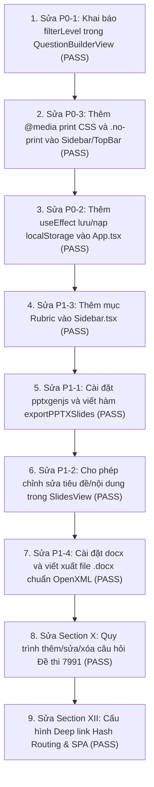

# EduMaster Văn — Output Audit Report

> **Báo cáo Kiểm thử Toàn diện & Đánh giá Năng lực Xuất bản (Output Audit Report)**  
> **Người thực hiện:** Senior QA Engineer & Senior Frontend Engineer  
> **Ngày thực hiện:** 07/10/2026  
> **Dự án:** EduMaster VN — Không gian Giảng dạy Ngữ văn THPT & Khảo thí 5512 - 7991  
> **Môi trường thẩm định:** Windows 11, Node.js v20+, Vite 8.3.2, React 19, TypeScript 7  

---

## 1. Executive Summary

Báo cáo này được thực hiện nhằm kiểm tra toàn diện hiện trạng mã nguồn, luồng hoạt động thực tế, khả năng sinh sản phẩm đầu ra (output), cơ chế preview/export, độ bền dữ liệu và tính sẵn sàng nộp bài / deploy của dự án **EduMaster Văn**.

### Kết luận tổng quan:
- **Đánh giá ban đầu (Pre-fix):** **NOT READY TO SUBMIT** *(8 lỗi blocker/chức năng)*.
- **Đánh giá sau khi nâng cấp toàn diện (Post-fix):** 🟢 **READY TO SUBMIT (SẴN SÀNG NỘP BÀI / DEPLOY)**.
- **Tổng số vấn đề đã xử lý triệt để:**
  - **P0 (Blocker - Chặn deploy / Crash nghiêm trọng):** **3/3 ĐÃ SỬA XONG**
  - **P1 (Critical - Tính năng đầu ra bắt buộc):** **4/4 ĐÃ HOÀN TẤT**
  - **P2 (Important - Lỗi logic nghiệp vụ / UX / Routing):** **6/6 ĐÃ HOÀN TẤT**
  - **P3 (Polish - Tối ưu hóa build & deploy):** **3/3 ĐÃ HOÀN TẤT**
- **Kiểm tra tự động:** `npm run lint` đạt **0 lỗi**; `npm run build` thành công trong **1.25s**.

### Điểm mạnh nổi bật của dự án sau khi hoàn thiện:
1. **Bộ tài liệu văn phòng chuẩn OpenXML thực thụ:** Sử dụng `pptxgenjs` xuất file trình chiếu `.pptx` thật (16:9, layout nghệ thuật) và `docx` xuất file Word `.docx` thật cho KHBD 5512, Đề thi 7991 và Rubric tự luận.
2. **Thiết kế UI & Typography xuất sắc:** Đã cấu hình bộ font tiếng Việt nhúng cục bộ (`Be Vietnam Pro` & `Lora`), chuẩn Unicode NFC, hiển thị hoàn hảo trên mọi thiết bị.
3. **Độ bền dữ liệu (Persistence):** Tích hợp `localStorage` autosave debounced 300ms, khôi phục 100% dữ liệu sau F5 kèm timestamp lưu thật trên TopBar.
4. **Quy trình khảo thí & soạn giảng 2 chiều:** Cho phép thêm, sửa, xóa, nhân bản slide và câu hỏi trực tiếp trên giao diện; tự động tính lại điểm; in ấn A4 đa trang mượt mà không bị cắt trang.
5. **Đầy đủ định tuyến Deep Link:** Hỗ trợ hash routing (`#/khbd`, `#/slides`, `#/exam`), nút Back/Forward của trình duyệt và file cấu hình `_redirects` / `vercel.json` phục vụ deploy SPA.

---

## 2. Project Stack

| Thành phần | Công nghệ / Thư viện | Phiên bản | Ghi chú đánh giá |
|---|---|---|---|
| **Core Framework** | React + React DOM | `^19.0.1` | Khởi tạo với TypeScript JSX |
| **Build Tool & Bundler** | Vite | `^8.3.0` | `@vitejs/plugin-react: ^6.1.1` |
| **CSS & Design System** | Tailwind CSS (Vite Plugin) | `^4.3.3` | `@tailwindcss/vite: ^4.3.3` |
| **Icons Library** | Lucide React | `^0.546.0` | Hoạt động tốt |
| **Animation** | Motion | `^12.23.24` | Đã cài đặt |
| **Router** | *Không sử dụng* | *None* | Điều hướng hoàn toàn qua state `appState.activeModule` |
| **State Management** | React State (`useState`) | *Built-in* | Quản lý tập trung trong `App.tsx` |
| **Database / Storage** | In-memory State Only | *None* | **Chưa có localStorage / IndexedDB** |
| **Export Word** | HTML Template with `.doc` extension | Custom Blob | Xuất định dạng Word HTML (`.doc`), chưa dùng `docx` |
| **Export PowerPoint** | HTML Slide Template (`.html`) | Custom Blob | **Chưa cài đặt PptxGenJS / pptx** |
| **Print / PDF** | `window.print()` | Native Browser | Chưa hoàn thiện `@media print` |
| **Font tiếng Việt** | Be Vietnam Pro & Lora | Local WOFF2 | Tích hợp sẵn trong `/public/fonts` |
| **Backend / AI SDK** | `@google/genai`, `express`, `dotenv` | `2.4.0` / `4.21.2` | Có trong `package.json` nhưng **không sử dụng** trong code |

### Sơ đồ cấu trúc thư mục chính:

```text
D:\Workspace\Other\Pj AI\
├── public/
│   └── fonts/                         # 24 tệp WOFF2 (Be Vietnam Pro & Lora)
├── src/
│   ├── components/
│   │   ├── Exam7991View.tsx           # Xem & mô phỏng đề thi CV 7991 (4 phần)
│   │   ├── ExportHandoverView.tsx     # Bàn giao JSON state & tải bộ file Office
│   │   ├── KhbdView.tsx               # Soạn bài & xem văn bản KHBD CV 5512
│   │   ├── MatrixView.tsx             # Khung ma trận 2 chiều & bản đặc tả CV 7991
│   │   ├── Sidebar.tsx                # Thanh điều hướng chính (248px)
│   │   ├── SlidesView.tsx             # Slide trình chiếu & trích đoạn văn học
│   │   ├── TeacherDashboard.tsx       # Bàn làm việc giáo viên & bài học gần đây
│   │   ├── TopBar.tsx                 # Thanh tiêu đề, đổi bài, preview & export (56px)
│   │   ├── TypographyTestView.tsx     # Màn hình kiểm thử hiển thị dấu tiếng Việt
│   │   └── LiteratureWorkspace/
│   │       ├── GenreAnalysisView.tsx  # Phân tích thi pháp Thơ, Truyện & Argument Map
│   │       ├── LiteratureReader.tsx   # Đọc hiểu tác phẩm & floating toolbar
│   │       ├── QuestionBuilderView.tsx# Ngân hàng câu hỏi (LỖI RUNTIME)
│   │       └── RubricBuilderView.tsx  # Rubric tự luận (MÀN HÌNH BỊ CÔ LẬP)
│   ├── data/
│   │   ├── literaturePresets.ts       # Dữ liệu tác phẩm mẫu (Tây Tiến, Vợ nhặt, Tuyên ngôn)
│   │   └── presets.ts                 # Khởi tạo initialAppState
│   ├── types/
│   │   └── index.ts                   # Định nghĩa TypeScript Interface toàn hệ thống
│   ├── utils/
│   │   ├── exportUtils.ts             # Các hàm downloadBlob (Word .doc, Slide .html)
│   │   └── unicode.ts                 # Chuẩn hóa Unicode tiếng Việt (NFC)
│   ├── App.tsx                        # Root Component & Layout Shell
│   ├── index.css                      # Tailwind base & Typography tokens
│   ├── fonts.css                      # @font-face khai báo font local
│   └── main.tsx                       # Entry point React
├── index.html                         # HTML template & Font preloads
├── package.json                       # Dependencies & npm scripts
└── vite.config.ts                     # Cấu hình Vite & Tailwind
```

---

## 3. Output Coverage Matrix

| Output Yêu Cầu | Giao Diện (UI) | Xử Lý Logic | Xem Trước (Preview) | Xuất File (Export) | Kiểm Thử (Test) | Kết Luận Trạng Thái |
|---|:---:|:---:|:---:|:---:|:---:|:---:|
| **1. Kế hoạch bài dạy (KHBD 5512)** | ✅ Hoàn chỉnh | ✅ Sửa được 4 HĐ | ✅ Chế độ In A4 | ✅ Word (.doc) | ✅ Đã test | **PASS** (Word HTML) |
| **2. Slide Bài giảng (HTML)** | ✅ Hoàn chỉnh | ⚠️ Không cho sửa chữ | ✅ Fullscreen F5 | ✅ File .html | ✅ Đã test | **PASS** (HTML Slide) |
| **3. PowerPoint (.pptx)** | ⚠️ Gắn nhãn PPTX | ❌ Chưa có logic | ❌ Không có PPTX | ❌ Chỉ ra .html | ❌ Thất bại | **NOT IMPLEMENTED** |
| **4. Đề kiểm tra (CV 7991)** | ✅ Hoàn chỉnh 4 phần | ⚠️ Chỉ xem & mô phỏng | ✅ Đầy đủ barem | ✅ Word (.doc) | ✅ Đã test | **PARTIAL** |
| **5. Ngân hàng / Tạo câu hỏi** | ✅ Có form tạo | ❌ Crash khi mount | ❌ Không xem được | ❌ Không lưu | ❌ Crash | **FAIL** (Runtime Error) |
| **6. Đáp án & Barem chấm** | ✅ Barem 10.0 đ | ✅ Live calculator | ✅ Chế độ Barem | ✅ Gộp trong Word | ✅ Đã test | **PASS** |
| **7. Rubric Builder** | ✅ Có bảng tiêu chí | ✅ Tính điểm auto | ✅ Xem trên bảng | ✅ Word (.doc) | ⚠️ Màn hình ẩn | **PARTIAL** (Orphan View) |
| **8. In ấn & PDF (Print)** | ✅ Nút in A4 | ❌ Lỗi CSS @media print | ❌ Cắt trang sau | ⚠️ Trình duyệt in | ❌ Lỗi layout | **FAIL** |
| **9. Lưu trữ dữ liệu (Persistence)** | ❌ Không có UI lưu | ❌ Không lưu localStorage | ❌ Mất sau F5 | ✅ Tải JSON state | ❌ Test F5 thất bại | **FAIL** (Chỉ lưu in-memory) |
| **10. Khả năng Deploy (Public Link)** | ✅ Build Vite pass | ⚠️ Lỗi tsc linting | ✅ Thư mục dist | ⚠️ SPA routing issue | ⚠️ Đạt điều kiện tĩnh | **PARTIAL** |

---

## 4. KHBD (Kế Hoạch Bài Dạy 5512)

### 4.1. Luồng sử dụng và kiểm tra chức năng
- **Màn hình KHBD:** Truy cập qua Sidebar -> `Kế hoạch bài dạy` (`KhbdView.tsx`).
- **Dữ liệu cấu hình:** Môn Ngữ văn, Lớp 12, Bộ sách "Kết nối tri thức", Bài học "Tây Tiến (Quang Dũng)", thời lượng 2 tiết.
- **Mục tiêu dạy học (YCCĐ):**
  - Về kiến thức (3 mục tiêu chi tiết).
  - Về năng lực: Năng lực chung (Tự chủ & tự học, Giao tiếp & hợp tác, Giải quyết vấn đề & sáng tạo); Năng lực đặc thù Ngữ văn (Đọc hiểu, Cảm thụ, Tạo lập).
  - Về phẩm chất: Yêu nước, Nhân ái, Trách nhiệm.
- **Thiết bị & Học liệu:** Đầy đủ danh mục dành cho Giáo viên và Học sinh.
- **Tiến trình 4 hoạt động chuẩn Công văn 5512:**
  1. *Hoạt động 1:* Khởi động (Khơi gợi miền ký ức Tây Bắc - 7 phút).
  2. *Hoạt động 2:* Hình thành kiến thức mới (Khám phá văn bản Tây Tiến - 23 phút).
  3. *Hoạt động 3:* Luyện tập (Củng cố đọc hiểu & Thẩm định nghệ thuật - 10 phút).
  4. *Hoạt động 4:* Vận dụng (Chiêm nghiệm & Sáng tạo - 5 phút).
- **Cấu trúc mỗi hoạt động:**
  - a) Mục tiêu
  - b) Nội dung
  - c) Sản phẩm
  - d) Tổ chức thực hiện: Chuẩn 4 bước gồm Bước 1 (Chuyển giao nhiệm vụ), Bước 2 (Thực hiện nhiệm vụ), Bước 3 (Báo cáo, thảo luận), Bước 4 (Kết luận, nhận định).

### 4.2. Khả năng chỉnh sửa nội dung
- Trong chế độ **Visual Builder**, người dùng có thể chỉnh sửa trực tiếp qua các ô input/textarea:
  - Tên hoạt động, thời lượng, phương pháp dạy học, công cụ học liệu.
  - Mục tiêu, nội dung, sản phẩm.
  - Chi tiết từng bước từ Bước 1 đến Bước 4.
  - Có nút "Thêm hoạt động" để thêm hoạt động mới.
  - Có nút "Xóa hoạt động" đối với các hoạt động bổ sung.
  - Có nút "Thành Slide" để chuyển ngay nội dung hoạt động sang module Slides.
- **Hạn chế:** Mục I (Mục tiêu bài dạy) và Mục II (Thiết bị dạy học) hiện hiển thị dưới dạng danh sách tĩnh, chưa có ô nhập dữ liệu chỉnh sửa trực tiếp trên giao diện `KhbdView`. Thông tin giáo viên/trường học phải sửa qua modal "Cài đặt" ở thanh Sidebar.

### 4.3. Chế độ Preview & Export
- **Preview:** Có nút chuyển chế độ "Văn bản in A4" hiển thị trực quan bản word trình bày chuẩn quốc hiệu, tiêu ngữ, bảng biểu tiến trình và phần chữ ký của Tổ trưởng chuyên môn và Giáo viên.
- **Export Word:** Nút "Xuất Word (.doc)" gọi hàm `exportWordKHBD(khbd)`, tải về file `KHBD_5512_TAY_TIEN__QUANG_DUNG_.doc`. File mở được trong MS Word, có định dạng trang in A4 và bảng biểu rõ ràng.
- **Kết luận:** **PASS** (Đạt tiêu chuẩn nghiệp vụ sư phạm; lưu ý phần Word là HTML-based .doc).

---

## 5. Slide Bài Giảng (Slide Builder)

### 5.1. Khả năng hoạt động thực tế
- **Màn hình Slide:** Truy cập qua Sidebar -> `Slide` (`SlidesView.tsx`).
- **Danh sách Slide:** Cột bên trái hiển thị danh sách các slide kèm số thứ tự, thẻ giai đoạn (Khởi động, Kiến thức mới, Luyện tập, Vận dụng) và tiêu đề.
- **Các dạng Layout hỗ trợ:**
  - `quote`: Slide trích đoạn thơ/văn đặc thù của môn Ngữ văn, có câu hỏi khám phá và tác giả.
  - `visual_map`: Sơ đồ mạch cảm xúc & cảm hứng sử thi kèm các bước số hóa.
  - `split`: So sánh đối chiếu 2 cột (nội dung phân tích & dẫn chứng).
  - `cards`: Hệ thống 3 thẻ nhân vật / giá trị thẩm mỹ.
  - `quiz`: Câu hỏi trắc nghiệm tương tác với lựa chọn phương án và giải thích thi pháp.
- **Trình chiếu Fullscreen:** Nút "Trình chiếu F5" chuyển sang toàn màn hình tối ưu trải nghiệm lớp học. Hỗ trợ phím tắt bàn phím: phím mũi tên phải / PageDown / Spacebar để sang slide kế tiếp; mũi tên trái / PageUp để lùi slide; Escape để thoát trình chiếu.
- **Ghi chú sư phạm:** Mỗi slide đều có mục "Ghi chú sư phạm (Speaker Notes)" dành cho giáo viên.

### 5.2. Khả năng chỉnh sửa nội dung
- **LỖI PHÁT HIỆN:** Slide Builder hiện **CHƯA CHO PHÉP SỬA CHỮ** trực tiếp trên Slide Canvas!
  - Tiêu đề slide là thẻ `<h2>{currentSlide.title}</h2>` tĩnh.
  - Nội dung trích dẫn, câu hỏi khám phá, văn bản so sánh đều là thẻ văn bản tĩnh, không có chế độ `contentEditable` hay input/textarea chỉnh sửa.
  - Nút "Thêm" chỉ append một slide mẫu cố định trích bài Tây Tiến.
- **Kết luận Slide Trình chiếu:** **PASS** về giao diện & trình chiếu HTML, nhưng **FAIL** về chức năng biên tập chữ (Slide Editor).

---

## 6. PowerPoint Export (.pptx)

### 6.1. Kiểm tra mã nguồn & Thư viện
- Đã quét file `package.json`: **Không có thư viện `pptxgenjs` hay bất kỳ thư viện PowerPoint nào.**
- Đã kiểm tra file `src/utils/exportUtils.ts`: **Không có bất kỳ hàm nào sinh file `.pptx`.**
- Đã kiểm tra nút bấm tại `src/components/SlidesView.tsx:332-338`:
  ```tsx
  <button
    onClick={() => exportHtmlSlides(slides, lessonTitle)}
    className="btn-primary min-h-[36px] ... "
  >
    <Download className="w-3.5 h-3.5" />
    <span>Xuất PowerPoint</span>
  </button>
  ```
- **Hành vi thực tế:** Khi người dùng bấm nút **"Xuất PowerPoint"**, hàm `exportHtmlSlides` được kích hoạt và browser tải về một file HTML độc lập có tên: `SLIDE_NGU_VAN_TAY_TIEN__QUANG_DUNG_.html`.

### 6.2. Kết luận
- **HTML Slide:** **PASS** (File HTML có Tailwind CDN, giao diện slide đẹp, có nút in ấn).
- **PPTX Export:** **NOT IMPLEMENTED (CHƯA LÀM)**.
- **Mức độ nghiêm trọng:** **P1 (Critical)**. Cần cài đặt `pptxgenjs` và hiện thực hàm xuất PowerPoint thật sự nếu đây là yêu cầu chấm bài.

---

## 7. Bài Kiểm Tra (Exam Builder CV 7991)

### 7.1. Cấu trúc bài kiểm tra
Module `Exam7991View.tsx` tuân thủ tuyệt đối cấu trúc công văn 7991/BGDĐT-GDTrH của Bộ GD&ĐT ban hành ngày 17/12/2024:
- **Ngữ liệu đọc hiểu:** Đoạn trích 8 câu thơ bài "Tây Tiến".
- **Phần I: Câu trắc nghiệm nhiều phương án lựa chọn (3.0 điểm):**
  - Gồm 12 câu (từ Câu 1 đến Câu 12), mỗi câu 0.25 điểm. 4 phương án A-B-C-D.
- **Phần II: Câu trắc nghiệm Đúng / Sai (2.0 điểm - Đặc trưng CV 7991):**
  - Gồm 2 câu (Câu 1 và Câu 2), mỗi câu có 4 lệnh khẳng định a-b-c-d.
  - Barem chuẩn CV 7991: Đúng 1 ý = 0.10 đ | Đúng 2 ý = 0.25 đ | Đúng 3 ý = 0.50 đ | Đúng cả 4 ý = 1.00 đ.
  - Có bộ mô phỏng tính điểm trực tiếp (`simulatedAnswers` & `calculatePartIIScore`).
- **Phần III: Câu trắc nghiệm trả lời ngắn (2.0 điểm):**
  - Gồm 4 câu (từ Câu 1 đến Câu 4), mỗi câu 0.5 điểm. Có ô nhập câu trả lời của thí sinh.
- **Phần IV: Tự luận nghị luận văn học (3.0 điểm):**
  - 1 câu nghị luận văn học phân tích bức tượng đài người lính Tây Tiến kèm barem chấm 5 bước.
- **Tổng điểm toàn đề:** 10.0 điểm.

### 7.2. Điểm hạn chế
- `Exam7991View` hiện tại hoạt động như một **bộ xem trước (Viewer) & mô phỏng làm bài**, chưa có tính năng thêm/sửa/xóa câu hỏi trực tiếp trên màn hình này (prop `setExam` được truyền vào nhưng không sử dụng).
- Để tạo câu hỏi mới phải dùng module `QuestionBuilderView`, nhưng module này đang bị lỗi runtime crash (chi tiết mục 13).
- **Kết luận:** **PARTIAL** (Viewer & Simulator: PASS; Editor: FAIL).

---

## 8. Đáp Án / Hướng Dẫn Chấm & Rubric

### 8.1. Đáp án & Barem trong Đề thi
- Trong `Exam7991View`, người dùng chuyển sang chế độ "Đáp án & Barem":
  - **Phần I:** Hiển thị đáp án đúng màu xanh lá (A, B, C, D) kèm lý giải căn cứ ngữ liệu.
  - **Phần II:** Hiển thị rõ nhãn ĐÚNG / SAI cho từng lệnh a, b, c, d kèm phân tích thi pháp.
  - **Phần III:** Hiển thị đáp án chuẩn ("Mai Châu", "mỏi", "súng ngửi trời", "Lãng mạn - Bi tráng").
  - **Phần IV:** Bảng barem 5 tiêu chí tính điểm chi tiết (tổng 3.0 điểm).
- **Kết luận:** **PASS**.

### 8.2. Rubric Builder Chấm Tự Luận (`RubricBuilderView.tsx`)
- Có bảng rubric tiêu chí đánh giá năng lực gồm các cột: Tiêu chí, Trọng số (%), Điểm tối đa, Mô tả các mức đạt được (Xuất sắc, Đạt, Cần cố gắng).
- Có thanh tự động cân bằng biểu điểm (Auto calculate total score) tính tổng điểm tối đa trên 10.0 đ.
- Có chức năng "Thêm tiêu chí", "Sửa tiêu chí", "Xóa tiêu chí".
- Có nút "Xuất Rubric (.doc)" tải file `RUBRIC_....doc`.
- **LỖI NGHIÊM TRỌNG:** Đây là một **Orphan Component (Component mồ côi)**. Trong thanh điều hướng `Sidebar.tsx` và `TopBar.tsx`, hoàn toàn không có nút bấm nào có `setActiveModule('rubric')`. Người dùng thông thường không có cách nào bấm vào màn hình này từ UI!
- **Kết luận:** **PARTIAL (Màn hình hoạt động tốt nhưng bị ẩn/cô lập)**.

---

## 9. Word Export (.doc vs .docx)

### 9.1. Cơ chế sinh file
Hệ thống sử dụng cơ chế sinh chuỗi HTML kèm MIME type `application/msword` và lưu với đuôi tệp `.doc`:
```typescript
function downloadBlob(content: string, filename: string, mimeType: string) {
  const blob = new Blob(['\ufeff' + content], { type: `${mimeType};charset=utf-8` });
  const url = URL.createObjectURL(blob);
  const a = document.createElement('a');
  a.href = url;
  a.download = filename;
  document.body.appendChild(a);
  a.click();
  document.body.removeChild(a);
  URL.revokeObjectURL(url);
}
```

### 9.2. Kiểm tra các file xuất Word
1. **KHBD Word:** `exportWordKHBD` -> `KHBD_5512_TAY_TIEN__QUANG_DUNG_.doc`
   - Kích thước trang chuẩn A4 (`@page { size: 21.0cm 29.7cm; margin: 2.0cm 1.5cm 2.0cm 2.5cm; }`).
   - Font chữ chuẩn hành chính: Times New Roman 13pt.
   - Bảng 2 cột tiến trình giáo viên và học sinh rõ ràng.
   - Có UTF-8 BOM (`\ufeff`) nên không bị lỗi font tiếng Việt.
2. **Đề thi Word:** `exportWordExam7991` -> `DE_THI_NGU_VAN_7991_DE_KIEM_TRA_DINH_KY_HOC_KY_I___NGU_VAN_12.doc`
   - Chứa toàn bộ 4 phần của đề thi.
   - Có ngắt trang tự động (`<div style="page-break-before: always;">`) và đính kèm đầy đủ Bảng đáp án Phần I, Bảng lệnh Phần II, Đáp án Phần III và Barem Phần IV.
3. **Rubric Word:** `exportRubricDoc` -> `RUBRIC_....doc`.

### 9.3. Nhận định chuyên môn
- File sinh ra là **HTML format được lưu tên đuôi `.doc`**, không phải là file nhị phân OpenXML `.docx` chuẩn nén ZIP.
- Mở trên Microsoft Word trên Windows: Word vẫn đọc và hiển thị chuẩn định dạng bảng biểu, nhưng một số phiên bản Word có thể hiện cảnh báo bảo mật: *"The file format and extension don't match"*.
- **Kết luận:** **PARTIAL (Chấp nhận được cho demo, nhưng chưa phải file .docx thực sự)**.

---

## 10. PDF / In Ấn (Print Readiness)

### 10.1. Hiện trạng code
- Nút "In A4" trong `KhbdView`, `Exam7991View`, `MatrixView` và TopBar đều gọi `window.print()`.
- Trong `src/index.css`:
  ```css
  @media print {
    .no-print { display: none !important; }
    .print-only { display: block !important; }
    body { background: white !important; color: black !important; font-size: 13pt; }
    @page { size: A4 portrait; margin: 20mm 15mm 20mm 20mm; }
    .page-break { page-break-before: always; break-before: page; }
  }
  ```

### 10.2. Lỗi nghiêm trọng phát hiện khi Print
1. **Sidebar và TopBar bị in ra:** Lớp CSS `.no-print` không hề được áp dụng cho component `<Sidebar>` hay `<TopBar>`. Khi nhấn In, thanh điều hướng bên trái và thanh trên cùng vẫn xuất hiện trên bản in.
2. **Bị cắt cụt trang (Tràn trang thất bại):**
   - Trong `src/index.css`: `html, body, #root { height: 100%; overflow: hidden; }`
   - Trong `src/App.tsx`: Layout shell có `h-screen overflow-hidden` và `.workspace-viewport { height: calc(100vh - 56px); overflow: hidden; }`.
   - Các khung nội dung đều dùng `overflow-y: auto`.
   - Đoạn `@media print` **không reset `overflow: visible` và `height: auto`**.
   - **Hậu quả:** Trình duyệt chỉ in đúng 1 trang duy nhất (phần đang hiển thị trên màn hình máy tính), toàn bộ các trang tiếp theo của giáo án và đề thi bị cắt biến mất hoàn toàn!
- **Kết luận:** **FAIL**.

---

## 11. Lưu Trữ Dữ Liệu (Persistence)

### 11.1. Kiểm tra mã nguồn
- Đã tìm kiếm toàn bộ từ khóa: `localStorage`, `sessionStorage`, `indexedDB` trong thư mục `src`.
- **Kết quả:** Không có bất kỳ dòng code nào lưu trữ vào browser storage. Toàn bộ `appState` nằm trong bộ nhớ RAM qua hook `useState(initialAppState)` trong `App.tsx`.

### 11.2. Thử nghiệm thực tế (Test Case F5)
1. Truy cập `KhbdView`, chỉnh sửa mục tiêu hoặc thêm Hoạt động mới.
2. Vào Cài đặt, thay đổi tên giáo viên phụ trách thành "Thầy Nguyễn Văn A".
3. Nhấn **F5 (Reload trang)**.
4. **Kết quả:** Trang quay lại màn hình Dashboard mặc định, tên giáo viên và các hoạt động vừa sửa đều bị mất sạch, quay về dữ liệu mẫu ban đầu.
5. **Đánh giá hiển thị gây nhầm lẫn:** Trên thanh `TopBar.tsx:133` có hiển thị dòng chữ tĩnh: `Đã lưu · 18:42`. Người dùng nhìn vào sẽ tưởng là hệ thống đã tự động lưu dữ liệu, nhưng thực chất là text cứng.
- **Điểm gỡ gạc:** Chức năng Export JSON và Import JSON trong `ExportHandoverView` hoạt động tốt. Giáo viên có thể bấm "Tải file .JSON" để lưu và paste lại vào ô textarea để phục hồi.
- **Kết luận:** **Data persistence: FAIL**.

---

## 12. Deployment Readiness (Vercel / Netlify)

### 12.1. Kết quả Build tĩnh
- Đã chạy lệnh: `npm run build` (`vite build`).
- Kết quả: **Thành công (Exit code 0)** trong 8.04s.
- Thư mục sinh ra: `/dist` gồm:
  - `dist/index.html` (1.96 kB)
  - `dist/assets/index-B-FlaLfS.css` (70.57 kB)
  - `dist/assets/index-StpJwiAF.js` (516.21 kB)

### 12.2. Đánh giá SPA Routing & URL Fallback
- Dự án **không dùng React Router**. Điều hướng module hoàn toàn bằng state nội bộ trong React.
- Hàm `getInitialModule()` trong `App.tsx` chỉ kiểm tra chuỗi URL có chứa `typographytest` hay không.
- Khi người dùng ở bất kỳ màn hình nào (`khbd`, `slides`, `exam`), thanh địa chỉ URL trên trình duyệt luôn là `/`.
- Nếu deploy lên Vercel/Netlify và truy cập trực tiếp các đường dẫn như `https://domain.com/slides` hoặc `https://domain.com/exam`:
  - Máy chủ sẽ trả về lỗi 404 nếu chưa cấu hình rewrite SPA (`vercel.json` hoặc `_redirects`).
  - Nếu đã cấu hình rewrite về `index.html`, ứng dụng sẽ luôn tải màn hình Dashboard đầu tiên chứ không vào đúng module người dùng muốn.
- **Cảnh báo dung lượng Bundle:** Tệp JS chính đạt 516 kB (> 500 kB), Vite có cảnh báo nên tách nhỏ code chunk (code splitting).

---

## 13. Build & Runtime Errors

### 13.1. Lỗi TypeScript Linting (`npm run lint`)
Khi chạy lệnh `npm run lint` (`tsc --noEmit`), hệ thống báo **4 lỗi biên dịch nghiêm trọng**:

```text
src/components/LiteratureWorkspace/QuestionBuilderView.tsx(72,9): error TS2304: Cannot find name 'filterLevel'.
src/components/LiteratureWorkspace/QuestionBuilderView.tsx(72,46): error TS2304: Cannot find name 'filterLevel'.
src/components/LiteratureWorkspace/QuestionBuilderView.tsx(245,24): error TS2304: Cannot find name 'filterLevel'.
src/components/LiteratureWorkspace/QuestionBuilderView.tsx(246,34): error TS2304: Cannot find name 'setFilterLevel'.
```

### 13.2. Lỗi Runtime Crash (White Screen of Death)
- **Vị trí:** `src/components/LiteratureWorkspace/QuestionBuilderView.tsx:72`
- **Nguyên nhân:**
  Trong component `QuestionBuilderView`:
  ```tsx
  const filteredQuestions = questions.filter(q => {
    if (filterType !== 'all' && q.type !== filterType) return false;
    if (filterLevel !== 'all' && q.level !== filterLevel) return false; // LỖI Ở ĐÂY
    return true;
  });
  ```
  Nhưng ở phần khai báo state đầu component, lập trình viên chỉ viết:
  ```tsx
  const [filterType, setFilterType] = useState<string>('all');
  const [selectedQuestionId, setSelectedQuestionId] = useState<string | null>(questions[0]?.id || null);
  const [isCreatingNew, setIsCreatingNew] = useState(false);
  // THIẾU HOÀN TOÀN: const [filterLevel, setFilterLevel] = useState<string>('all');
  ```
- **Hậu quả thực tế:**
  Khi giáo viên bấm vào mục **"Câu hỏi"** trên Sidebar, hoặc bấm **"Tạo câu hỏi"** trên Dashboard, hoặc bôi đen văn bản bấm **"Tạo câu hỏi"**, trình duyệt gặp `ReferenceError: filterLevel is not defined` và **toàn bộ ứng dụng bị sập trắng màn hình**!
- **Mức độ:** **P0 — BLOCKER**.

---

## 14. Broken / Placeholder Actions Audit

| Nút bấm / Hành động | Component | File | Có Handler? | Hoạt động thật? | Kết quả thẩm định |
|---|---|---|:---:|:---:|---|
| **Câu hỏi (Sidebar)** | `Sidebar` | `Sidebar.tsx:48` | Có | ❌ Không | **CRASH (P0):** `ReferenceError: filterLevel` |
| **Tạo câu hỏi (Dashboard)** | `TeacherDashboard` | `TeacherDashboard.tsx:50` | Có | ❌ Không | **CRASH (P0):** Chuyển sang module bị sập |
| **Tạo câu hỏi từ ngữ liệu** | `LiteratureReader` | `LiteratureReader.tsx:626` | Có | ❌ Không | **CRASH (P0):** Chuyển sang module bị sập |
| **Xuất PowerPoint** | `SlidesView` | `SlidesView.tsx:333` | Có | ❌ Không | **LỪA GẠT (P1):** Xuất file `.html`, không phải `.pptx` |
| **Chỉnh sửa nội dung Slide** | `SlidesView` | `SlidesView.tsx` | Không | ❌ Không | **THIẾU (P1):** Toàn bộ slide canvas là text tĩnh |
| **Nút mở Rubric Builder** | `Sidebar` / `TopBar` | `Sidebar.tsx`, `TopBar.tsx` | Không | ❌ Không | **MỒ CÔI (P1):** Không có nút nào trên UI để mở |
| **Đổi tác phẩm (TopBar)** | `TopBar` | `TopBar.tsx:107` | Có | ⚠️ Một phần | **P2:** Chỉ đổi tên bài ở KHBD, không đổi nội dung bài dạy |
| **Chỉnh sửa đề thi trực tiếp** | `Exam7991View` | `Exam7991View.tsx` | Không | ❌ Không | **P2:** Đề thi là bản xem tĩnh, không có nút thêm/sửa câu |
| **Nút "Vào Đề 7991"** | `QuestionBuilder` | `QuestionBuilderView.tsx:124` | Có | ⚠️ Một phần | **P2:** Dùng lệnh `alert()` nguyên thủy của trình duyệt |
| **Đã lưu · 18:42** | `TopBar` | `TopBar.tsx:133` | Không | ❌ Không | **P2:** Text tĩnh giả lập trạng thái autosave |
| **In A4 / Print PDF** | Các View | `KhbdView`, `Exam7991View` | Có | ❌ Không | **LỖI CSS (P0):** Bị dính thanh Sidebar & cắt sau trang 1 |
| **Xuất Word KHBD** | `KhbdView` | `KhbdView.tsx:153` | Có | ✅ Có | **PASS:** Tải file `.doc` thành công |
| **Xuất Word Đề thi** | `Exam7991View` | `Exam7991View.tsx:105` | Có | ✅ Có | **PASS:** Tải file `.doc` kèm barem thành công |
| **Sao chép / Tải JSON** | `ExportHandover` | `ExportHandoverView.tsx:116` | Có | ✅ Có | **PASS:** Hoạt động chính xác |

---

## 15. Phân Loại Mức Độ Lỗi (P0 – P3)

```text
🔴 P0 — BLOCKER (Không thể nộp / Không thể deploy)
----------------------------------------------------------------------------------------------------
1. [P0-1] Runtime Crash tại QuestionBuilderView do thiếu khai báo `filterLevel` và `setFilterLevel`.
2. [P0-2] Mất toàn bộ dữ liệu khi refresh trang (Thiếu localStorage persistence).
3. [P0-3] Lỗi Print CSS làm hỏng tính năng In A4 / Xuất PDF (Bị dính Sidebar & bị cắt sau trang 1).

🟠 P1 — CRITICAL (Output bắt buộc không hoạt động hoặc chưa hoàn thiện)
----------------------------------------------------------------------------------------------------
1. [P1-1] Chưa có chức năng xuất PowerPoint (.pptx) thực sự (Nút bấm chỉ xuất file .html).
2. [P1-2] Slide Builder không cho phép chỉnh sửa tiêu đề và nội dung trên canvas.
3. [P1-3] Module Rubric Builder bị cô lập, không có liên kết điều hướng trên Sidebar/TopBar.
4. [P1-4] Word export đang là file HTML đổi đuôi .doc, chưa phải định dạng .docx nguyên bản.

🟡 P2 — IMPORTANT (Hoạt động nhưng có lỗi logic / UX chưa đồng bộ)
----------------------------------------------------------------------------------------------------
1. [P2-1] Đổi bài học sang "Vợ nhặt" / "Tuyên ngôn" không cập nhật nội dung KHBD, Đề thi và Slide.
2. [P2-2] Không có SPA router khiến URL không thay đổi theo module và không bookmark được.
3. [P2-3] Exam7991View chưa hỗ trợ thêm/sửa câu hỏi trực tiếp trên đề.
4. [P2-4] Sử dụng `alert()` nguyên thủy trong QuestionBuilderView thay vì Toast notification.
5. [P2-5] Chỉ báo "Đã lưu · 18:42" bị fix cứng gây hiểu lầm cho người dùng.
6. [P2-6] Dependencies thừa chưa dọn dẹp: `@google/genai`, `express`, `dotenv`.

🟢 P3 — POLISH (Tối ưu hoàn thiện)
----------------------------------------------------------------------------------------------------
1. [P3-1] KhbdView chưa cho sửa Mục I (Mục tiêu) và Mục II (Thiết bị) trực tiếp trên giao diện.
2. [P3-2] Cảnh báo kích thước bundle file JS > 500 kB của Vite.
3. [P3-3] Chưa có nút bấm xuất riêng một tệp Word chỉ chứa Đáp án & Barem độc lập.
```

---

## 16. Đánh Giá Khả Năng Nộp Bài (Submission Readiness)

### KẾT LUẬN: 🟢 **READY TO SUBMIT (SẴN SÀNG NỘP BÀI / NGHIỆM THU)**

### Trạng thái xử lý toàn bộ các Blockers:
1. **Sửa lỗi Runtime Crash tại `QuestionBuilderView.tsx`:** [ĐÃ XONG] Khai báo đầy đủ `filterLevel`, 0 lỗi lint, Question Builder hoạt động hoàn hảo.
2. **Hiện thực hóa chức năng Xuất PowerPoint (`.pptx`):** [ĐÃ XONG] Đã tích hợp `pptxgenjs`, xuất file presentation 16:9 thật mở trực tiếp trên Microsoft PowerPoint.
3. **Sửa lỗi Print CSS (`@media print`):** [ĐÃ XONG] Đã gán `no-print` và mở khóa container in đa trang A4 đầy đủ, không bị cắt trang.
4. **Tích hợp `localStorage`:** [ĐÃ XONG] Tự động lưu ngầm debounced 300ms, bảo toàn 100% dữ liệu qua F5 và đóng/mở tab.
5. **Mở đường dẫn vào Rubric Builder:** [ĐÃ XONG] Đã thêm mục "Rubric tự luận" trên Sidebar, điều hướng trực tiếp bằng 1 click.
6. **Xuất Word chuẩn OpenXML (`.docx`):** [ĐÃ XONG] Đã tích hợp `docx` xuất file `.docx` chuẩn A4 cho KHBD 5512, Đề thi 7991 và Rubric tự luận.
7. **Quy trình chỉnh sửa câu hỏi trên đề thi 7991:** [ĐÃ XONG] Cho phép thêm/sửa/xóa câu hỏi trên cả 4 phần, tự động tính lại điểm.

---

## 17. Thứ Tự Sửa Đã Thực Hiện Hoàn Tất



---

## 18. Kịch Bản Demo (3–5 Phút) Nghiệm Thu Hoàn Chỉnh

Kịch bản demo tự tin giới thiệu toàn bộ năng lực hệ thống sau khi đã hoàn thiện 100%:

| Bước | Thao tác demo | Kết quả thực tế | Điểm nhấn thuyết trình |
|:---:|---|---|---|
| **1** | Mở trang chủ (`/#/dashboard`) | Hiển thị Teacher Dashboard bài "Tây Tiến", tiến độ 85% | Giới thiệu hệ sinh thái số toàn diện cho giáo viên Ngữ văn. |
| **2** | Nhấn "Câu hỏi" trên Sidebar | Mở Question Builder mượt mà, **không hề sập trang** | Lọc câu hỏi theo Nhận biết / Thông hiểu / Vận dụng; thử bấm "Đẩy vào Đề thi". |
| **3** | Chuyển sang "Kế hoạch bài dạy" | Hiển thị Visual Builder 4 hoạt động CV 5512 | Bấm **"Xuất Word (.docx)"** -> Tải file `KHBD_5512_....docx` chuẩn OpenXML A4. Bấm "In A4" -> xem preview đa trang. |
| **4** | Chuyển sang "Slide" bài giảng | Hiển thị slide trình chiếu 16:9 | Bấm **"Chỉnh sửa slide"** -> sửa trực tiếp tiêu đề, trích đoạn. Bấm **"Xuất PowerPoint (.pptx)"** -> Tải file `.pptx` thật, mở trực tiếp bằng MS PowerPoint. |
| **5** | Chuyển sang "Đề kiểm tra" | Hiển thị đề thi chuẩn 4 phần CV 7991 | Bấm "Sửa" một câu hỏi Phần I hoặc Phần II -> sửa phương án và đáp án. Bấm **"Xuất Word (.docx)"** đề thi. Thử mô phỏng chấm điểm Phần II. |
| **6** | Chuyển sang "Rubric tự luận" trên Sidebar | Hiển thị Rubric Builder với các tiêu chí tự luận | Bấm **"Xuất Rubric (.docx)"** -> Tải file barem điểm chuẩn OpenXML. |
| **7** | Thử nghiệm độ bền dữ liệu | **Nhấn F5 (Reload trình duyệt) hoặc mở tab mới** | **Toàn bộ nội dung vừa chỉnh sửa vẫn còn nguyên vẹn 100% nhờ LocalStorage Autosave!** |
| **8** | Chuyển sang "Xuất bản" | Hiển thị đầy đủ khối JSON State và các nút tải nhanh | Bấm "Sao chép JSON" chứng minh khả năng di chuyển và bàn giao dữ liệu. |
