# TÀI LIỆU SƠ ĐỒ CHỨC NĂNG & USE CASE HỆ THỐNG EDUMASTER VĂN
## PHÂN TÍCH THIẾT KẾ CHỨC NĂNG DỰA TRÊN THIET_KE_BO_CUC_UI_UX_DESIGN.MD

> **Hệ thống:** EduMaster VN (EduMaster Văn) — Không gian Giảng dạy Ngữ văn THPT & Khảo thí 5512 - 7991  
> **Ngôn ngữ mô hình hóa:** Mermaid Sequence & Flowchart (Chuẩn hóa Use Case Diagrams)  
> **Tài liệu căn cứ:** `docs/THIET_KE_BO_CUC_UI_UX_DESIGN.md`  
> **Ngày lập tài liệu:** 08/10/2026  
> **Vị trí lưu trữ:** `docs/SO_DO_CHUC_NANG_USECASE_EDUMASTER_VAN.md`

---

## MỤC LỤC TỔNG QUAN

1. [DANH SÁCH ACTOR (TÁC NHÂN HỆ THỐNG)](#1-danh-sách-actor-tác-nhân-hệ-thống)
2. [SƠ ĐỒ PHÂN RÃ CHỨC NĂNG TỔNG THỂ (FUNCTIONAL DECOMPOSITION TREE)](#2-sơ-đồ-phân-rã-chức-năng-tổng-thể-functional-decomposition-tree)
3. [SƠ ĐỒ USE CASE TỔNG THỂ TOÀN HỆ THỐNG (GLOBAL SYSTEM USE CASE)](#3-sơ-đồ-use-case-tổng-thể-toàn-hệ-thống-global-system-use-case)
4. [SƠ ĐỒ USE CASE CHI TIẾT TỪNG PHÂN HỆ (SUBSYSTEM USE CASE DIAGRAMS)](#4-sơ-đồ-use-case-chi-tiết-từng-phân-hệ-subsystem-use-case-diagrams)
   - 4.1. Phân hệ 1: Bàn làm việc Giáo viên (Teacher Dashboard)
   - 4.2. Phân hệ 2: Không gian Đọc & Chú giải Tác phẩm (Literature Workspace / Reader)
   - 4.3. Phân hệ 3: Phân tích Thể loại & Lược đồ Luận điểm (Genre Analysis & Argument Map)
   - 4.4. Phân hệ 4: Kế hoạch Bài dạy Chuẩn 5512 (KHBD Visual Builder & Document View)
   - 4.5. Phân hệ 5: Ngân hàng Câu hỏi Đọc hiểu (Question Builder)
   - 4.6. Phân hệ 6: Đề Kiểm tra Định kỳ Chuẩn 7991 (Exam 7991 Paper & Marking Guide)
   - 4.7. Phân hệ 7: Ma trận Đề thi 2 Chiều & Bản đặc tả YCCĐ (Matrix & Specifications)
   - 4.8. Phân hệ 8: Rubric Đánh giá Tự luận (Rubric Builder)
   - 4.9. Phân hệ 9: Trình chiếu Bài giảng Điện tử (Slides Studio)
   - 4.10. Phân hệ 10: Trung tâm Xuất bản & Bàn giao (Export & Handover Center)
   - 4.11. Phân hệ 11: Phòng Kiểm định Kiểu chữ Tiếng Việt (Typography Verification Suite)
   - 4.12. Khung vỏ Toàn cục: Thanh Điều hướng Đỉnh & Cài đặt (Global App Shell & Settings)
5. [SƠ ĐỒ LUỒNG USE CASE LIÊN THÔNG XUYÊN PHÂN HỆ (CROSS-SUBSYSTEM FLOW)](#5-sơ-đồ-luồng-use-case-liên-thông-xuyên-phân-hệ-cross-subsystem-flow)

---

## 1. DANH SÁCH ACTOR (TÁC NHÂN HỆ THỐNG)

Hệ thống EduMaster Văn tương tác với 4 tác nhân chính:

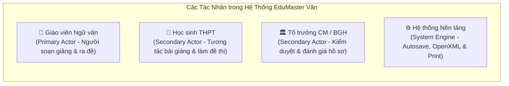
```mermaid
flowchart LR
    subgraph System_Actors ["Các Tác Nhân trong Hệ Thống EduMaster Văn"]
        A1["👤 Giáo viên Ngữ văn<br/>(Primary Actor - Người soạn giảng & ra đề)"]
        A2["👥 Học sinh THPT<br/>(Secondary Actor - Tương tác bài giảng & làm đề thi)"]
        A3["🏛️ Tổ trưởng CM / BGH<br/>(Secondary Actor - Kiểm duyệt & đánh giá hồ sơ)"]
        A4["⚙️ Hệ thống Nền tảng<br/>(System Engine - Autosave, OpenXML & Print)"]
    end
```

1. **Giáo viên Ngữ văn (Primary Actor)**:
   - Người trực tiếp sử dụng toàn bộ 11 phân hệ: Đọc tác phẩm, soạn KHBD 5512, tạo slide, tạo câu hỏi, xây dựng ma trận và đề kiểm tra 7991, xuất bản hồ sơ chuyên môn.
2. **Học sinh THPT (Secondary Actor)**:
   - Tiếp nhận bài giảng trực quan trong giờ học, tham gia trả lời trắc nghiệm tương tác trên slide Quiz, làm bài kiểm tra định kỳ theo đề 7991.
3. **Tổ trưởng Chuyên môn / Ban Giám hiệu (Secondary Actor)**:
   - Tiếp nhận tệp Word `.docx` KHBD 5512, tệp Đề thi 7991 kèm Ma trận và Bảng đặc tả để phê duyệt kế hoạch giáo dục.
4. **Hệ thống Nền tảng (System Engine - System Actor)**:
   - Tự động lưu ngầm dữ liệu (Autosave Engine debounced 300ms vào LocalStorage), động cơ xuất tài liệu OpenXML (`docx`, `pptxgenjs`), và bộ xử lý in ấn A4 (`Print Engine`).

---

## 2. SƠ ĐỒ PHÂN RÃ CHỨC NĂNG TỔNG THỂ (FUNCTIONAL DECOMPOSITION TREE)

```mermaid
flowchart TD
    Root["HỆ THỐNG EDUMASTER VĂN (THPT)"]

    Root --> F1["1. Bàn làm việc (Dashboard)"]
    Root --> F2["2. Không gian Đọc (Literature Reader)"]
    Root --> F3["3. Phân tích Thể loại (Genre Analysis)"]
    Root --> F4["4. Kế hoạch Bài dạy (KHBD 5512)"]
    Root --> F5["5. Ngân hàng Câu hỏi (Question Builder)"]
    Root --> F6["6. Đề kiểm tra 7991 (Exam Builder)"]
    Root --> F7["7. Ma trận & Đặc tả (Matrix & Spec)"]
    Root --> F8["8. Rubric Tự luận (Rubric Builder)"]
    Root --> F9["9. Slide Bài giảng (Slides Studio)"]
    Root --> F10["10. Xuất bản & Bàn giao (Export Center)"]
    Root --> F11["11. Kiểm định Kiểu chữ (Typography Test)"]
    Root --> F12["12. Quản trị Khung vỏ (App Shell)"]

    F1 --> F1_1["Tiếp tục công việc (Resume Card)"]
    F1 --> F1_2["4 Thao tác nhanh (Quick Actions)"]
    F1 --> F1_3["Danh mục bài học gần đây (Recent Lessons)"]

    F2 --> F2_1["Mục lục & Đánh dấu (Outline & Notes)"]
    F2 --> F2_2["Vùng đọc Lora 18px & Chế độ Zen Focus"]
    F2 --> F2_3["Floating Toolbar (Highlight 5 màu)"]
    F2 --> F2_4["Trích dẫn sang Slide / Câu hỏi / Đề thi"]
    F2 --> F2_5["Panel Thi pháp & Hình tượng nghệ thuật"]

    F3 --> F3_1["Phân tích đặc trưng Thơ / Truyện / Nghị luận"]
    F3 --> F3_2["Lược đồ Luận điểm (Argument Map)"]

    F4 --> F4_1["Mục tiêu bài dạy (3 Mục tiêu chuẩn)"]
    F4 --> F4_2["Tiến trình 4 Hoạt động & 4 Bước CV 5512"]
    F4 --> F4_3["Visual Builder vs Document View A4"]
    F4 --> F4_4["Đẩy Hoạt động sang Slide"]

    F5 --> F5_1["Bộ lọc đôi (Dạng câu hỏi x Nhận thức)"]
    F5 --> F5_2["Biên soạn Ngữ liệu, Đáp án & Hướng dẫn chấm"]
    F5 --> F5_3["Đẩy câu hỏi sang Đề thi 7991"]

    F6 --> F6_1["Đề thi 4 phần chuẩn CV 7991"]
    F6 --> F6_2["Đề thi học sinh vs Hướng dẫn chấm"]
    F6 --> F6_3["Mô phỏng chấm điểm lũy tiến Phần II"]
    F6 --> F6_4["Cân bằng thang điểm 10.0"]

    F7 --> F7_1["Khung Ma trận 2 chiều (Đọc hiểu x Viết)"]
    F7 --> F7_2["Bản đặc tả Yêu cầu cần đạt (YCCĐ)"]

    F8 --> F8_1["Thiết lập Tiêu chí chấm tự luận"]
    F8 --> F8_2["Phân cấp 3 mức chất lượng"]
    F8 --> F8_3["Tính tự động tổng điểm tối đa"]

    F9 --> F9_1["5 Kiểu mẫu Slide (Quote, Split, Cards, Quiz, Single)"]
    F9 --> F9_2["Trình chiếu Fullscreen bàn phím"]
    F9 --> F9_3["Trắc nghiệm Quiz phản hồi tức thì"]
    F9 --> F9_4["Xuất PowerPoint .pptx 16:9"]

    F10 --> F10_1["Xuất bộ tệp Office (.docx, .pptx)"]
    F10 --> F10_2["Đóng gói & Tải JSON Handover"]
    F10 --> F10_3["Khôi phục trạng thái làm việc (Import)"]

    F11 --> F11_1["Kiểm tra Hierarchy & Controls"]
    F11 --> F11_2["Kiểm định 134 ký tự tiếng Việt có dấu"]

    F12 --> F12_1["Bộ chuyển đổi tác phẩm (Lesson Switcher)"]
    F12 --> F12_2["Tự động lưu ngầm (LocalStorage Debounced)"]
    F12 --> F12_3["Cài đặt Giáo viên & Đơn vị công tác"]
```

---

## 3. SƠ ĐỒ USE CASE TỔNG THỂ TOÀN HỆ THỐNG (GLOBAL SYSTEM USE CASE)

Sơ đồ thể hiện mối quan hệ giữa Giáo viên Ngữ văn, Tổ chuyên môn, Học sinh và Hệ thống nền tảng với các nhóm ca sử dụng cấp cao:

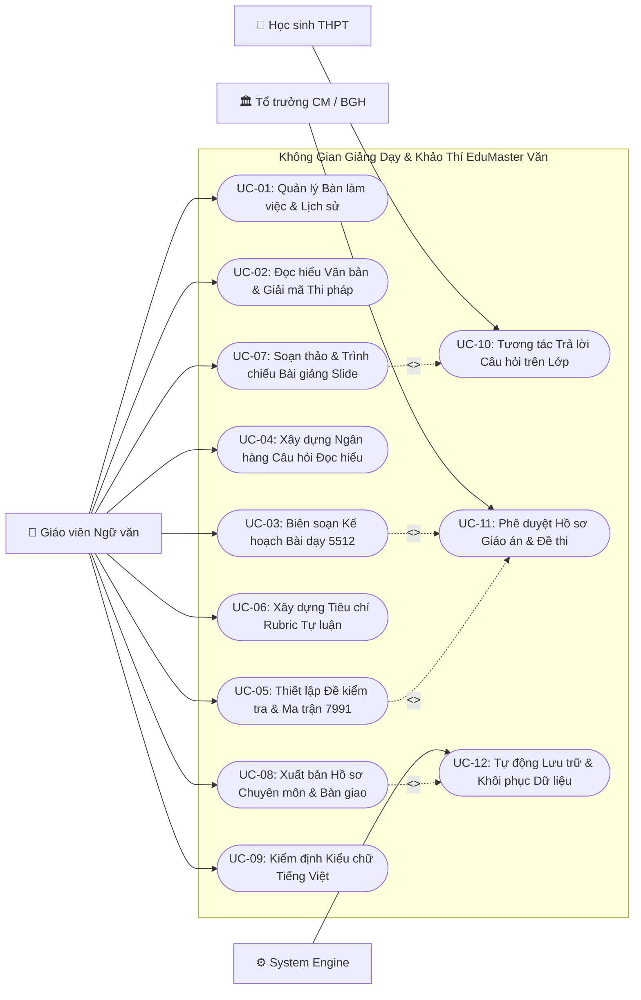
```mermaid
flowchart LR
    Teacher["👤 Giáo viên Ngữ văn"]
    Student["👥 Học sinh THPT"]
    Admin["🏛️ Tổ trưởng CM / BGH"]
    Engine["⚙️ System Engine"]

    subgraph EduMaster_System ["Không Gian Giảng Dạy & Khảo Thí EduMaster Văn"]
        UC_ManageDashboard(["UC-01: Quản lý Bàn làm việc & Lịch sử"])
        UC_ReadAnalyze(["UC-02: Đọc hiểu Văn bản & Giải mã Thi pháp"])
        UC_BuildKHBD(["UC-03: Biên soạn Kế hoạch Bài dạy 5512"])
        UC_BuildQuestions(["UC-04: Xây dựng Ngân hàng Câu hỏi Đọc hiểu"])
        UC_BuildExam(["UC-05: Thiết lập Đề kiểm tra & Ma trận 7991"])
        UC_BuildRubric(["UC-06: Xây dựng Tiêu chí Rubric Tự luận"])
        UC_PresentSlides(["UC-07: Soạn thảo & Trình chiếu Bài giảng Slide"])
        UC_ExportHandover(["UC-08: Xuất bản Hồ sơ Chuyên môn & Bàn giao"])
        UC_VerifyTypography(["UC-09: Kiểm định Kiểu chữ Tiếng Việt"])
        UC_InteractQuiz(["UC-10: Tương tác Trả lời Câu hỏi trên Lớp"])
        UC_ReviewPlan(["UC-11: Phê duyệt Hồ sơ Giáo án & Đề thi"])
        UC_AutosaveState(["UC-12: Tự động Lưu trữ & Khôi phục Dữ liệu"])
    end

    Teacher --> UC_ManageDashboard
    Teacher --> UC_ReadAnalyze
    Teacher --> UC_BuildKHBD
    Teacher --> UC_BuildQuestions
    Teacher --> UC_BuildExam
    Teacher --> UC_BuildRubric
    Teacher --> UC_PresentSlides
    Teacher --> UC_ExportHandover
    Teacher --> UC_VerifyTypography

    Student --> UC_InteractQuiz
    Admin --> UC_ReviewPlan
    Engine --> UC_AutosaveState

    UC_BuildKHBD -.->|"<<extend>>"| UC_ReviewPlan
    UC_BuildExam -.->|"<<extend>>"| UC_ReviewPlan
    UC_PresentSlides -.->|"<<include>>"| UC_InteractQuiz
    UC_ExportHandover -.->|"<<include>>"| UC_AutosaveState
```

---

## 4. SƠ ĐỒ USE CASE CHI TIẾT TỪNG PHÂN HỆ (SUBSYSTEM USE CASE DIAGRAMS)

---

### 4.1. Phân hệ 1: Bàn làm việc Giáo viên (Teacher Dashboard)

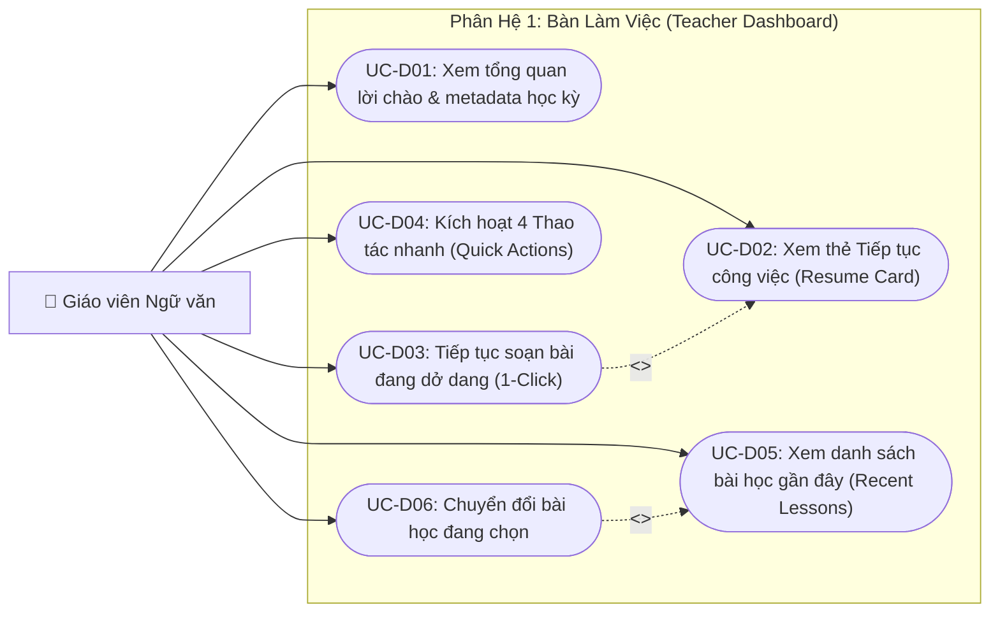
```mermaid
flowchart LR
    Teacher["👤 Giáo viên Ngữ văn"]

    subgraph Subsystem_Dashboard ["Phân Hệ 1: Bàn Làm Việc (Teacher Dashboard)"]
        UC_D01(["UC-D01: Xem tổng quan lời chào & metadata học kỳ"])
        UC_D02(["UC-D02: Xem thẻ Tiếp tục công việc (Resume Card)"])
        UC_D03(["UC-D03: Tiếp tục soạn bài đang dở dang (1-Click)"])
        UC_D04(["UC-D04: Kích hoạt 4 Thao tác nhanh (Quick Actions)"])
        UC_D05(["UC-D05: Xem danh sách bài học gần đây (Recent Lessons)"])
        UC_D06(["UC-D06: Chuyển đổi bài học đang chọn"])
    end

    Teacher --> UC_D01
    Teacher --> UC_D02
    Teacher --> UC_D03
    Teacher --> UC_D04
    Teacher --> UC_D05
    Teacher --> UC_D06

    UC_D03 -.->|"<<include>>"| UC_D02
    UC_D06 -.->|"<<include>>"| UC_D05
```

* **Mô tả Ca sử dụng chính**:
  - `UC-D03`: Giáo viên nhấn nút "Tiếp tục" tại Resume Card, hệ thống lập tức mở *Literature Workspace* với tác phẩm và tiến độ bài học tương ứng.
  - `UC-D04`: Giáo viên nhấp vào 1 trong 4 thẻ (Soạn bài, Phân tích văn bản, Tạo câu hỏi, Tạo đề) để điều hướng trực tiếp sang module chuyên trách.

---

### 4.2. Phân hệ 2: Không gian Đọc & Chú giải Tác phẩm (Literature Workspace / Reader)

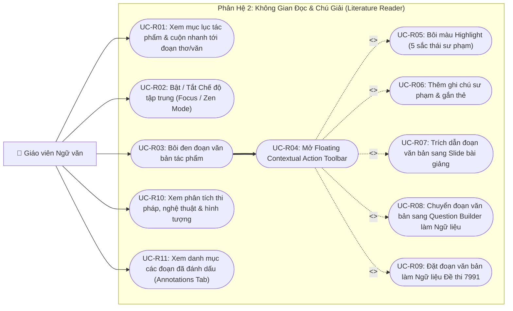
```mermaid
flowchart LR
    Teacher["👤 Giáo viên Ngữ văn"]

    subgraph Subsystem_Reader ["Phân Hệ 2: Không Gian Đọc & Chú Giải (Literature Reader)"]
        UC_R01(["UC-R01: Xem mục lục tác phẩm & cuộn nhanh tới đoạn thơ/văn"])
        UC_R02(["UC-R02: Bật / Tắt Chế độ tập trung (Focus / Zen Mode)"])
        UC_R03(["UC-R03: Bôi đen đoạn văn bản tác phẩm"])
        UC_R04(["UC-R04: Mở Floating Contextual Action Toolbar"])
        UC_R05(["UC-R05: Bôi màu Highlight (5 sắc thái sư phạm)"])
        UC_R06(["UC-R06: Thêm ghi chú sư phạm & gắn thẻ"])
        UC_R07(["UC-R07: Trích dẫn đoạn văn bản sang Slide bài giảng"])
        UC_R08(["UC-R08: Chuyển đoạn văn bản sang Question Builder làm Ngữ liệu"])
        UC_R09(["UC-R09: Đặt đoạn văn bản làm Ngữ liệu Đề thi 7991"])
        UC_R10(["UC-R10: Xem phân tích thi pháp, nghệ thuật & hình tượng"])
        UC_R11(["UC-R11: Xem danh mục các đoạn đã đánh dấu (Annotations Tab)"])
    end

    Teacher --> UC_R01
    Teacher --> UC_R02
    Teacher --> UC_R03
    Teacher --> UC_R10
    Teacher --> UC_R11

    UC_R03 ==> UC_R04
    UC_R04 -.->|"<<include>>"| UC_R05
    UC_R04 -.->|"<<include>>"| UC_R06
    UC_R04 -.->|"<<include>>"| UC_R07
    UC_R04 -.->|"<<include>>"| UC_R08
    UC_R04 -.->|"<<include>>"| UC_R09
```

* **Mô tả Ca sử dụng chính**:
  - `UC-R04`: Khi tác nhân bôi đen đoạn văn bản dài $\ge 2$ ký tự, hệ thống tự động tính toán tọa độ và mở thanh công cụ ngữ cảnh nổi ngay sát con trỏ chuột.
  - `UC-R07 / R08 / R09`: Thao tác 1-chạm đẩy dữ liệu liên thông sang các phân hệ Slide, Câu hỏi và Đề thi mà không cần sao chép trung gian.

---

### 4.3. Phân hệ 3: Phân tích Thể loại & Lược đồ Luận điểm (Genre Analysis & Argument Map)

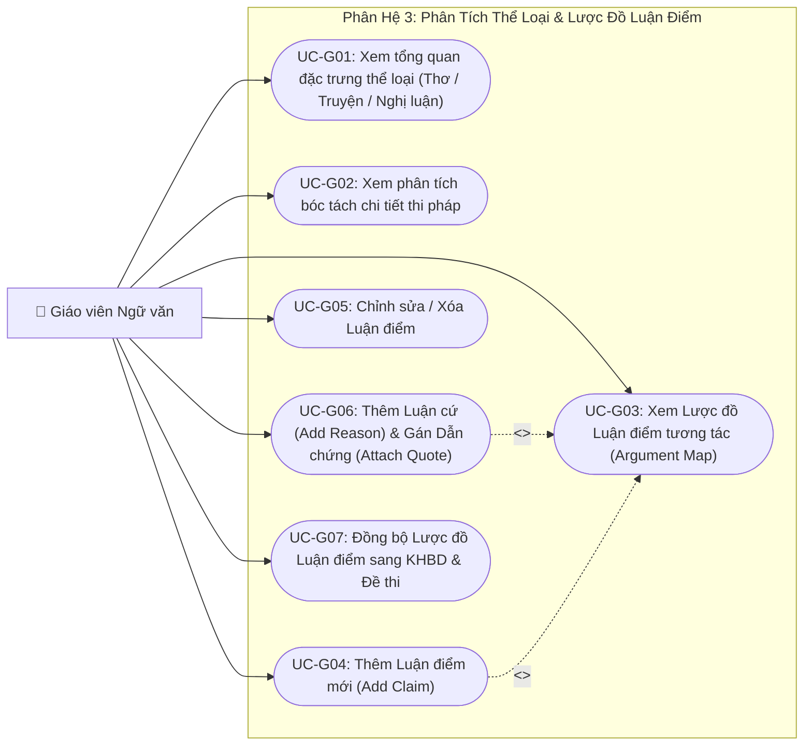
```mermaid
flowchart LR
    Teacher["👤 Giáo viên Ngữ văn"]

    subgraph Subsystem_Genre ["Phân Hệ 3: Phân Tích Thể Loại & Lược Đồ Luận Điểm"]
        UC_G01(["UC-G01: Xem tổng quan đặc trưng thể loại (Thơ / Truyện / Nghị luận)"])
        UC_G02(["UC-G02: Xem phân tích bóc tách chi tiết thi pháp"])
        UC_G03(["UC-G03: Xem Lược đồ Luận điểm tương tác (Argument Map)"])
        UC_G04(["UC-G04: Thêm Luận điểm mới (Add Claim)"])
        UC_G05(["UC-G05: Chỉnh sửa / Xóa Luận điểm"])
        UC_G06(["UC-G06: Thêm Luận cứ (Add Reason) & Gán Dẫn chứng (Attach Quote)"])
        UC_G07(["UC-G07: Đồng bộ Lược đồ Luận điểm sang KHBD & Đề thi"])
    end

    Teacher --> UC_G01
    Teacher --> UC_G02
    Teacher --> UC_G03
    Teacher --> UC_G04
    Teacher --> UC_G05
    Teacher --> UC_G06
    Teacher --> UC_G07

    UC_G06 -.->|"<<include>>"| UC_G03
    UC_G04 -.->|"<<include>>"| UC_G03
```

---

### 4.4. Phân hệ 4: Kế hoạch Bài dạy Chuẩn 5512 (KHBD Visual Builder & Document View)

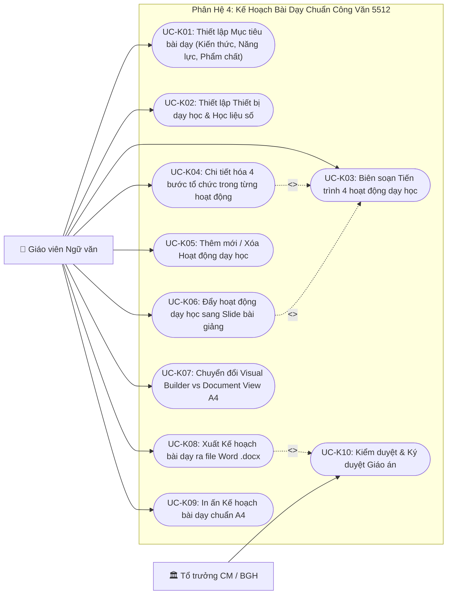
```mermaid
flowchart LR
    Teacher["👤 Giáo viên Ngữ văn"]
    Admin["🏛️ Tổ trưởng CM / BGH"]

    subgraph Subsystem_KHBD ["Phân Hệ 4: Kế Hoạch Bài Dạy Chuẩn Công Văn 5512"]
        UC_K01(["UC-K01: Thiết lập Mục tiêu bài dạy (Kiến thức, Năng lực, Phẩm chất)"])
        UC_K02(["UC-K02: Thiết lập Thiết bị dạy học & Học liệu số"])
        UC_K03(["UC-K03: Biên soạn Tiến trình 4 hoạt động dạy học"])
        UC_K04(["UC-K04: Chi tiết hóa 4 bước tổ chức trong từng hoạt động"])
        UC_K05(["UC-K05: Thêm mới / Xóa Hoạt động dạy học"])
        UC_K06(["UC-K06: Đẩy hoạt động dạy học sang Slide bài giảng"])
        UC_K07(["UC-K07: Chuyển đổi Visual Builder vs Document View A4"])
        UC_K08(["UC-K08: Xuất Kế hoạch bài dạy ra file Word .docx"])
        UC_K09(["UC-K09: In ấn Kế hoạch bài dạy chuẩn A4"])
        UC_K10(["UC-K10: Kiểm duyệt & Ký duyệt Giáo án"])
    end

    Teacher --> UC_K01
    Teacher --> UC_K02
    Teacher --> UC_K03
    Teacher --> UC_K04
    Teacher --> UC_K05
    Teacher --> UC_K06
    Teacher --> UC_K07
    Teacher --> UC_K08
    Teacher --> UC_K09

    Admin --> UC_K10

    UC_K04 -.->|"<<include>>"| UC_K03
    UC_K06 -.->|"<<extend>>"| UC_K03
    UC_K08 -.->|"<<extend>>"| UC_K10
```

---

### 4.5. Phân hệ 5: Ngân hàng Câu hỏi Đọc hiểu (Question Builder)

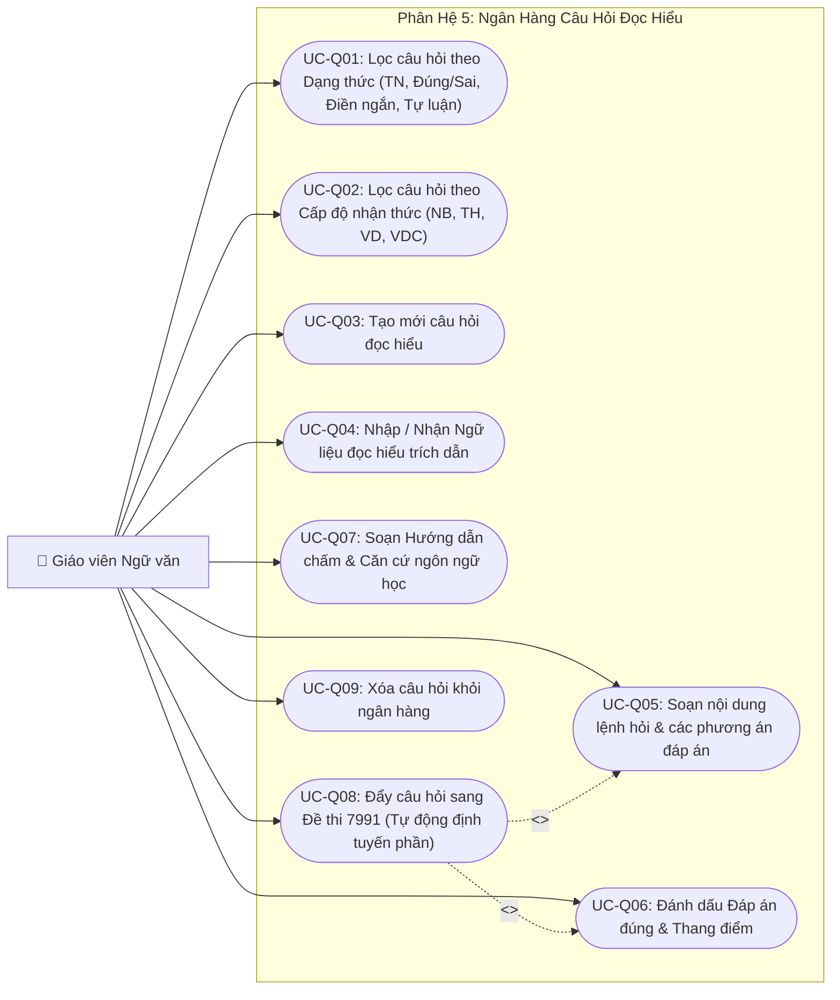
```mermaid
flowchart LR
    Teacher["👤 Giáo viên Ngữ văn"]

    subgraph Subsystem_Questions ["Phân Hệ 5: Ngân Hàng Câu Hỏi Đọc Hiểu"]
        UC_Q01(["UC-Q01: Lọc câu hỏi theo Dạng thức (TN, Đúng/Sai, Điền ngắn, Tự luận)"])
        UC_Q02(["UC-Q02: Lọc câu hỏi theo Cấp độ nhận thức (NB, TH, VD, VDC)"])
        UC_Q03(["UC-Q03: Tạo mới câu hỏi đọc hiểu"])
        UC_Q04(["UC-Q04: Nhập / Nhận Ngữ liệu đọc hiểu trích dẫn"])
        UC_Q05(["UC-Q05: Soạn nội dung lệnh hỏi & các phương án đáp án"])
        UC_Q06(["UC-Q06: Đánh dấu Đáp án đúng & Thang điểm"])
        UC_Q07(["UC-Q07: Soạn Hướng dẫn chấm & Căn cứ ngôn ngữ học"])
        UC_Q08(["UC-Q08: Đẩy câu hỏi sang Đề thi 7991 (Tự động định tuyến phần)"])
        UC_Q09(["UC-Q09: Xóa câu hỏi khỏi ngân hàng"])
    end

    Teacher --> UC_Q01
    Teacher --> UC_Q02
    Teacher --> UC_Q03
    Teacher --> UC_Q04
    Teacher --> UC_Q05
    Teacher --> UC_Q06
    Teacher --> UC_Q07
    Teacher --> UC_Q08
    Teacher --> UC_Q09

    UC_Q08 -.->|"<<include>>"| UC_Q05
    UC_Q08 -.->|"<<include>>"| UC_Q06
```

---

### 4.6. Phân hệ 6: Đề Kiểm tra Định kỳ Chuẩn 7991 (Exam 7991 Paper & Marking Guide)

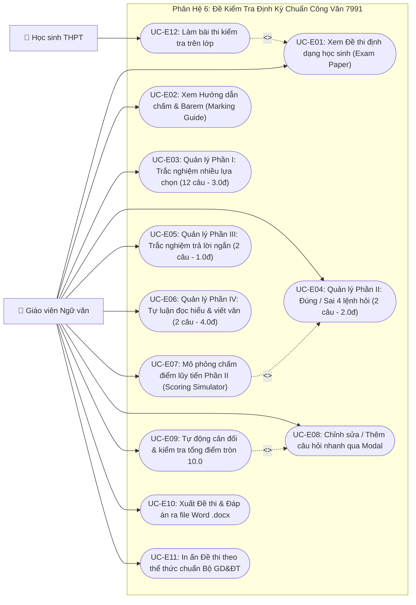
```mermaid
flowchart LR
    Teacher["👤 Giáo viên Ngữ văn"]
    Student["👥 Học sinh THPT"]

    subgraph Subsystem_Exam ["Phân Hệ 6: Đề Kiểm Tra Định Kỳ Chuẩn Công Văn 7991"]
        UC_E01(["UC-E01: Xem Đề thi định dạng học sinh (Exam Paper)"])
        UC_E02(["UC-E02: Xem Hướng dẫn chấm & Barem (Marking Guide)"])
        UC_E03(["UC-E03: Quản lý Phần I: Trắc nghiệm nhiều lựa chọn (12 câu - 3.0đ)"])
        UC_E04(["UC-E04: Quản lý Phần II: Đúng / Sai 4 lệnh hỏi (2 câu - 2.0đ)"])
        UC_E05(["UC-E05: Quản lý Phần III: Trắc nghiệm trả lời ngắn (2 câu - 1.0đ)"])
        UC_E06(["UC-E06: Quản lý Phần IV: Tự luận đọc hiểu & viết văn (2 câu - 4.0đ)"])
        UC_E07(["UC-E07: Mô phỏng chấm điểm lũy tiến Phần II (Scoring Simulator)"])
        UC_E08(["UC-E08: Chỉnh sửa / Thêm câu hỏi nhanh qua Modal"])
        UC_E09(["UC-E09: Tự động cân đối & kiểm tra tổng điểm tròn 10.0"])
        UC_E10(["UC-E10: Xuất Đề thi & Đáp án ra file Word .docx"])
        UC_E11(["UC-E11: In ấn Đề thi theo thể thức chuẩn Bộ GD&ĐT"])
        UC_E12(["UC-E12: Làm bài thi kiểm tra trên lớp"])
    end

    Teacher --> UC_E01
    Teacher --> UC_E02
    Teacher --> UC_E03
    Teacher --> UC_E04
    Teacher --> UC_E05
    Teacher --> UC_E06
    Teacher --> UC_E07
    Teacher --> UC_E08
    Teacher --> UC_E09
    Teacher --> UC_E10
    Teacher --> UC_E11

    Student --> UC_E12

    UC_E07 -.->|"<<include>>"| UC_E04
    UC_E09 -.->|"<<include>>"| UC_E08
    UC_E12 -.->|"<<extend>>"| UC_E01
```

* **Mô tả Ca sử dụng chính**:
  - `UC-E07`: Giáo viên hoặc học sinh nhấp chọn thử các phương án đúng/sai của 4 phát biểu a, b, c, d; hệ thống kích hoạt công thức lũy tiến tính điểm tự động: Đúng 1 ý = 0.1đ; Đúng 2 ý = 0.25đ; Đúng 3 ý = 0.5đ; Đúng 4 ý = 1.0đ.

---

### 4.7. Phân hệ 7: Ma trận Đề thi 2 Chiều & Bản đặc tả YCCĐ (Matrix & Specifications)

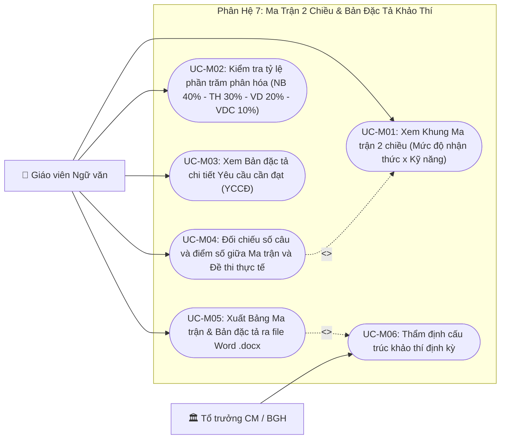
```mermaid
flowchart LR
    Teacher["👤 Giáo viên Ngữ văn"]
    Admin["🏛️ Tổ trưởng CM / BGH"]

    subgraph Subsystem_Matrix ["Phân Hệ 7: Ma Trận 2 Chiều & Bản Đặc Tả Khảo Thí"]
        UC_M01(["UC-M01: Xem Khung Ma trận 2 chiều (Mức độ nhận thức x Kỹ năng)"])
        UC_M02(["UC-M02: Kiểm tra tỷ lệ phần trăm phân hóa (NB 40% - TH 30% - VD 20% - VDC 10%)"])
        UC_M03(["UC-M03: Xem Bản đặc tả chi tiết Yêu cầu cần đạt (YCCĐ)"])
        UC_M04(["UC-M04: Đối chiếu số câu và điểm số giữa Ma trận và Đề thi thực tế"])
        UC_M05(["UC-M05: Xuất Bảng Ma trận & Bản đặc tả ra file Word .docx"])
        UC_M06(["UC-M06: Thẩm định cấu trúc khảo thí định kỳ"])
    end

    Teacher --> UC_M01
    Teacher --> UC_M02
    Teacher --> UC_M03
    Teacher --> UC_M04
    Teacher --> UC_M05

    Admin --> UC_M06

    UC_M04 -.->|"<<include>>"| UC_M01
    UC_M05 -.->|"<<extend>>"| UC_M06
```

---

### 4.8. Phân hệ 8: Rubric Đánh giá Tự luận (Rubric Builder)

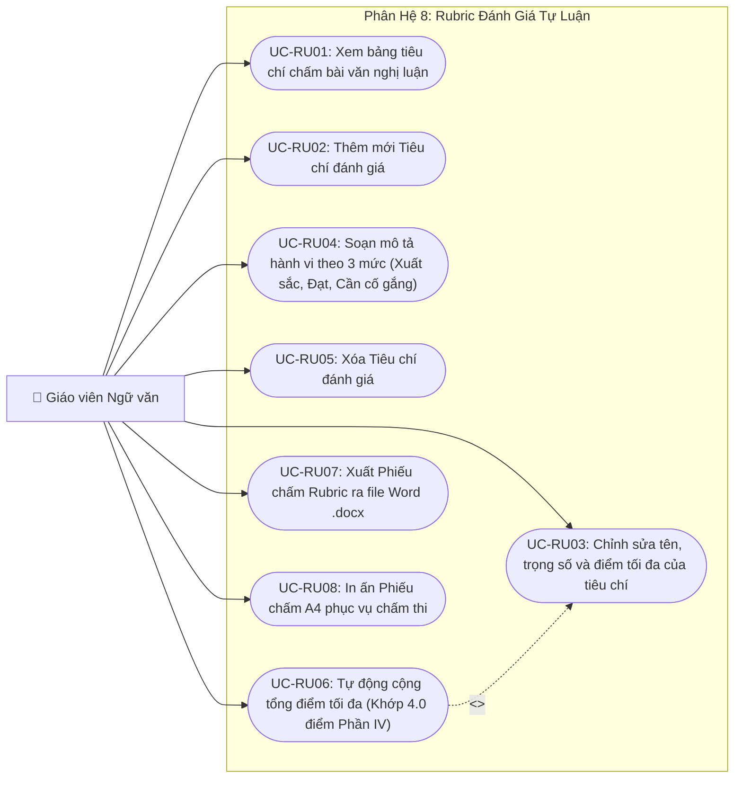
```mermaid
flowchart LR
    Teacher["👤 Giáo viên Ngữ văn"]

    subgraph Subsystem_Rubric ["Phân Hệ 8: Rubric Đánh Giá Tự Luận"]
        UC_RU01(["UC-RU01: Xem bảng tiêu chí chấm bài văn nghị luận"])
        UC_RU02(["UC-RU02: Thêm mới Tiêu chí đánh giá"])
        UC_RU03(["UC-RU03: Chỉnh sửa tên, trọng số và điểm tối đa của tiêu chí"])
        UC_RU04(["UC-RU04: Soạn mô tả hành vi theo 3 mức (Xuất sắc, Đạt, Cần cố gắng)"])
        UC_RU05(["UC-RU05: Xóa Tiêu chí đánh giá"])
        UC_RU06(["UC-RU06: Tự động cộng tổng điểm tối đa (Khớp 4.0 điểm Phần IV)"])
        UC_RU07(["UC-RU07: Xuất Phiếu chấm Rubric ra file Word .docx"])
        UC_RU08(["UC-RU08: In ấn Phiếu chấm A4 phục vụ chấm thi"])
    end

    Teacher --> UC_RU01
    Teacher --> UC_RU02
    Teacher --> UC_RU03
    Teacher --> UC_RU04
    Teacher --> UC_RU05
    Teacher --> UC_RU06
    Teacher --> UC_RU07
    Teacher --> UC_RU08

    UC_RU06 -.->|"<<include>>"| UC_RU03
```

---

### 4.9. Phân hệ 9: Trình chiếu Bài giảng Điện tử (Slides Studio)

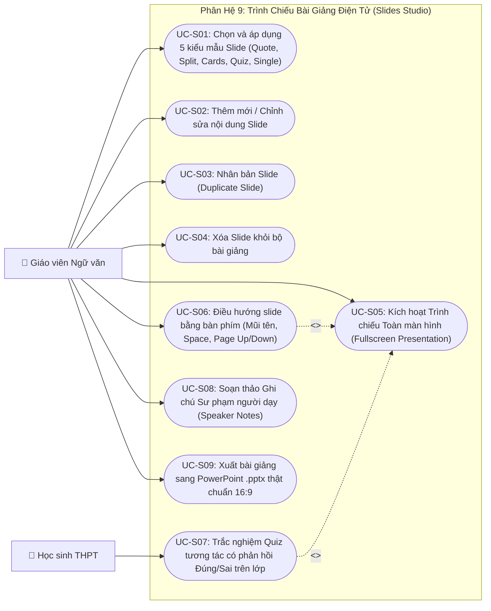
```mermaid
flowchart LR
    Teacher["👤 Giáo viên Ngữ văn"]
    Student["👥 Học sinh THPT"]

    subgraph Subsystem_Slides ["Phân Hệ 9: Trình Chiếu Bài Giảng Điện Tử (Slides Studio)"]
        UC_S01(["UC-S01: Chọn và áp dụng 5 kiểu mẫu Slide (Quote, Split, Cards, Quiz, Single)"])
        UC_S02(["UC-S02: Thêm mới / Chỉnh sửa nội dung Slide"])
        UC_S03(["UC-S03: Nhân bản Slide (Duplicate Slide)"])
        UC_S04(["UC-S04: Xóa Slide khỏi bộ bài giảng"])
        UC_S05(["UC-S05: Kích hoạt Trình chiếu Toàn màn hình (Fullscreen Presentation)"])
        UC_S06(["UC-S06: Điều hướng slide bằng bàn phím (Mũi tên, Space, Page Up/Down)"])
        UC_S07(["UC-S07: Trắc nghiệm Quiz tương tác có phản hồi Đúng/Sai trên lớp"])
        UC_S08(["UC-S08: Soạn thảo Ghi chú Sư phạm người dạy (Speaker Notes)"])
        UC_S09(["UC-S09: Xuất bài giảng sang PowerPoint .pptx thật chuẩn 16:9"])
    end

    Teacher --> UC_S01
    Teacher --> UC_S02
    Teacher --> UC_S03
    Teacher --> UC_S04
    Teacher --> UC_S05
    Teacher --> UC_S06
    Teacher --> UC_S08
    Teacher --> UC_S09

    Student --> UC_S07

    UC_S07 -.->|"<<include>>"| UC_S05
    UC_S06 -.->|"<<include>>"| UC_S05
```

---

### 4.10. Phân hệ 10: Trung tâm Xuất bản & Bàn giao (Export & Handover Center)

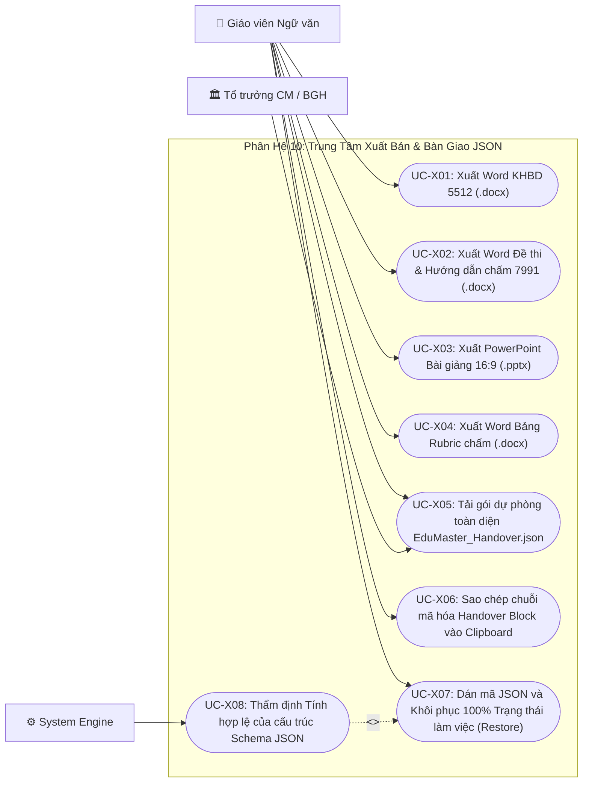
```mermaid
flowchart LR
    Teacher["👤 Giáo viên Ngữ văn"]
    Admin["🏛️ Tổ trưởng CM / BGH"]
    Engine["⚙️ System Engine"]

    subgraph Subsystem_Export ["Phân Hệ 10: Trung Tâm Xuất Bản & Bàn Giao JSON"]
        UC_X01(["UC-X01: Xuất Word KHBD 5512 (.docx)"])
        UC_X02(["UC-X02: Xuất Word Đề thi & Hướng dẫn chấm 7991 (.docx)"])
        UC_X03(["UC-X03: Xuất PowerPoint Bài giảng 16:9 (.pptx)"])
        UC_X04(["UC-X04: Xuất Word Bảng Rubric chấm (.docx)"])
        UC_X05(["UC-X05: Tải gói dự phòng toàn diện EduMaster_Handover.json"])
        UC_X06(["UC-X06: Sao chép chuỗi mã hóa Handover Block vào Clipboard"])
        UC_X07(["UC-X07: Dán mã JSON và Khôi phục 100% Trạng thái làm việc (Restore)"])
        UC_X08(["UC-X08: Thẩm định Tính hợp lệ của cấu trúc Schema JSON"])
    end

    Teacher --> UC_X01
    Teacher --> UC_X02
    Teacher --> UC_X03
    Teacher --> UC_X04
    Teacher --> UC_X05
    Teacher --> UC_X06
    Teacher --> UC_X07

    Admin --> UC_X05
    Engine --> UC_X08

    UC_X08 -.->|"<<include>>"| UC_X07
```

---

### 4.11. Phân hệ 11: Phòng Kiểm định Kiểu chữ Tiếng Việt (Typography Verification Suite)

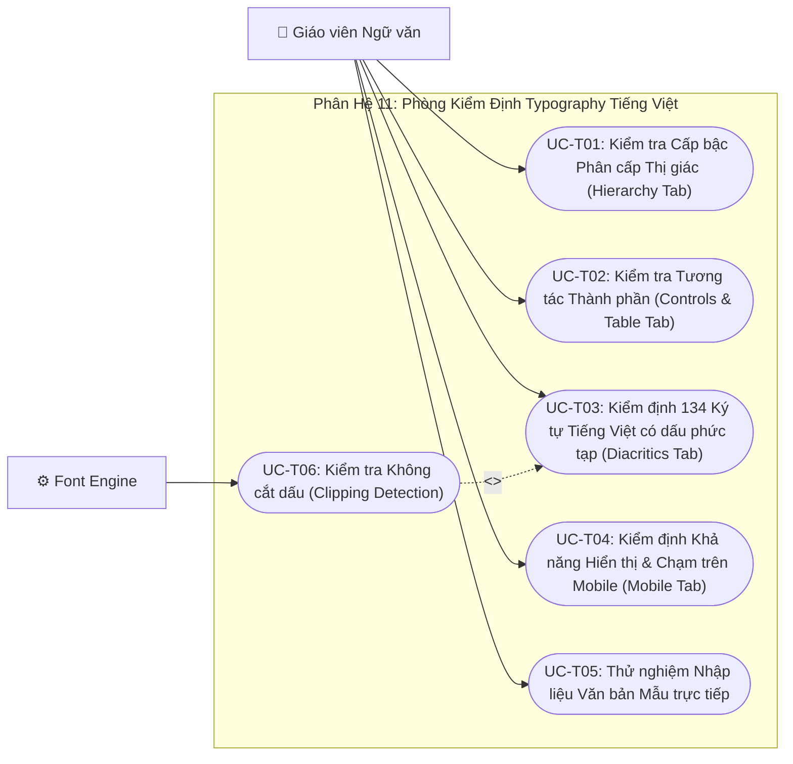
```mermaid
flowchart LR
    Teacher["👤 Giáo viên Ngữ văn"]
    Engine["⚙️ Font Engine"]

    subgraph Subsystem_Typography ["Phân Hệ 11: Phòng Kiểm Định Typography Tiếng Việt"]
        UC_T01(["UC-T01: Kiểm tra Cấp bậc Phân cấp Thị giác (Hierarchy Tab)"])
        UC_T02(["UC-T02: Kiểm tra Tương tác Thành phần (Controls & Table Tab)"])
        UC_T03(["UC-T03: Kiểm định 134 Ký tự Tiếng Việt có dấu phức tạp (Diacritics Tab)"])
        UC_T04(["UC-T04: Kiểm định Khả năng Hiển thị & Chạm trên Mobile (Mobile Tab)"])
        UC_T05(["UC-T05: Thử nghiệm Nhập liệu Văn bản Mẫu trực tiếp"])
        UC_T06(["UC-T06: Kiểm tra Không cắt dấu (Clipping Detection)"])
    end

    Teacher --> UC_T01
    Teacher --> UC_T02
    Teacher --> UC_T03
    Teacher --> UC_T04
    Teacher --> UC_T05

    Engine --> UC_T06

    UC_T06 -.->|"<<include>>"| UC_T03
```

---

### 4.12. Khung vỏ Toàn cục: Thanh Điều hướng Đỉnh & Cài đặt (Global App Shell & Settings)

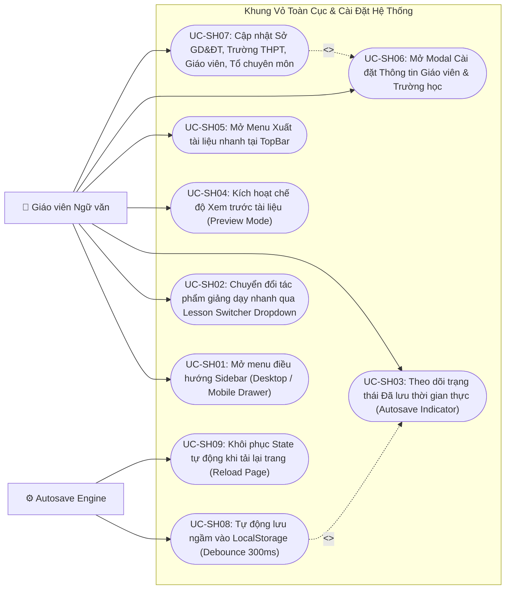
```mermaid
flowchart LR
    Teacher["👤 Giáo viên Ngữ văn"]
    Engine["⚙️ Autosave Engine"]

    subgraph Subsystem_AppShell ["Khung Vỏ Toàn Cục & Cài Đặt Hệ Thống"]
        UC_SH01(["UC-SH01: Mở menu điều hướng Sidebar (Desktop / Mobile Drawer)"])
        UC_SH02(["UC-SH02: Chuyển đổi tác phẩm giảng dạy nhanh qua Lesson Switcher Dropdown"])
        UC_SH03(["UC-SH03: Theo dõi trạng thái Đã lưu thời gian thực (Autosave Indicator)"])
        UC_SH04(["UC-SH04: Kích hoạt chế độ Xem trước tài liệu (Preview Mode)"])
        UC_SH05(["UC-SH05: Mở Menu Xuất tài liệu nhanh tại TopBar"])
        UC_SH06(["UC-SH06: Mở Modal Cài đặt Thông tin Giáo viên & Trường học"])
        UC_SH07(["UC-SH07: Cập nhật Sở GD&ĐT, Trường THPT, Giáo viên, Tổ chuyên môn"])
        UC_SH08(["UC-SH08: Tự động lưu ngầm vào LocalStorage (Debounce 300ms)"])
        UC_SH09(["UC-SH09: Khôi phục State tự động khi tải lại trang (Reload Page)"])
    end

    Teacher --> UC_SH01
    Teacher --> UC_SH02
    Teacher --> UC_SH03
    Teacher --> UC_SH04
    Teacher --> UC_SH05
    Teacher --> UC_SH06
    Teacher --> UC_SH07

    Engine --> UC_SH08
    Engine --> UC_SH09

    UC_SH07 -.->|"<<include>>"| UC_SH06
    UC_SH08 -.->|"<<include>>"| UC_SH03
```

---

## 5. SƠ ĐỒ LUỒNG USE CASE LIÊN THÔNG XUYÊN PHÂN HỆ (CROSS-SUBSYSTEM FLOW)

Sơ đồ thể hiện chu trình khép kín khi giáo viên thực hiện công tác chuẩn bị bài giảng và khảo thí từ đầu đến cuối:

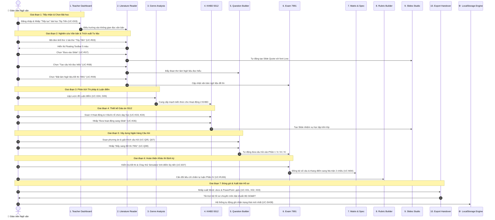
```mermaid
sequenceDiagram
    autonumber
    actor T as 👤 Giáo viên Ngữ văn
    participant D as 1. Teacher Dashboard
    participant R as 2. Literature Reader
    participant G as 3. Genre Analysis
    participant K as 4. KHBD 5512
    participant Q as 5. Question Builder
    participant E as 6. Exam 7991
    participant M as 7. Matrix & Spec
    participant RU as 8. Rubric Builder
    participant S as 9. Slides Studio
    participant EX as 10. Export Handover
    participant DB as ⚙️ LocalStorage Engine

    Note over T, D: Giai đoạn 1: Tiếp nhận & Chọn Bài học
    T->>D: Đăng nhập & Nhấp "Tiếp tục" bài học Tây Tiến (UC-D03)
    D->>R: Điều hướng vào không gian đọc văn bản

    Note over T, R: Giai đoạn 2: Nghiên cứu Văn bản & Trích xuất Tư liệu
    T->>R: Bôi đen khổ thơ 1 bài thơ "Tây Tiến" (UC-R03)
    R-->>T: Hiển thị Floating Toolbar 5 màu
    T->>R: Chọn "Đưa vào Slide" (UC-R07)
    R->>S: Tự động tạo Slide Quote với font Lora
    T->>R: Chọn "Tạo câu hỏi đọc hiểu" (UC-R08)
    R->>Q: Đẩy đoạn thơ làm Ngữ liệu đọc hiểu
    T->>R: Chọn "Đặt làm Ngữ liệu Đề thi 7991" (UC-R09)
    R->>E: Cập nhật văn bản ngữ liệu đề thi

    Note over T, G: Giai đoạn 3: Phân tích Thi pháp & Luận điểm
    T->>G: Lập Lược đồ Luận điểm (UC-G04, G06)
    G-->>K: Cung cấp mạch kiến thức cho Hoạt động 2 KHBD

    Note over T, K: Giai đoạn 4: Thiết kế Giáo án 5512
    T->>K: Soạn 4 Hoạt động & 4 Bước tổ chức dạy học (UC-K03, K04)
    T->>K: Nhấp "Đưa hoạt động sang Slide" (UC-K06)
    K->>S: Tạo Slide nhiệm vụ học tập trên lớp

    Note over T, Q: Giai đoạn 5: Xây dựng Ngân hàng Câu hỏi
    T->>Q: Soạn phương án & giải thích câu hỏi (UC-Q05, Q07)
    T->>Q: Nhấp "Đẩy sang Đề thi 7991" (UC-Q08)
    Q->>E: Tự động đưa câu hỏi vào Phần I / II / III / IV

    Note over T, E: Giai đoạn 6: Hoàn thiện Khảo thí Định kỳ
    T->>E: Kiểm tra Đề thi & Chạy thử Simulator tính điểm lũy tiến (UC-E07)
    E->>M: Đồng bộ số câu & thang điểm sang Ma trận 2 chiều (UC-M04)
    T->>RU: Cân đối tiêu chí chấm tự luận Phần IV (UC-RU06)

    Note over T, EX: Giai đoạn 7: Đóng gói & Xuất bản Hồ sơ
    T->>EX: Nhấp xuất Word .docx & PowerPoint .pptx (UC-X01, X02, X03)
    EX->>T: Tải trọn bộ hồ sơ chuyên môn đạt chuẩn Bộ GD&ĐT
    T->>DB: Hệ thống tự động ghi nhận trạng thái mới nhất (UC-SH08)
```

---

## 6. BẢNG TỔNG HỢP MÃ USE CASE & TIÊU CHÍ NGHIỆM THU

| Mã Use Case | Tên Ca Sử Dụng | Phân Hệ Phụ Trách | Đầu Vào (Input) | Đầu Ra (Output / Result) | Mức Độ Ưu Tiên |
| :--- | :--- | :--- | :--- | :--- | :---: |
| **UC-D03** | Tiếp tục soạn bài đang dở | Dashboard | Nhấp nút "Tiếp tục" | Chuyển ngay đến Reader của bài học đang chọn | **P0** |
| **UC-R04** | Mở Floating Contextual Toolbar | Literature Reader | Bôi đen văn bản $\ge 2$ ký tự | Thanh công cụ nổi bật ngay sát con trỏ chuột | **P0** |
| **UC-R07** | Trích dẫn văn bản sang Slide | Literature Reader | Nhấp icon Slide trên Floating Bar | Tạo 1 slide mới kiểu Quote trong Slides Studio | **P1** |
| **UC-R08** | Chuyển đoạn văn sang Question Builder | Literature Reader | Nhấp icon Hỏi trên Floating Bar | Đẩy đoạn văn vào ô Ngữ liệu của Question Builder | **P1** |
| **UC-R09** | Đặt làm Ngữ liệu Đề thi 7991 | Literature Reader | Nhấp icon Đề trên Floating Bar | Cập nhật ngữ liệu Đọc hiểu trong Exam View | **P1** |
| **UC-K03** | Soạn tiến trình 4 hoạt động 5512 | KHBD View | Nhập mục tiêu, nội dung, sản phẩm | Kế hoạch bài dạy hoàn chỉnh 4 hoạt động | **P0** |
| **UC-K06** | Đưa hoạt động dạy học sang Slide | KHBD View | Nhấp icon "Sang Slide" tại hoạt động | Sinh slide bài giảng chứa nhiệm vụ của hoạt động | **P1** |
| **UC-Q08** | Đẩy câu hỏi vào Đề thi 7991 | Question Builder | Nhấp nút "Đẩy sang Đề thi" | Câu hỏi xuất hiện đúng Phần I/II/III/IV của Đề thi | **P0** |
| **UC-E04** | Thiết lập câu hỏi Đúng/Sai Phần II | Exam 7991 View | 1 câu hỏi gồm 4 phát biểu a, b, c, d | Giao diện khảo thí Phần II chuẩn Công văn 7991 | **P0** |
| **UC-E07** | Mô phỏng tính điểm lũy tiến Phần II | Exam 7991 View | Nhấp chọn các ý Đúng/Sai học sinh | Điểm tự động tính (0.1đ / 0.25đ / 0.5đ / 1.0đ) | **P1** |
| **UC-M01** | Xem Khung Ma trận 2 chiều | Matrix View | Dữ liệu từ Đề thi 7991 | Bảng ma trận tổng hợp số câu, điểm và % phân hóa | **P0** |
| **UC-RU06**| Tự động tính tổng điểm Rubric | Rubric Builder | Trọng số các tiêu chí đánh giá | Tổng điểm khớp với thang 4.0đ của Phần IV | **P1** |
| **UC-S07** | Trắc nghiệm tương tác trên Slide | Slides Studio | Nhấp chọn đáp án A, B, C, D | Phản hồi Đúng/Sai và hộp giải thích sư phạm | **P1** |
| **UC-S09** | Xuất bài giảng sang PowerPoint .pptx | Slides Studio | Nhấp "Xuất PowerPoint (.pptx)" | Tệp trình chiếu OpenXML 16:9 kèm Speaker Notes | **P0** |
| **UC-X01** | Xuất Kế hoạch bài dạy sang Word .docx | Export Center | Nhấp "Word KHBD 5512 (.docx)" | Tệp tài liệu Word OpenXML A4 thể thức chuẩn | **P0** |
| **UC-X02** | Xuất Đề thi & Barem sang Word .docx | Export Center | Nhấp "Word Đề thi 7991 (.docx)" | Tệp Word gồm Đề thi, Ma trận, Đặc tả, Đáp án | **P0** |
| **UC-X07** | Nhập mã JSON và khôi phục State | Export Center | Dán chuỗi JSON Handover | Khôi phục 100% dữ liệu bài dạy, đề thi, slide | **P0** |
| **UC-SH08**| Tự động lưu ngầm LocalStorage | App Shell | Mọi thao tác chỉnh sửa dữ liệu | Lưu ngầm sau 300ms, hiển thị giờ lưu trên TopBar | **P0** |

---
*Tài liệu được khởi tạo và lưu trữ chính thức tại: `docs/SO_DO_CHUC_NANG_USECASE_EDUMASTER_VAN.md`.*
