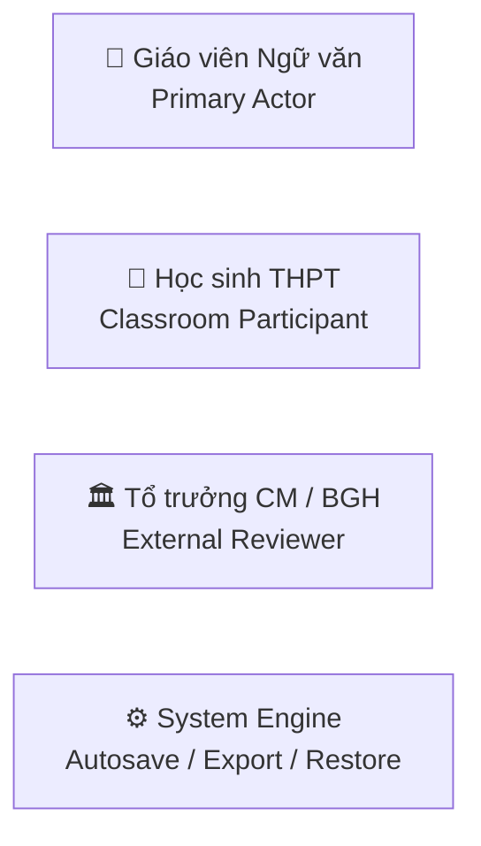
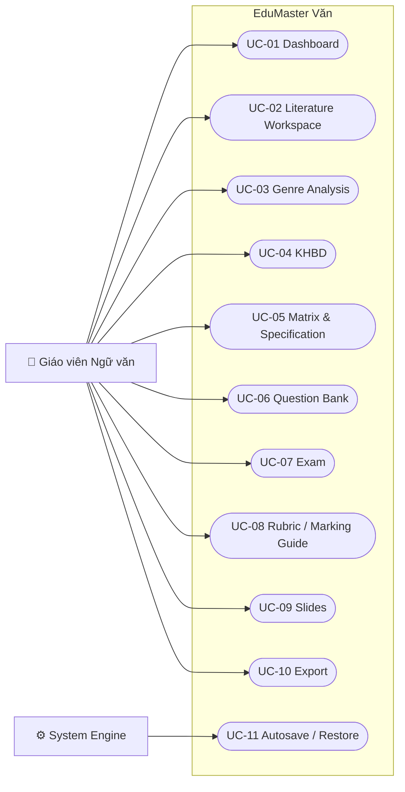
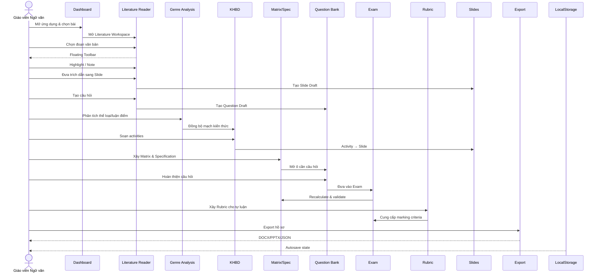

# TÀI LIỆU SƠ ĐỒ CHỨC NĂNG & USE CASE HỆ THỐNG EDUMASTER VĂN

> **Hệ thống:** EduMaster Văn — Không gian Giảng dạy Ngữ văn THPT & Khảo thí  
> **Đối tượng chính:** Giáo viên Ngữ văn THPT  
> **Phạm vi:** Giáo viên truy cập trực tiếp; không có authentication trong scope hiện tại

---

# 1. ACTOR

## Giáo viên
Dùng trực tiếp:
- Dashboard
- Literature Workspace
- Genre Analysis
- KHBD
- Question Bank
- Matrix & Specification
- Exam
- Rubric
- Slides
- Export

## Học sinh
Không đăng nhập hệ thống trong scope hiện tại.
- xem slide;
- trả lời quiz trên lớp;
- làm đề giáo viên xuất.

## Tổ trưởng/BGH
Không đăng nhập hệ thống.
- nhận hồ sơ export;
- review bên ngoài.

---

# 2. FUNCTIONAL DECOMPOSITION

```mermaid
flowchart TD
    Root["EDUMASTER VĂN"]

    Root --> F1["Dashboard"]
    Root --> F2["Literature Workspace"]
    Root --> F3["Genre Analysis"]
    Root --> F4["KHBD"]
    Root --> F5["Question Bank"]
    Root --> F6["Matrix & Specification"]
    Root --> F7["Exam Builder"]
    Root --> F8["Rubric / Marking Guide"]
    Root --> F9["Slides Studio"]
    Root --> F10["Export Center"]
    Root --> F11["System Services"]

    F2 --> F21["Outline"]
    F2 --> F22["Focus Mode"]
    F2 --> F23["Highlight / Annotation"]
    F2 --> F24["Reader → Slide / Question / Exam"]
    F2 --> F25["Thi pháp / Hình tượng"]

    F3 --> F31["Thể loại"]
    F3 --> F32["Argument Map"]
    F3 --> F33["Dẫn chứng"]

    F4 --> F41["Mục tiêu"]
    F4 --> F42["Thiết bị / Học liệu"]
    F4 --> F43["Hoạt động"]
    F4 --> F44["4 bước tổ chức"]
    F4 --> F45["Document View"]
    F4 --> F46["To Slide"]

    F5 --> F51["Ngữ liệu"]
    F5 --> F52["4 dạng câu hỏi"]
    F5 --> F53["Đáp án / Hướng dẫn chấm"]
    F5 --> F54["To Exam"]

    F6 --> F61["Matrix"]
    F6 --> F62["Specification"]
    F6 --> F63["Exam Validation"]

    F7 --> F71["Sections"]
    F7 --> F72["Question management"]
    F7 --> F73["Statistics"]
    F7 --> F74["Marking Guide"]

    F8 --> F81["Criteria"]
    F8 --> F82["Weights / Points"]
    F8 --> F83["Quality Levels"]

    F9 --> F91["Quote / Split / Cards / Quiz"]
    F9 --> F92["Fullscreen"]
    F9 --> F93["PPTX"]

    F10 --> F101["DOCX"]
    F10 --> F102["PPTX"]
    F10 --> F103["JSON Backup/Restore"]

    F11 --> F111["Autosave"]
    F11 --> F112["Schema Migration"]
```

---

# 3. GLOBAL USE CASE

---

# 4. DASHBOARD USE CASES

- UC-D01: Xem Resume Card
- UC-D02: Tiếp tục bài hiện tại
- UC-D03: Quick Actions
- UC-D04: Xem Recent Lessons
- UC-D05: Chuyển Current Lesson

---

# 5. LITERATURE WORKSPACE USE CASES

- UC-R01: Xem mục lục tác phẩm
- UC-R02: Focus / Zen Mode
- UC-R03: Chọn đoạn văn bản
- UC-R04: Mở Floating Toolbar
- UC-R05: Highlight
- UC-R06: Ghi chú / Tag
- UC-R07: Đưa trích dẫn sang Slide
- UC-R08: Tạo câu hỏi từ trích dẫn
- UC-R09: Đặt trích dẫn làm ngữ liệu đề
- UC-R10: Xem phân tích thi pháp/hình tượng
- UC-R11: Xem Annotations

---

# 6. GENRE ANALYSIS USE CASES

- UC-G01: Xem đặc trưng thể loại
- UC-G02: Phân tích thi pháp
- UC-G03: Xem Argument Map
- UC-G04: Thêm/Sửa/Xóa luận điểm
- UC-G05: Thêm luận cứ
- UC-G06: Gắn dẫn chứng
- UC-G07: Đồng bộ sang KHBD/Slide/Question

---

# 7. KHBD USE CASES

- UC-K01: Thiết lập mục tiêu
- UC-K02: Thiết bị & học liệu
- UC-K03: Biên soạn hoạt động
- UC-K04: 4 bước tổ chức
- UC-K05: Thêm/Xóa activity
- UC-K06: Activity → Slide
- UC-K07: Visual / Document View
- UC-K08: Export Word
- UC-K09: Print A4

---

# 8. MATRIX & SPECIFICATION USE CASES

- UC-M01: Xây Matrix từ YCCĐ
- UC-M02: Phân bổ dạng câu/mức độ/điểm
- UC-M03: Sinh/hiển thị Specification
- UC-M04: Matrix cell → Question Bank
- UC-M05: Validate Exam với Matrix
- UC-M06: Export Matrix/Spec

---

# 9. QUESTION BANK USE CASES

- UC-Q01: Lọc câu theo tác phẩm/chủ đề
- UC-Q02: Lọc theo mức độ
- UC-Q03: Tạo câu hỏi
- UC-Q04: Nhận ngữ liệu từ Reader
- UC-Q05: Soạn đáp án
- UC-Q06: Soạn hướng dẫn chấm
- UC-Q07: Gắn YCCĐ/metadata
- UC-Q08: Đưa câu vào Exam
- UC-Q09: Xóa câu hỏi có dependency check

---

# 10. EXAM USE CASES

- UC-E01: Xem Exam Paper
- UC-E02: Xem Marking Guide
- UC-E03: Quản lý MCQ
- UC-E04: Quản lý True/False
- UC-E05: Quản lý Short Answer
- UC-E06: Quản lý Essay
- UC-E07: Edit/Add/Remove/Reorder
- UC-E08: Tính tổng điểm
- UC-E09: Validate Matrix
- UC-E10: Export Word
- UC-E11: Print

Không hard-code số câu hoặc scoring đặc thù nếu không được source xác nhận.

---

# 11. RUBRIC USE CASES

- UC-RU01: Xem Rubric
- UC-RU02: Thêm tiêu chí
- UC-RU03: Sửa tên/trọng số/điểm
- UC-RU04: Mô tả mức chất lượng
- UC-RU05: Xóa tiêu chí
- UC-RU06: Tính tổng điểm
- UC-RU07: Export Word
- UC-RU08: Print

---

# 12. SLIDES USE CASES

- UC-S01: Tạo Quote/Split/Cards/Quiz/Summary
- UC-S02: Edit slide
- UC-S03: Duplicate
- UC-S04: Delete
- UC-S05: Fullscreen
- UC-S06: Keyboard navigation
- UC-S07: Teacher-controlled Quiz
- UC-S08: Speaker Notes
- UC-S09: PPTX export

---

# 13. EXPORT USE CASES

- UC-X01: Export KHBD DOCX
- UC-X02: Export Exam DOCX
- UC-X03: Export PPTX
- UC-X04: Export Matrix/Spec
- UC-X05: Export Rubric/Marking
- UC-X06: Download JSON backup
- UC-X07: Copy JSON
- UC-X08: Restore JSON
- UC-X09: Validate schema

---

# 14. APP SHELL USE CASES

- UC-SH01: Sidebar desktop/mobile
- UC-SH02: Lesson Switcher
- UC-SH03: Autosave Indicator
- UC-SH04: Preview
- UC-SH05: Quick Export
- UC-SH06: Autosave LocalStorage
- UC-SH07: Restore khi reload

Không có Login/Profile/Auth trong scope hiện tại.

---

# 15. CROSS-SUBSYSTEM FLOW

---

# 16. TIÊU CHÍ NGHIỆM THU P0

| ID | Chức năng | Kết quả |
|---|---|---|
| UC-D02 | Tiếp tục bài | Mở đúng Reader |
| UC-R04 | Floating Toolbar | Hiện khi chọn text |
| UC-R07 | Reader → Slide | Tạo Slide Draft |
| UC-R08 | Reader → Question | Tạo Question Draft |
| UC-K03 | KHBD | Lưu activities |
| UC-K06 | KHBD → Slide | Sinh slide |
| UC-M01 | Matrix | Hiển thị đúng plan |
| UC-Q08 | Question → Exam | Câu vào đúng section |
| UC-E09 | Exam Validation | Phát hiện mismatch |
| UC-RU06 | Rubric total | Tính đúng tổng |
| UC-S05 | Fullscreen | Trình chiếu được |
| UC-S09 | PPTX | Tạo file thật |
| UC-X01 | KHBD DOCX | Tạo file thật |
| UC-X08 | Restore JSON | Khôi phục state |
| UC-SH06 | Autosave | Lưu localStorage |