# TÀI LIỆU SƠ ĐỒ FLOW HIỂN THỊ UI TOÀN BỘ HỆ THỐNG EDUMASTER VĂN

> **Hệ thống:** EduMaster Văn — Literature Teaching Workspace  
> **Đối tượng chính:** Giáo viên Ngữ văn THPT  
> **Mô hình:** SPA Viewport-First, không yêu cầu đăng nhập/xác thực

---

# 1. GLOBAL SCREEN FLOW

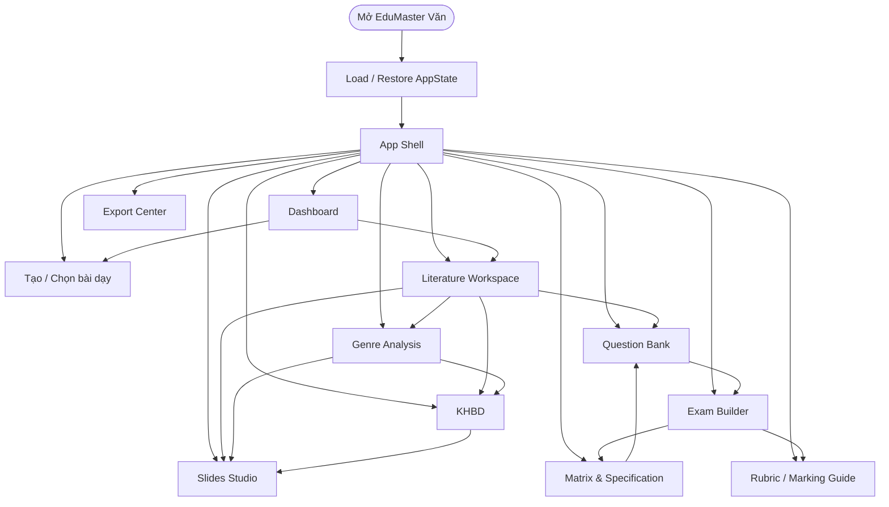

---

# 2. APP SHELL

```text
┌───────────────┬─────────────────────────────────────────┐
│ Sidebar       │ TopBar                                  │
│               ├─────────────────────────────────────────┤
│               │ Active View                             │
└───────────────┴─────────────────────────────────────────┘
```

Sidebar:
```text
Bàn làm việc
Tác phẩm
Phân tích thể loại
KHBD
Câu hỏi
Ma trận & Đặc tả
Đề kiểm tra
Rubric
Slide
Xuất bản
```

TopBar:
```text
Ngữ văn 12 / Tây Tiến — Quang Dũng
Đã lưu · HH:mm
Xem trước
Xuất
•••
```

---

# 3. DASHBOARD UI FLOW

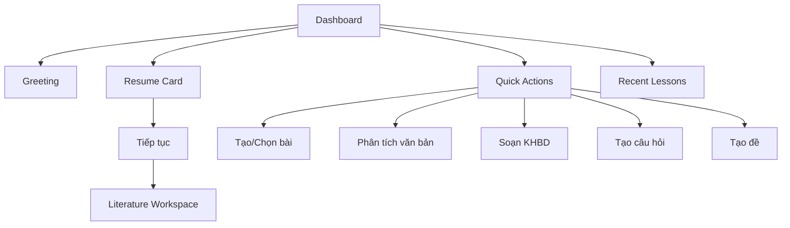

---

# 4. CREATE LESSON UI

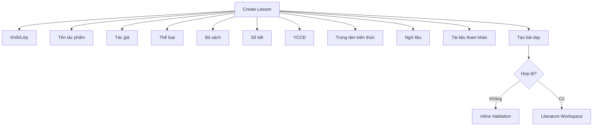

---

# 5. LITERATURE WORKSPACE UI

```text
┌──────────────┬────────────────────────────┬──────────────────┐
│ OUTLINE      │ READER                     │ INSIGHT PANEL    │
│ 220–240px    │ flexible                   │ 300–340px        │
└──────────────┴────────────────────────────┴──────────────────┘
```

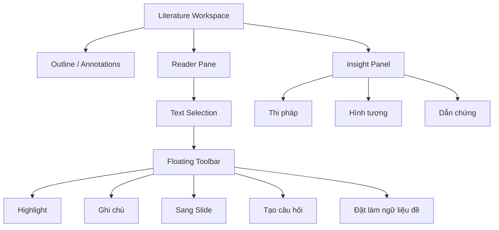

Focus mode:
```text
Reader full width
+ ẩn/thu gọn side panels
```

---

# 6. GENRE ANALYSIS UI

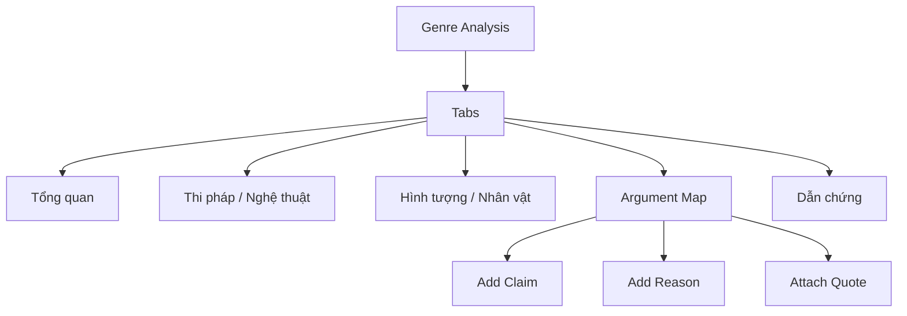

---

# 7. KHBD UI

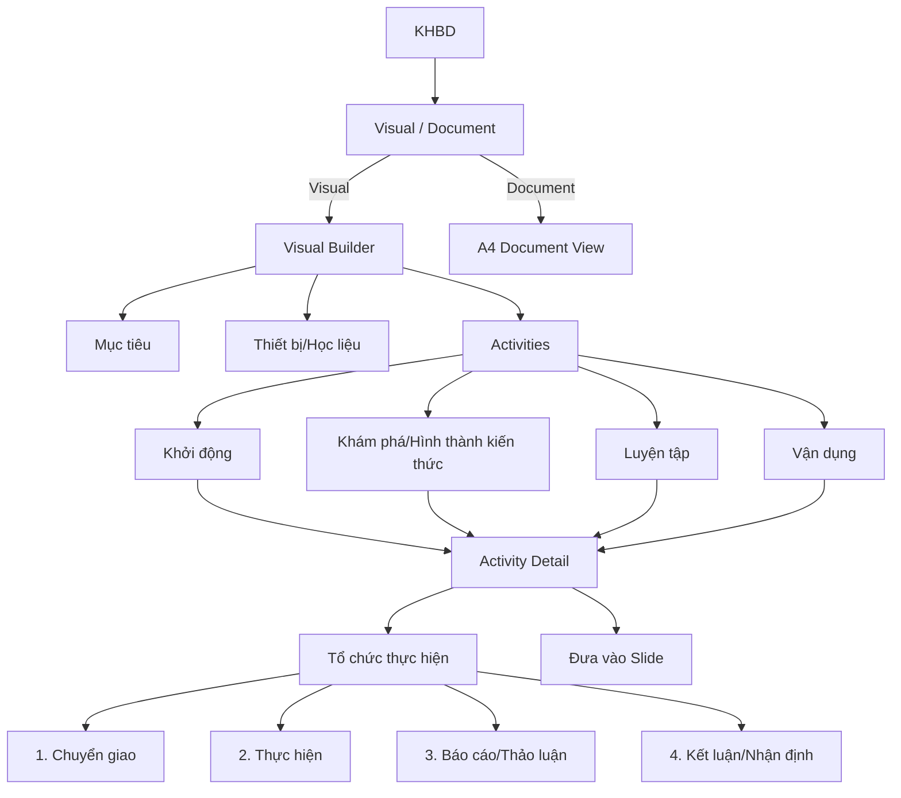

---

# 8. SLIDES UI

```text
Thumbnails | 16:9 Canvas | Inspector
```

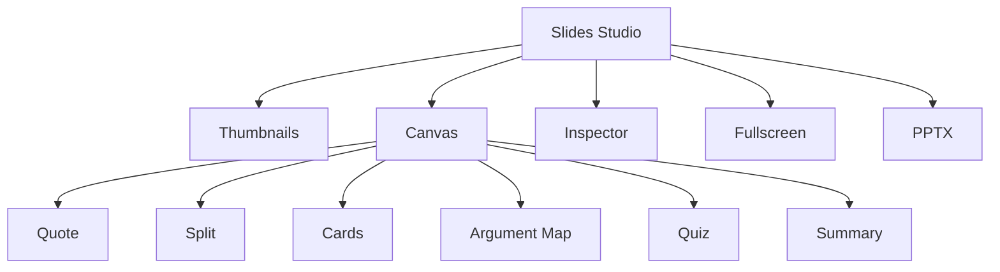

---

# 9. PRESENTATION

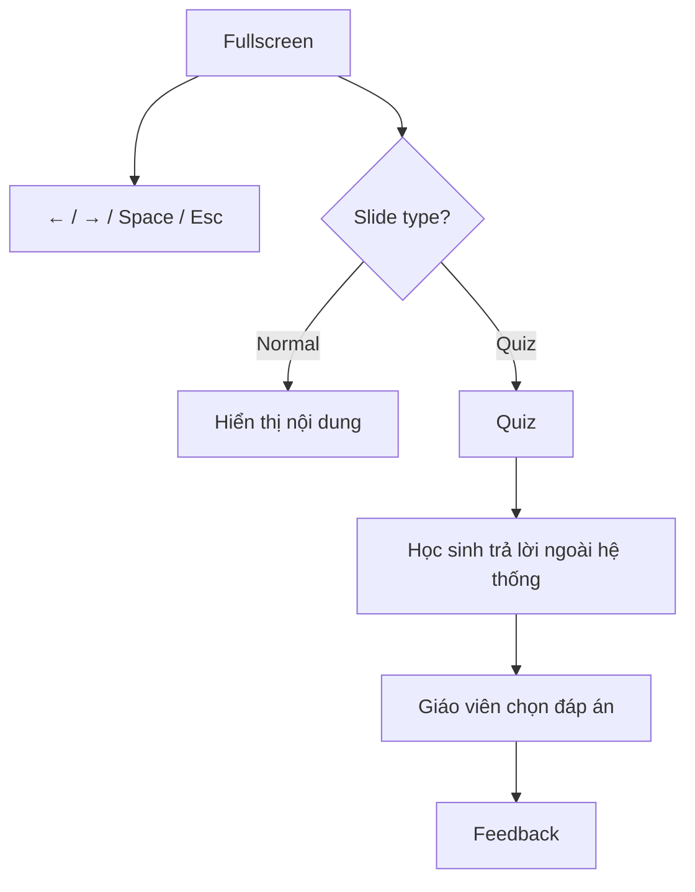

---

# 10. MATRIX & SPEC

```text
Header + Summary
Tabs: Matrix | Specification
Main Table | Live Summary
```

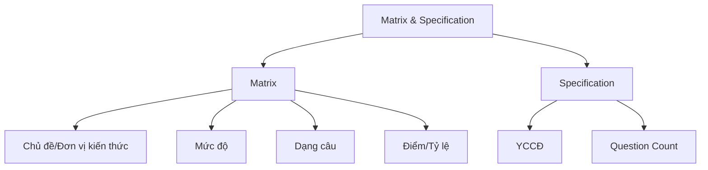

---

# 11. QUESTION BANK UI

```text
Filters + Question List | Question Editor
```

Editor:
```text
Ngữ liệu
Câu hỏi
Đáp án
Hướng dẫn chấm
Metadata
```

Filters:
```text
Khối
Tác phẩm / Chủ đề
YCCĐ
Mức độ
Dạng câu
```

---

# 12. EXAM BUILDER UI

```text
Sections | Questions | Statistics
```

Sections:
```text
Multiple Choice
True/False
Short Answer
Essay
```

Statistics:
```text
Tổng câu
Tổng điểm
Thời lượng
Mức độ
Phân bố dạng
Matrix match
```

---

# 13. RUBRIC UI

```text
Rubric Builder

Criterion List
│
├── Tên tiêu chí
├── Điểm tối đa
├── Trọng số
└── Mô tả mức chất lượng

Live Total
```

Các tiêu chí gợi ý:
```text
Nội dung
Lập luận
Dẫn chứng
Diễn đạt
Chính tả / trình bày
Sáng tạo
```

---

# 14. EXPORT UI

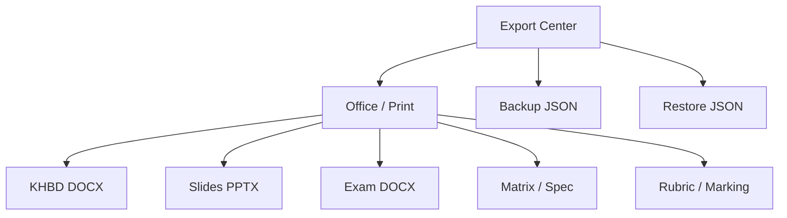

---

# 15. AUTOSAVE UI

```text
Đang lưu…
Đã lưu · 13:14
Lỗi lưu
```

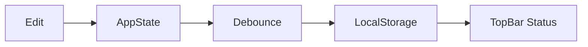

---

# 16. RESPONSIVE

Desktop:
```text
Reader: Outline | Reader | Insight
Slides: Thumbnails | Canvas | Inspector
Exam: Sections | Questions | Statistics
```

Tablet:
```text
Content
+ Sidebar Drawer
+ Inspector Drawer
```

Mobile:
```text
Single column
+ Bottom Sheet tools
```

---

# 17. UI TRANSITION MATRIX

| Nguồn | Trigger | Đích |
|---|---|---|
| Dashboard | Tiếp tục | Literature Workspace |
| Dashboard | Tạo bài | Create Lesson |
| Reader | Phân tích | Genre Analysis |
| Reader | Sang Slide | Slides |
| Reader | Tạo câu hỏi | Question Bank |
| Reader | Đặt ngữ liệu đề | Exam |
| Genre | Đưa vào KHBD | KHBD |
| KHBD | Đưa hoạt động sang Slide | Slides |
| Matrix | Tạo/tìm câu | Question Bank |
| Question Bank | Đưa vào đề | Exam |
| Exam | Xem Rubric | Rubric |
| Export | Restore JSON | Dashboard |
| Bất kỳ edit | State change | Autosave |

---

# 18. ROUTES ĐỀ XUẤT

```text
#/dashboard
#/lesson/new
#/reader
#/genre
#/khbd
#/slides
#/matrix
#/questions
#/exam
#/rubric
#/export
```

Không có:
```text
#/login
#/profile
#/admin
#/student
```

---

# 19. DEMO FLOW

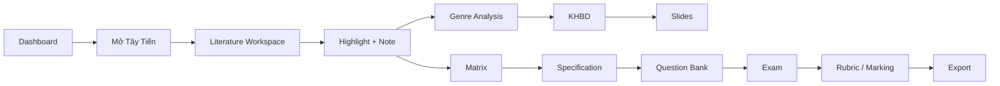

---

# 20. CHECKLIST

- [ ] Không có text/module Toán trong production UI
- [ ] Literature Reader hoạt động
- [ ] Genre Analysis hoạt động
- [ ] Highlight/Annotation hoạt động
- [ ] Reader → Slide/Question/Exam
- [ ] KHBD đúng cấu trúc
- [ ] Slide quote/split/cards/quiz
- [ ] Matrix & Specification
- [ ] Question Bank
- [ ] Exam
- [ ] Rubric
- [ ] Export
- [ ] Autosave
- [ ] JSON Backup/Restore
- [ ] Responsive