# TÀI LIỆU SƠ ĐỒ FLOW HIỂN THỊ UI TOÀN BỘ HỆ THỐNG EDUMATH

## KIẾN TRÚC ĐIỀU HƯỚNG, CHUYỂN CẢNH MÀN HÌNH & TRẠNG THÁI GIAO DIỆN

> **Hệ thống:** EduMath — Mathematics Teaching Workspace  
> **Đối tượng chính:** Giáo viên Toán THCS  
> **Mô hình ứng dụng:** SPA Viewport-First, không yêu cầu đăng nhập/xác thực trong phạm vi hiện tại  
> **Ngôn ngữ mô hình hóa:** Mermaid Flowchart (`flowchart TD`, `flowchart LR`)  
> **Tài liệu tham chiếu:**  
> - `SO_DO_FLOW_HIEN_THI_UI.md` — flow UI hệ thống EduMaster Văn trước khi chuyển đổi  
> - `FLOW_EDUMATH_COMPLETE.md` — flow nghiệp vụ EduMath đã chuẩn hóa  
> **Ngày cập nhật:** 08/10/2026  

---

# 1. MỤC TIÊU TÀI LIỆU

Tài liệu này mô tả **toàn bộ flow hiển thị giao diện của EduMath**, bao gồm:

- màn hình chính;
- module nghiệp vụ;
- overlay/modal/drawer;
- điều hướng xuyên module;
- chế độ hiển thị đặc biệt;
- responsive;
- trạng thái autosave;
- import/export;
- validation UI;
- luồng dữ liệu liên thông giữa bài dạy, KHBD, Slide, Matrix, Question Bank, Exam và Scoring Guide.

Tài liệu không mô hình hóa các chức năng chưa có trong phạm vi hiện tại như:

- đăng nhập;
- đăng ký;
- phân quyền;
- student portal;
- admin approval portal;
- cloud collaboration.

---

# 2. NGUYÊN TẮC UI CỐT LÕI

## 2.1. Viewport-First

EduMath ưu tiên giao diện desktop:

```text
1366×768
1440×900
1920×1080
```

App shell:

```text
height: 100vh
overflow: hidden
```

Panel nội bộ:

```text
min-height: 0
overflow-y: auto
```

Mục tiêu:
- hạn chế scroll toàn body;
- ưu tiên scroll từng panel;
- luôn giữ được navigation + context + primary action.

## 2.2. Một nguồn dữ liệu

Mọi màn hình phải đọc từ cùng `AppState`.

```text
MathLesson
├── Lesson Content
├── KHBD
├── Slides
├── Questions
├── Assessment Plan
├── Matrix / Specification
├── Exam
└── Scoring Guide
```

## 2.3. Progressive Disclosure

Không hiển thị mọi công cụ cùng lúc.

Ví dụ:
- chưa chọn Formula → không hiện Formula Toolbar;
- chưa chọn Graph → không hiện Graph Inspector;
- Activity đóng → không render form chi tiết;
- chưa chọn Question → không hiện metadata editor.

## 2.4. Một Primary Action mỗi màn hình

Ví dụ:

```text
Dashboard       → Tạo bài dạy
Math Workspace  → Thêm nội dung
KHBD            → Thêm hoạt động
Question Bank   → Tạo câu hỏi
Matrix          → Thêm dòng kế hoạch
Exam            → Thêm câu hỏi
Slides          → Thêm slide
Export Center   → Xuất tài liệu
```

---

# 3. KIẾN TRÚC ĐIỀU HƯỚNG UI TỔNG THỂ

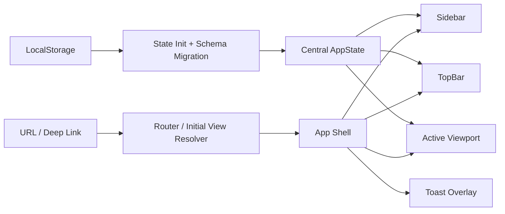

### Không có Authentication Layer

Flow truy cập:

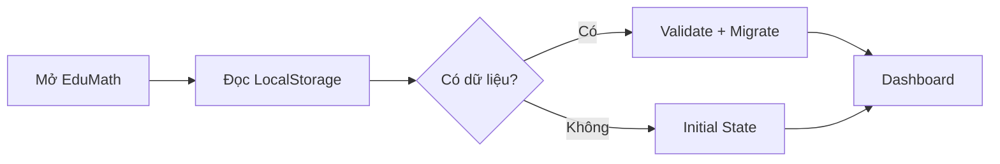

---

# 4. GLOBAL SCREEN FLOW

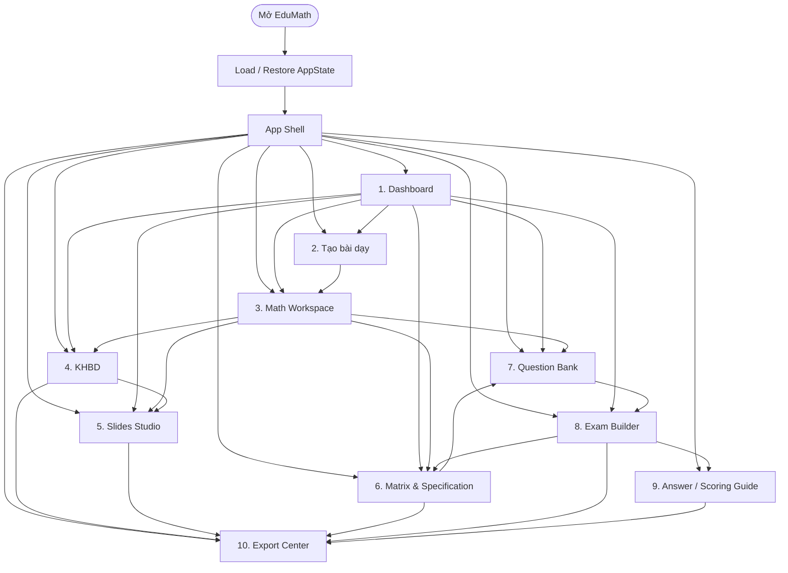

---

# 5. UI FLOW 01 — APP SHELL

## Cấu trúc

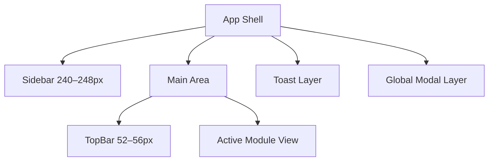

## Desktop

```text
┌───────────────┬─────────────────────────────────────────┐
│ Sidebar       │ TopBar                                  │
│               ├─────────────────────────────────────────┤
│               │ Active View                             │
│               │                                         │
└───────────────┴─────────────────────────────────────────┘
```

## Mobile / Tablet

```text
TopBar
├── Hamburger
└── Context

Drawer Sidebar
+
Backdrop

Main View
```

---

# 6. UI FLOW 02 — TOPBAR

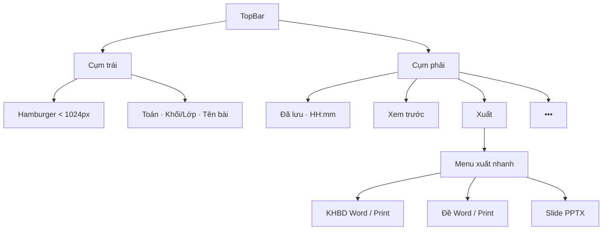

TopBar không chứa:
- profile page;
- login/logout;
- quá nhiều nút export.

---

# 7. UI FLOW 03 — SIDEBAR

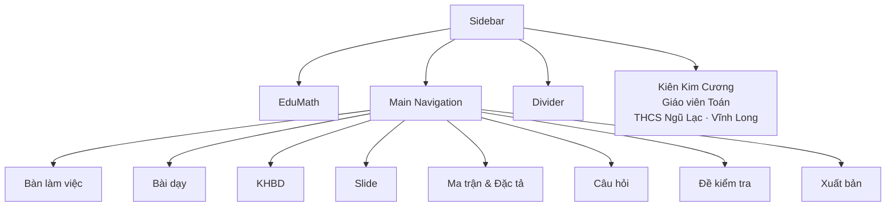

### Active State

```text
background nhẹ
primary text
border-left 3px
icon cùng màu primary
```

### Mobile

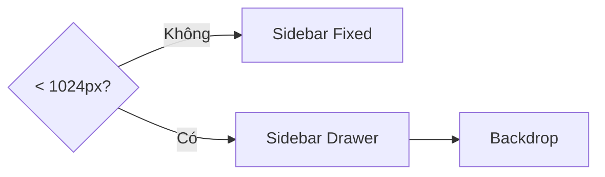

---

# 8. UI FLOW 04 — DASHBOARD

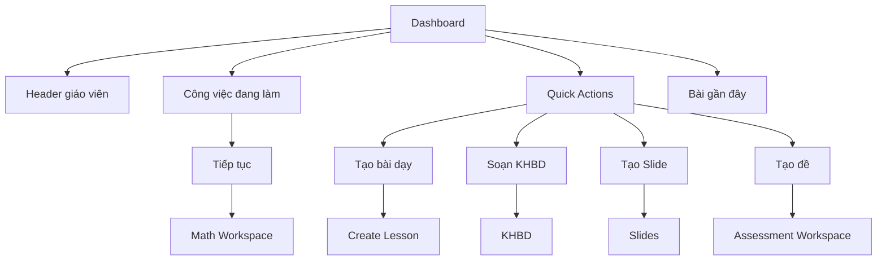

### Resume Card

Hiển thị:
- tên bài;
- khối;
- số tiết;
- % KHBD;
- % Slides;
- % Assessment;
- lần lưu cuối.

---

# 9. UI FLOW 05 — CREATE LESSON

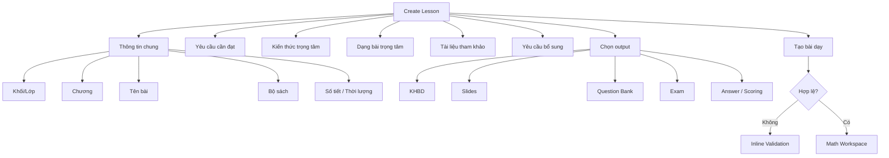

---

# 10. UI FLOW 06 — MATH WORKSPACE

## Layout 3 cột

```text
┌──────────────┬────────────────────────────┬──────────────────┐
│ Outline      │ Math Content               │ Inspector        │
│ 220–240px    │ flexible                   │ 300–340px        │
└──────────────┴────────────────────────────┴──────────────────┘
```

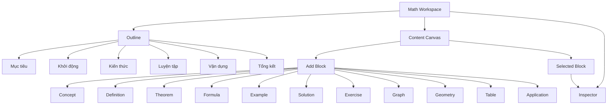

---

# 11. UI FLOW 07 — FORMULA EDITOR

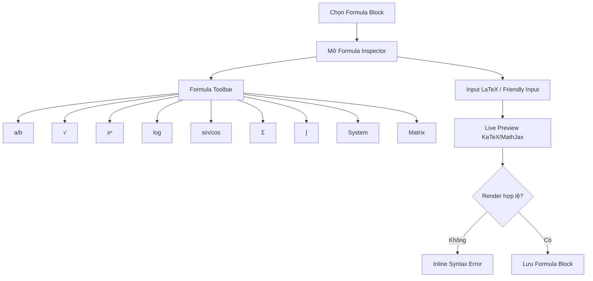

---

# 12. UI FLOW 08 — EXAMPLE & SOLUTION

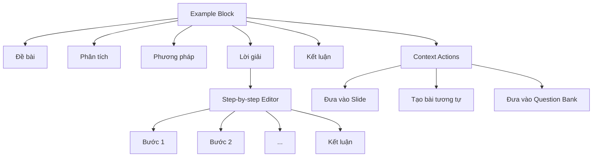

---

# 13. UI FLOW 09 — GRAPH / GEOMETRY / TABLE

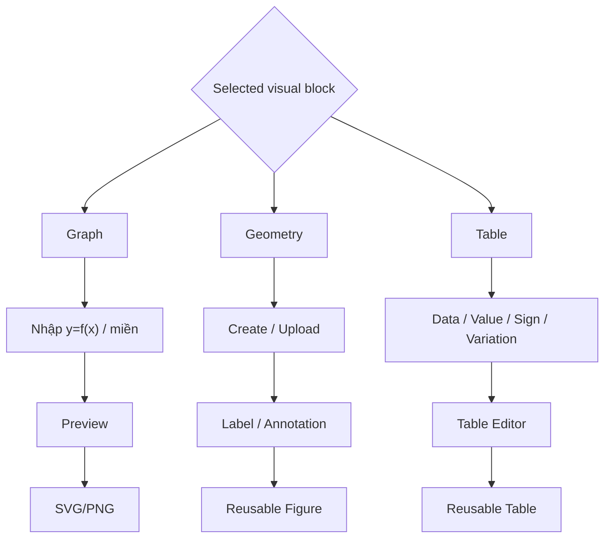

---

# 14. UI FLOW 10 — KHBD BUILDER

## Layout

```text
Header
Mode Switcher: Visual Builder | Document View
---------------------------------------------
Objectives
Equipment
Activities Accordion
```

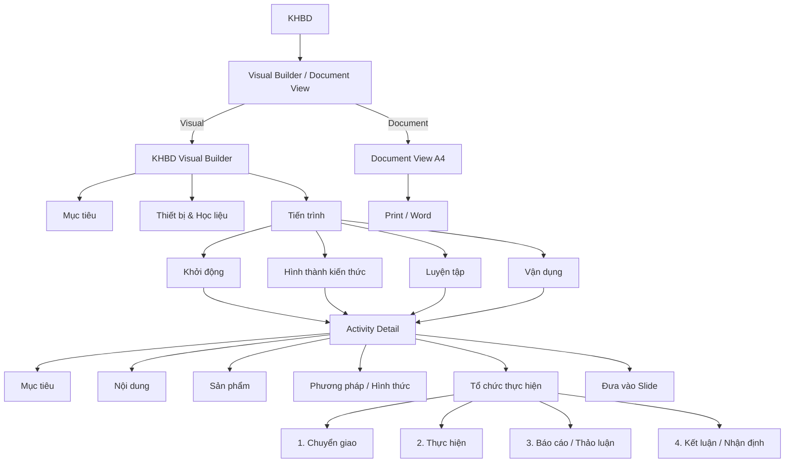

---

# 15. UI FLOW 11 — KHBD → SLIDE

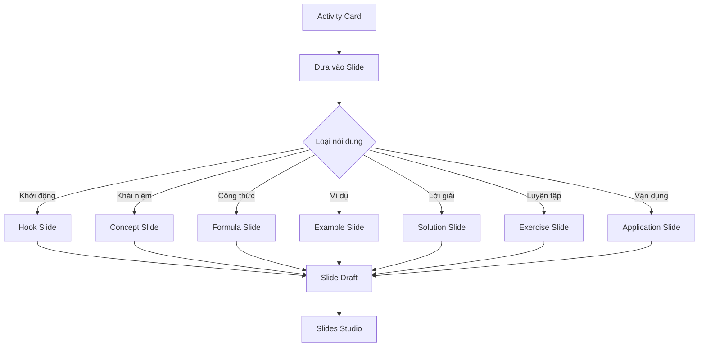

---

# 16. UI FLOW 12 — SLIDES STUDIO

## Layout

```text
┌──────────────┬────────────────────────────┬─────────────────┐
│ Thumbnails   │ Slide Canvas               │ Slide Inspector │
└──────────────┴────────────────────────────┴─────────────────┘
```

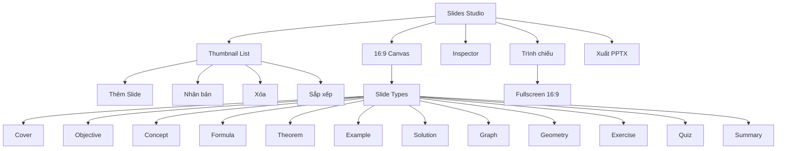

---

# 17. UI FLOW 13 — PRESENTATION MODE

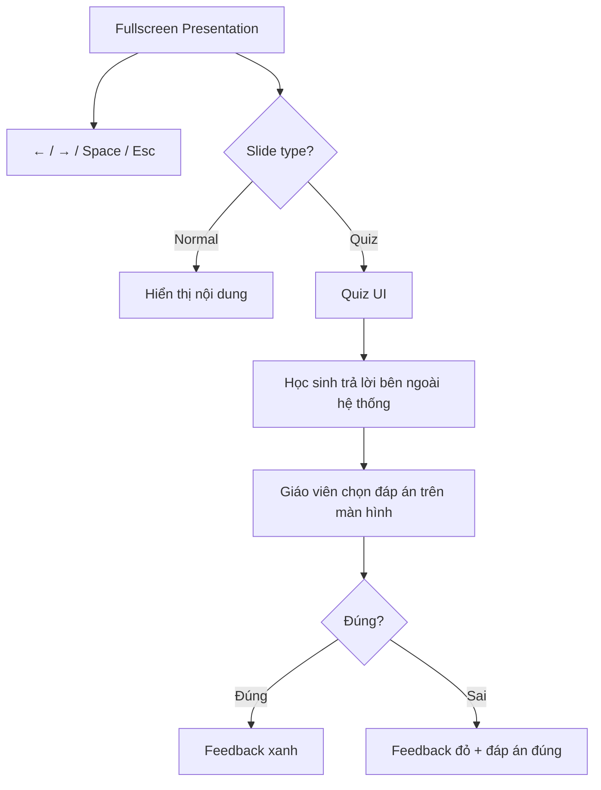

---

# 18. UI FLOW 14 — ASSESSMENT WORKSPACE

Assessment không bắt đầu bằng Exam.

Flow chuẩn:

```text
YCCĐ
→ Matrix
→ Specification
→ Question Bank
→ Exam
→ Validation
→ Scoring Guide
```

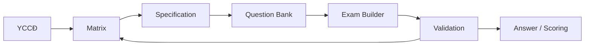

---

# 19. UI FLOW 15 — MATRIX & SPECIFICATION

## Layout đề xuất

```text
Header + Assessment Summary
Tabs: Matrix | Specification
------------------------------------
Main Table
Right Summary / Validation
```

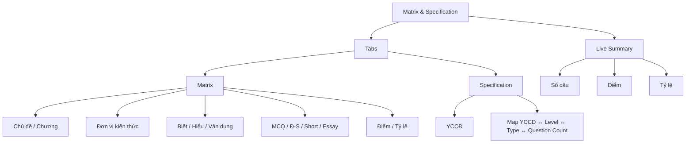

---

# 20. UI FLOW 16 — QUESTION BANK

## Layout Master–Detail

```text
┌─────────────────────┬──────────────────────────────────┐
│ Filters + Questions │ Question Editor                  │
└─────────────────────┴──────────────────────────────────┘
```

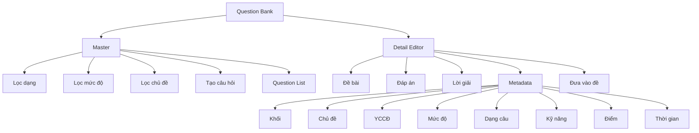

---

# 21. UI FLOW 17 — QUESTION EDITOR THEO DẠNG

```mermaid
flowchart TD
    Type{"Question Type"}

    Type --> MC["Multiple Choice"]
    MC --> MCOpt["A / B / C / D + correct option"]

    Type --> TF["True / False"]
    TF --> TFLead["Phần dẫn"]
    TFLead --> TF4["a / b / c / d"]
    TF4 --> Truth["Đúng / Sai từng ý"]

    Type --> Short["Short Answer"]
    Short --> Expected["Expected Answer"]

    Type --> Essay["Essay"]
    Essay --> Steps["Solution Steps + Points"]

    MC --> Save["Save"]
    TF --> Save
    Short --> Save
    Essay --> Save
```

---

# 22. UI FLOW 18 — PUSH QUESTION TO EXAM

```mermaid
flowchart TD
    Q["Question Detail"] --> Push["Đưa vào đề"]
    Push --> Validate{"Metadata đầy đủ?"}

    Validate -->|Không| Missing["Highlight field thiếu"]
    Validate -->|Có| Exam["Add to Exam"]

    Exam --> Recalc["Recalculate"]
    Recalc --> Matrix["Update Matrix"]
    Matrix --> Toast["Toast thành công"]
```

---

# 23. UI FLOW 19 — EXAM BUILDER

## Layout 3 cột

```text
┌──────────────┬────────────────────────────┬──────────────────┐
│ Sections     │ Questions                  │ Statistics       │
│ ~220px       │ flexible                   │ ~280px           │
└──────────────┴────────────────────────────┴──────────────────┘
```

```mermaid
flowchart TD
    Root["Exam Builder"]

    Root --> Left["Sections"]
    Left --> P1["Multiple Choice"]
    Left --> P2["True / False"]
    Left --> P3["Short Answer"]
    Left --> P4["Essay"]

    Root --> Center["Question List / Editor"]
    Center --> Edit["Edit"]
    Center --> Add["Add"]
    Center --> Remove["Remove"]
    Center --> Reorder["Reorder"]

    Root --> Right["Statistics"]
    Right --> TotalQ["Tổng câu"]
    Right --> TotalScore["Tổng điểm"]
    Right --> LevelDist["Biết / Hiểu / Vận dụng"]
    Right --> TypeDist["Phân bố dạng"]
    Right --> Duration["Thời lượng"]

    Root --> Preview["Preview đề"]
    Root --> Guide["Đáp án / Hướng dẫn chấm"]
```

Không hard-code số câu cố định trong UI.

---

# 24. UI FLOW 20 — EXAM VALIDATION

```mermaid
flowchart TD
    Exam["Exam"] --> Validate["Validate"]

    Validate --> Score["Tổng điểm"]
    Validate --> Matrix["Khớp Matrix"]
    Validate --> Meta["Metadata"]
    Validate --> Answer["Có đáp án"]
    Validate --> Solution["Có lời giải khi cần"]

    Score --> Result["Validation Panel"]
    Matrix --> Result
    Meta --> Result
    Answer --> Result
    Solution --> Result

    Result --> Ready{"Ready?"}
    Ready -->|Không| Errors["Danh sách lỗi + link tới câu"]
    Ready -->|Có| Final["Exam Ready"]
```

---

# 25. UI FLOW 21 — ANSWER / SCORING GUIDE

```mermaid
flowchart TD
    Root["Answer / Scoring Guide"]

    Root --> Questions["Questions"]
    Questions --> MC["MCQ → Correct option"]
    Questions --> TF["T/F → 4 truth values"]
    Questions --> Short["Short → Expected answer"]
    Questions --> Essay["Essay → Solution steps"]

    Essay --> Score["Điểm từng bước"]
    Root --> Preview["Teacher Preview"]
    Root --> Export["Word / Print"]
```

Không tạo Rubric độc lập cho Toán nếu cùng dữ liệu đã nằm trong `scoringGuide`.

---

# 26. UI FLOW 22 — EXPORT CENTER

```mermaid
flowchart TD
    Root["Export Center"]

    Root --> Docs["Office / Print"]
    Docs --> KHBD["KHBD → DOCX / Print"]
    Docs --> Slide["Slides → PPTX"]
    Docs --> Exam["Exam → DOCX / Print"]
    Docs --> Matrix["Matrix → DOCX / Print"]
    Docs --> Spec["Specification → DOCX / Print"]
    Docs --> Score["Answer / Scoring → DOCX / Print"]

    Root --> Backup["Backup"]
    Backup --> Download["Download JSON"]
    Backup --> Copy["Copy JSON"]

    Root --> Restore["Restore"]
    Restore --> Input["Paste / Upload JSON"]
    Input --> Parse{"Parse?"}
    Parse -->|Fail| Err["Error UI"]
    Parse -->|OK| Schema{"Schema hợp lệ?"}
    Schema -->|Không| Migrate{"Có migration?"}
    Migrate -->|Không| Reject["Từ chối restore"]
    Migrate -->|Có| Apply["Migrate + Apply"]
    Schema -->|Có| Apply
    Apply --> Dashboard["Về Dashboard"]
```

---

# 27. UI FLOW 23 — AUTOSAVE INDICATOR

```mermaid
flowchart LR
    Edit["Bất kỳ thay đổi"] --> State["Update AppState"]
    State --> Debounce["Debounce"]
    Debounce --> Save["LocalStorage"]
    Save --> Status["TopBar: Đã lưu · HH:mm"]
```

Trạng thái có thể hiển thị:

```text
Đang lưu…
Đã lưu · 13:14
Lỗi lưu
```

Autosave không phụ thuộc Export Center.

---

# 28. UI FLOW 24 — DELETE WITH DEPENDENCY

```mermaid
flowchart TD
    Delete["Xóa entity"] --> Used{"Đang được tham chiếu?"}

    Used -->|Không| Confirm["Confirm Delete"]
    Confirm --> Done["Xóa"]

    Used -->|Có| Modal["Dependency Modal"]
    Modal --> Cancel["Hủy"]
    Modal --> Detach["Xóa khỏi nguồn, giữ snapshot"]
    Modal --> RemoveAll["Xóa toàn bộ liên kết"]

    RemoveAll --> Recalc["Recalculate dependent data"]
```

Dùng cho:
- Question đang nằm trong Exam;
- Formula/Example đang nằm trong Slide;
- Activity đã sinh Slide.

---

# 29. UI FLOW 25 — VALIDATION & ERROR STATES

```mermaid
flowchart TD
    Input["User Input"] --> Validate{"Valid?"}

    Validate -->|Có| Save["Save / Autosave"]
    Validate -->|Không| Error["Inline Error"]

    Error --> Draft["Giữ draft"]
    Error --> Block{"Critical?"}

    Block -->|Không| Continue["Cho tiếp tục chỉnh"]
    Block -->|Có| Disable["Disable Finalize / Export"]
```

Nguyên tắc:
- không xóa dữ liệu người dùng vì validation fail;
- highlight đúng field;
- lỗi export phải nêu lý do rõ ràng.

---

# 30. UI FLOW 26 — DOCUMENT PREVIEW / PRINT

```mermaid
flowchart TD
    Screen["Screen View"] --> Preview["Document Preview"]

    Preview --> Print["Print Trigger"]
    Print --> Hide["Ẩn Sidebar / TopBar / Controls"]
    Hide --> Expand["Expand content"]
    Expand --> Page["A4 Pagination"]

    Page --> Avoid["break-inside: avoid"]
    Page --> Output["Printer / Save PDF"]
```

Áp dụng cho:
- KHBD;
- Exam;
- Matrix;
- Specification;
- Answer/Scoring.

---

# 31. RESPONSIVE DISPLAY FLOW

```mermaid
flowchart TD
    Width{"Viewport"}

    Width -->|>= 1280px| Desktop["Desktop"]
    Width -->|768–1279px| Tablet["Tablet"]
    Width -->|< 768px| Mobile["Mobile"]

    Desktop --> DSide["Fixed Sidebar"]
    Desktop --> DMulti["2–3 Panels"]

    Tablet --> TDrawer["Sidebar Drawer"]
    Tablet --> TInspector["Inspector Drawer"]

    Mobile --> MSingle["Single Main Column"]
    Mobile --> MBottom["Secondary tools → Bottom Sheet"]
```

### Math Workspace responsive

Desktop:

```text
Outline | Content | Inspector
```

Tablet:

```text
Content
+ Outline Drawer
+ Inspector Drawer
```

Mobile:

```text
Content
+ Bottom Sheet tools
```

---

# 32. FOOTER / TEACHER IDENTITY FLOW

Không có Profile Page.

Footer đầy đủ chỉ nên xuất hiện ở:
- Dashboard;
- Export Center;
- Home/Landing nếu có.

Editor chính dùng Sidebar Mini Identity để tiết kiệm chiều cao.

```mermaid
flowchart TD
    Screen{"Loại màn hình"}

    Screen -->|Dashboard / Export| Full["Full Teacher Footer"]
    Screen -->|Workspace / KHBD / Slides / Exam| Mini["Sidebar Mini Identity"]

    Full --> Info["Kiên Kim Cương<br/>Giáo viên Toán<br/>Trường THCS Ngũ Lạc<br/>Vĩnh Long<br/>kienkimcuong@gmail.com"]
    Mini --> Compact["Kiên Kim Cương<br/>THCS Ngũ Lạc · Vĩnh Long"]
```

---

# 33. UI TRANSITION MATRIX

| Màn hình nguồn | Trigger | Đích / trạng thái mới | Ghi chú |
|---|---|---|---|
| Bất kỳ | Chọn Sidebar item | Module tương ứng | SPA, không reload |
| App Start | Có LocalStorage | Dashboard với state cũ | Validate + migrate trước |
| Dashboard | Tiếp tục | Math Workspace | Current Lesson |
| Dashboard | Tạo bài dạy | Create Lesson | Form mới |
| Create Lesson | Tạo bài | Math Workspace | Tạo `MathLesson` |
| Math Workspace | Đưa ví dụ vào Slide | Slides Studio | Tạo Slide Draft |
| Math Workspace | Đưa bài tập vào Question | Question Bank | Tạo Question Draft |
| KHBD | Đưa hoạt động vào Slide | Slides Studio | Map Activity → Slide |
| Matrix | Chọn ô cần câu hỏi | Question Bank | Có thể pre-filter metadata |
| Question Bank | Đưa vào đề | Exam Builder | Validate metadata trước |
| Exam | Chỉnh câu | Exam Editor | Recalculate Matrix |
| Exam | Xem đáp án | Scoring Guide | Cùng Question source |
| Slides | Trình chiếu | Fullscreen | 16:9 |
| Slides | Xuất PPTX | Export Service | Không screenshot toàn UI |
| Export | Restore JSON | Dashboard | Parse → schema → migrate → apply |
| Bất kỳ edit | State change | Autosave | Debounce |
| Document View | In | Print Mode | Ẩn shell |

---

# 34. GLOBAL OVERLAYS

Các overlay được phép xuất hiện xuyên hệ thống:

```text
Toast
Confirm Modal
Dependency Modal
Export Progress
JSON Restore Error
Mobile Sidebar Backdrop
Inspector Drawer
Bottom Sheet
```

Không dùng modal cho thao tác có thể xử lý inline.

---

# 35. ROUTE / MODULE MAP ĐỀ XUẤT

```text
#/dashboard
#/lesson/new
#/workspace
#/khbd
#/slides
#/assessment
#/matrix
#/questions
#/exam
#/scoring
#/export
```

Không có:

```text
#/login
#/profile
#/admin
#/student
```

trong scope hiện tại.

---

# 36. DEMO FLOW UI CHO BAN TỔ CHỨC

```mermaid
flowchart LR
    A["Dashboard"] --> B["Mở bài Toán"]
    B --> C["Math Workspace"]
    C --> D["Công thức + Ví dụ + Lời giải"]
    D --> E["KHBD"]
    E --> F["Slide"]
    D --> G["Matrix"]
    G --> H["Specification"]
    H --> I["Question Bank"]
    I --> J["Exam"]
    J --> K["Answer / Scoring"]
    K --> L["Export"]
```

Đây là flow demo ưu tiên hoàn thiện trước.

---

# 37. CHECKLIST HIỂN THỊ

## App Shell
- [ ] Không body scroll không cần thiết
- [ ] Sidebar cố định desktop
- [ ] Drawer mobile hoạt động
- [ ] TopBar không quá cao
- [ ] Autosave visible

## Dashboard
- [ ] Resume Card rõ
- [ ] Quick Actions ngắn
- [ ] Recent Lessons compact

## Math Workspace
- [ ] 3-panel desktop
- [ ] panel scroll độc lập
- [ ] formula preview
- [ ] block editor
- [ ] inspector contextual

## KHBD
- [ ] phân biệt Activity fields và 4 bước tổ chức
- [ ] Visual / Document Mode
- [ ] push to slide

## Slides
- [ ] thumbnail + canvas + inspector
- [ ] fullscreen
- [ ] quiz teacher-controlled
- [ ] PPTX

## Assessment
- [ ] Matrix-first
- [ ] Specification
- [ ] Question metadata
- [ ] Exam validation
- [ ] Scoring Guide

## Export
- [ ] DOCX
- [ ] PPTX
- [ ] Print/PDF
- [ ] JSON Backup
- [ ] JSON Restore

---

# 38. KẾT LUẬN KIẾN TRÚC UI

EduMath không còn tổ chức giao diện theo logic của EduMaster Văn cũ như:

```text
Literature Reader
→ Genre Analysis
→ Rubric Văn
```

Mà chuyển sang ba trục UI chính:

```text
AUTHORING
Math Workspace
→ KHBD
→ Slides
```

```text
ASSESSMENT
YCCĐ
→ Matrix
→ Specification
→ Question Bank
→ Exam
→ Validation
→ Scoring Guide
```

```text
SYSTEM
AppState
→ Autosave
→ Export
→ Backup
→ Restore
```

Ba trục này liên thông qua cùng `AppState`, giúp UI phản ánh đúng workflow thực tế của giáo viên Toán và giảm việc nhập lại dữ liệu ở nhiều màn hình.

---

*Tài liệu được xây dựng dựa trên flow UI EduMaster Văn hiện có và flow nghiệp vụ EduMath đã chuẩn hóa.*
