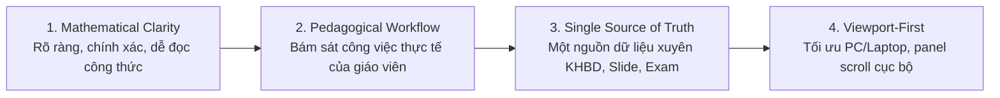

# TÀI LIỆU THIẾT KẾ BỐ CỤC UI/UX TOÀN HỆ THỐNG

# EDUMATH — MATHEMATICS TEACHING WORKSPACE

> **Phiên bản tài liệu:** v4.0 — EduMath Redesign  
> **Hệ thống áp dụng:** EduMath — Mathematics Teaching & Assessment Workspace  
> **Đối tượng chính:** Giáo viên Toán THCS  
> **Phạm vi hiện tại:** Ứng dụng một người dùng chính; mở trực tiếp, không yêu cầu đăng nhập/xác thực  
> **Căn cứ nghiệp vụ:** KHBD, kiểm tra đánh giá, ma trận, bản đặc tả, câu hỏi, đề kiểm tra và hồ sơ chuyên môn theo tài liệu nguồn của dự án  
> **Tài liệu đồng bộ:**  
> - `FLOW_EDUMATH_COMPLETE.md`  
> - `SO_DO_FLOW_HIEN_THI_UI_EDUMATH.md`  
> **Vị trí lưu trữ đề xuất:** `docs/THIET_KE_BO_CUC_UI_UX_DESIGN.md`

---

# MỤC LỤC

1. Tổng quan hệ thống & triết lý thiết kế  
2. Kiến trúc thông tin tổng thể  
3. Design System & Visual Tokens  
4. Global App Shell  
5. Dashboard  
6. Create Lesson  
7. Math Workspace  
8. Formula Editor  
9. Example & Step-by-Step Solution  
10. Graph / Geometry / Table  
11. KHBD Builder  
12. Slides Studio  
13. Assessment Workspace  
14. Matrix & Specification  
15. Question Bank  
16. Exam Builder  
17. Answer / Scoring Guide  
18. Export Center  
19. Autosave / Backup / Restore  
20. Footer & Teacher Identity  
21. Responsive  
22. Accessibility  
23. Print / Office Export  
24. Data Consistency & UI State Rules  
25. Error / Validation / Empty States  
26. Demo Flow  
27. Component Map  
28. Acceptance Checklist

---

# 1. TỔNG QUAN HỆ THỐNG & TRIẾT LÝ THIẾT KẾ

## 1.1. Định vị sản phẩm

**EduMath** là một **Mathematics Teaching Workspace** dành cho giáo viên Toán THCS, tập trung vào toàn bộ chu trình:

```text
Bài dạy
→ Kiến thức Toán
→ Công thức
→ Ví dụ
→ Lời giải
→ KHBD
→ Slide
→ YCCĐ
→ Ma trận
→ Bản đặc tả
→ Ngân hàng câu hỏi
→ Đề kiểm tra
→ Đáp án / Hướng dẫn chấm
→ Xuất bản
```

EduMath không được thiết kế như một dashboard quản trị doanh nghiệp, và cũng không chỉ là tập hợp nhiều form nhập liệu.

Mục tiêu của sản phẩm là tạo ra một **không gian làm việc chuyên môn Toán học**, nơi cùng một dữ liệu được tái sử dụng xuyên suốt các module.

---

## 1.2. Bốn trụ cột thiết kế mới



### 1. Mathematical Clarity

Ưu tiên:
- công thức dễ đọc;
- số liệu rõ;
- cấu trúc bước giải;
- bảng/đồ thị/hình học trực quan;
- ít màu nhiễu.

### 2. Pedagogical Workflow

UI phải đi đúng flow thực tế:

```text
Soạn bài
→ KHBD
→ Slide
```

và:

```text
YCCĐ
→ Matrix
→ Specification
→ Question Bank
→ Exam
→ Scoring
```

### 3. Single Source of Truth

Không nhập lại:
- tên bài;
- mục tiêu;
- YCCĐ;
- công thức;
- ví dụ;
- câu hỏi;
- điểm;

ở nhiều module khác nhau.

### 4. Viewport-First

Các màn hình editor chính phải tối ưu cho:

```text
1366×768
1440×900
1920×1080
```

Không để toàn bộ body scroll nếu có thể tránh.

---

# 2. KIẾN TRÚC THÔNG TIN TỔNG THỂ

## 2.1. Navigation chính

Sidebar chỉ giữ các module cấp cao:

```text
1. Bàn làm việc
2. Bài dạy
3. Kế hoạch bài dạy
4. Slide
5. Ma trận & Đặc tả
6. Câu hỏi
7. Đề kiểm tra
8. Xuất bản
```

Không đưa các công cụ kỹ thuật như Formula, Graph, Geometry thành menu cấp cao.

Các công cụ này nằm trong Math Workspace.

---

## 2.2. Ba trục sử dụng chính

### AUTHORING

```text
Math Workspace
→ KHBD
→ Slides
```

### ASSESSMENT

```text
YCCĐ
→ Matrix
→ Specification
→ Question Bank
→ Exam
→ Validation
→ Answer / Scoring Guide
```

### SYSTEM

```text
AppState
→ Autosave
→ Export
→ Backup
→ Restore
```

---

# 3. DESIGN SYSTEM & VISUAL TOKENS

## 3.1. Phong cách

Tên định hướng:

**Modern Academic Workspace + Mathematical Editor**

Cảm giác cần đạt:
- sạch;
- sáng;
- chính xác;
- có hệ thống;
- hiện đại;
- nhẹ;
- không màu mè;
- không quá giống dashboard doanh nghiệp.

---

## 3.2. Bảng màu

| Token | Giá trị gợi ý | Vai trò |
|---|---|---|
| `canvas` | `#F8FAFC` | Nền ứng dụng |
| `surface` | `#FFFFFF` | Card, panel, modal |
| `text-primary` | `#0F172A` | Văn bản chính |
| `text-secondary` | `#64748B` | Metadata |
| `border` | `#E2E8F0` | Viền |
| `primary` | `#1D4ED8` hoặc Indigo tương đương | CTA, active state |
| `primary-subtle` | `#EFF6FF` | Active background |
| `success` | `#15803D` | đúng, hoàn thành |
| `warning` | `#B45309` | lưu ý |
| `danger` | `#B91C1C` | lỗi, xóa |
| `purple` | `#7E22CE` | vận dụng/mô hình hóa |
| `cyan` | `#0891B2` | graph/data accents |

Nguyên tắc:
- Không tô toàn card bằng semantic color.
- Semantic color dùng cho border, badge, icon, status.
- Không dùng gradient nếu không có lý do rõ ràng.

---

## 3.3. Typography

### UI

Dùng **Be Vietnam Pro**.

```text
Page Title       24–28px / 600
Section Title    18–20px / 600
Card Title       15–16px / 600
Body             14–15px / 400
Metadata         12–13px / 500
Button            13–14px / 500–600
```

### Công thức

Dùng typography của **KaTeX / MathJax**.

Không dùng Lora làm font chính cho nội dung Toán.

---

## 3.4. Spacing

Base scale:

```text
4
8
12
16
20
24
32
40
48
```

Khuyến nghị:

```text
Page padding       16–24px
Section gap        16–24px
Card gap           12–16px
Card padding       16–20px
Compact controls   8–12px
```

---

## 3.5. Border Radius

```text
Large panel/card    12–16px
Small card          10–12px
Input/button         8px
Badge                999px
```

Tránh bo góc quá lớn ở mọi nơi.

---

# 4. GLOBAL APP SHELL

## 4.1. Cấu trúc

```text
┌───────────────┬────────────────────────────────────────────┐
│ Sidebar       │ TopBar                                     │
│ 248px         ├────────────────────────────────────────────┤
│               │ Main Active View                           │
│               │                                            │
└───────────────┴────────────────────────────────────────────┘
```

Implementation contract:

```tsx
<div className="h-screen overflow-hidden flex">
  <Sidebar />

  <div className="min-w-0 flex-1 flex flex-col">
    <TopBar />

    <main className="min-h-0 flex-1 overflow-hidden">
      <ActiveView />
    </main>
  </div>
</div>
```

---

## 4.2. TopBar

Chiều cao:

```text
52–56px
```

### Cụm trái

```text
[Hamburger mobile]
Toán 9 / Giải hệ hai phương trình bậc nhất hai ẩn
```

### Cụm phải

```text
Đã lưu · 13:14
[Xem trước]
[Xuất]
[•••]
```

TopBar không:
- chứa quá nhiều CTA;
- chứa Profile page;
- chứa Login;
- dùng nhiều màu.

---

## 4.3. Sidebar

Chiều rộng:

```text
240–248px
```

### Header

```text
EduMath
Mathematics Teaching Workspace
```

### Main Nav

```text
Bàn làm việc
Bài dạy
Kế hoạch bài dạy
Slide
Ma trận & Đặc tả
Câu hỏi
Đề kiểm tra
Xuất bản
```

### Footer nhỏ

```text
Kiên Kim Cương
Giáo viên Toán
THCS Ngũ Lạc · Vĩnh Long
```

---

## 4.4. Active Nav State

```text
background: primary-subtle
color: primary
left border: 3px primary
font-weight: 500–600
```

---

## 4.5. Toast

Vị trí:

```text
bottom-right
```

Các loại:
- success;
- info;
- warning;
- error.

Nội dung ngắn:

```text
Đã lưu câu hỏi
Đã thêm vào đề
Xuất file thành công
Dữ liệu JSON không hợp lệ
```

---

# 5. DASHBOARD

## 5.1. Mục tiêu

Dashboard phải giúp giáo viên trả lời trong vài giây:

- Tôi đang làm bài nào?
- Tiến độ đến đâu?
- Tôi muốn làm tiếp phần nào?
- Bài gần đây là gì?

---

## 5.2. Layout

```text
┌─────────────────────────────────────────────────────────────┐
│ Xin chào, Kiên Kim Cương                  Toán · THCS      │
├──────────────────────────────────┬──────────────────────────┤
│ CÔNG VIỆC ĐANG LÀM              │ THAO TÁC NHANH          │
│                                  │                          │
│ Giải hệ hai PT bậc nhất hai ẩn   │ [Tạo bài] [KHBD]        │
│ Toán 9 · 4 tiết                  │ [Slide]   [Tạo đề]       │
│                                  │                          │
│ KHBD   ████████ 80%              │                          │
│ Slide  ██████   60%              │                          │
│ Đề     ████     40%              │                          │
│                         [Tiếp tục]│                          │
├──────────────────────────────────┴──────────────────────────┤
│ BÀI HỌC GẦN ĐÂY                                           │
│ ...                                                        │
└─────────────────────────────────────────────────────────────┘
```

---

## 5.3. Primary Action

Duy nhất:

```text
Tạo bài dạy
```

Resume card:

```text
Tiếp tục
```

là contextual action.

---

# 6. CREATE LESSON

## 6.1. Mục tiêu

Cho phép giáo viên tạo bài học mới trong 1 màn hình gọn.

---

## 6.2. Form

### Khối 1 — Thông tin chung

```text
Khối/Lớp
Chương
Tên bài
Bộ sách
Số tiết
Thời lượng
```

### Khối 2 — Nội dung

```text
Yêu cầu cần đạt
Kiến thức trọng tâm
Dạng bài trọng tâm
```

### Khối 3 — Nguồn

```text
Tài liệu tham khảo
Yêu cầu bổ sung
```

### Khối 4 — Output

```text
☑ KHBD
☑ Slide
☑ Question Bank
☑ Exam
☑ Answer / Scoring
```

Primary CTA:

```text
Tạo bài dạy
```

---

# 7. MATH WORKSPACE

## 7.1. Mục tiêu

Đây là màn hình trung tâm.

Không phải “trang đọc tài liệu” như bản Ngữ văn cũ.

Đây là nơi giáo viên xây nội dung bài Toán.

---

## 7.2. Layout 3 cột

```text
┌──────────────┬────────────────────────────┬──────────────────┐
│ OUTLINE      │ MATH CONTENT               │ INSPECTOR        │
│ 220–240px    │ flexible                   │ 300–340px        │
├──────────────┼────────────────────────────┼──────────────────┤
│ Mục tiêu     │ [Concept Block]            │ Thuộc tính       │
│ Khởi động    │ [Formula Block]            │ Liên kết         │
│ Kiến thức    │ [Example Block]            │ Lời giải         │
│ Luyện tập    │ [Exercise Block]           │                  │
│ Vận dụng     │                            │                  │
└──────────────┴────────────────────────────┴──────────────────┘
```

---

## 7.3. Outline

Section mặc định:

```text
Mục tiêu
Khởi động
Kiến thức mới
Luyện tập
Vận dụng
Tổng kết
```

Cho phép:
- thêm section;
- reorder;
- collapse.

---

## 7.4. Math Blocks

Các block:

```text
TextBlock
ConceptBlock
DefinitionBlock
TheoremBlock
FormulaBlock
ExampleBlock
SolutionBlock
ExerciseBlock
GraphBlock
GeometryBlock
TableBlock
ApplicationBlock
QuestionBlock
NoteBlock
```

Mỗi block hỗ trợ:

```text
Edit
Duplicate
Move
Delete
To Slide
To Question
```

tùy loại.

---

## 7.5. Inspector

Tabs:

```text
Thuộc tính
Lời giải
Liên kết
```

Không hiện inspector chi tiết khi chưa chọn block.

---

# 8. FORMULA EDITOR

## 8.1. Layout

```text
┌───────────────────────────────────────┐
│ Formula Toolbar                      │
│ a/b  √  x²  xⁿ  log  sin  Σ  ∫ ... │
├───────────────────────────────────────┤
│ Input                                │
│ \frac{x+1}{x-2}                     │
├───────────────────────────────────────┤
│ Preview                              │
│         x + 1                        │
│         ─────                        │
│         x - 2                        │
└───────────────────────────────────────┘
```

---

## 8.2. UX

Giáo viên không cần biết LaTeX.

Toolbar phải insert template.

Ví dụ:

```text
System
```

→

```latex
\begin{cases}
...
\end{cases}
```

---

## 8.3. Validation

Nếu công thức lỗi:
- giữ nguyên input;
- hiển thị lỗi nhỏ bên dưới;
- không xóa nội dung.

---

# 9. EXAMPLE & STEP-BY-STEP SOLUTION

## 9.1. Example Card

```text
Đề bài
Phân tích
Phương pháp
Lời giải
Kết luận
```

Mặc định chỉ mở:
- Đề bài
- Lời giải

Các phần còn lại collapse được.

---

## 9.2. Solution Steps

```text
Bước 1
[Explanation]
[Formula]

Bước 2
[Explanation]
[Formula]

...

Kết luận
```

Actions:

```text
+ Thêm bước
Duplicate
Move up/down
Delete
```

---

# 10. GRAPH / GEOMETRY / TABLE

## 10.1. Graph Block

UI:

```text
Expression:
y = 2x + 1

[+] Thêm hàm

X min  -10
X max   10
Y min  -10
Y max   10

☑ Grid
☑ Axes
☑ Labels

[Preview]
```

Graph phải export được SVG/PNG.

---

## 10.2. Geometry

Scope vừa đủ:

```text
Point
Line
Segment
Triangle
Circle
Angle
Vector
Label
Annotation
```

Không cần clone GeoGebra.

Có thể:
- vẽ cơ bản;
- upload hình;
- annotate.

---

## 10.3. Table

Types:

```text
Data Table
Value Table
Sign Table
Variation Table
```

Không dùng textarea để giả bảng.

---

# 11. KHBD BUILDER

## 11.1. Hai mode

```text
Visual Builder
Document View
```

---

## 11.2. Visual Builder

Sections:

```text
I. Mục tiêu
II. Thiết bị & Học liệu
III. Tiến trình dạy học
```

### Activity Card

```text
Tên hoạt động
Thời lượng

Mục tiêu
Nội dung
Sản phẩm
Thiết bị/Học liệu
Phương pháp/Hình thức

Tổ chức thực hiện
```

---

## 11.3. Tổ chức thực hiện

Accordion:

```text
Bước 1. Chuyển giao nhiệm vụ
Bước 2. Thực hiện nhiệm vụ
Bước 3. Báo cáo / Thảo luận
Bước 4. Kết luận / Nhận định
```

Quan trọng:

```text
Mục tiêu / Nội dung / Sản phẩm / Tổ chức thực hiện
```

không phải 4 bước.

---

## 11.4. Activity → Slide

Context action:

```text
Đưa vào Slide
```

Không copy toàn Activity.

System phải map thành slide phù hợp.

---

## 11.5. Document View

A4 preview:
- header hành chính;
- thông tin bài;
- mục tiêu;
- thiết bị;
- tiến trình;
- page break hợp lý.

Actions:

```text
Xuất Word
In / PDF
```

---

# 12. SLIDES STUDIO

## 12.1. Layout

```text
┌──────────────┬────────────────────────────┬─────────────────┐
│ THUMBNAILS   │ SLIDE CANVAS               │ INSPECTOR       │
│ 180–220px    │ 16:9                       │ 280–320px       │
└──────────────┴────────────────────────────┴─────────────────┘
```

---

## 12.2. Slide Types

```text
CoverSlide
ObjectivesSlide
ConceptSlide
DefinitionSlide
FormulaSlide
TheoremSlide
ExampleSlide
SolutionSlide
GraphSlide
GeometrySlide
TableSlide
ExerciseSlide
QuizSlide
SummarySlide
```

---

## 12.3. Slide Principles

### Formula slide
- công thức lớn;
- tối đa 1–2 công thức chính;
- nhiều whitespace.

### Solution slide
- reveal theo bước;
- không nhồi cả lời giải lên một slide.

### Graph slide
- graph chiếm phần lớn diện tích;
- formula + điểm đặc biệt ở cạnh.

### Geometry slide
- hình lớn;
- dữ kiện / kết luận rõ.

---

## 12.4. Presentation

Fullscreen 16:9.

Keyboard:

```text
←
→
Space
Esc
```

Quiz:
- học sinh trả lời ngoài hệ thống;
- giáo viên click đáp án;
- UI hiển thị feedback.

---

# 13. ASSESSMENT WORKSPACE

## 13.1. Triết lý

Không bắt đầu bằng Exam.

Flow đúng:

```text
YCCĐ
→ Matrix
→ Specification
→ Question Bank
→ Exam
→ Validation
→ Scoring
```

---

## 13.2. Assessment Summary

Có thể hiển thị:

```text
Assessment Plan
10.0 điểm
45 phút

Biết       40%
Hiểu       30%
Vận dụng   30%

MCQ        3.0đ
Đ/S        2.0đ
Short      2.0đ
Essay      3.0đ
```

Các tỷ lệ/điểm phải là preset có thể cấu hình, không đóng cứng nếu nguồn nghiệp vụ không yêu cầu.

---

# 14. MATRIX & SPECIFICATION

## 14.1. Layout

```text
Header + Summary
Tabs: [Ma trận] [Bản đặc tả]

┌──────────────────────────────────┬───────────────┐
│ Main Table                       │ Live Summary  │
└──────────────────────────────────┴───────────────┘
```

---

## 14.2. Matrix

Rows:

```text
Chủ đề / Chương
Đơn vị kiến thức
```

Columns:

```text
Dạng câu
×
Biết / Hiểu / Vận dụng
```

Footer:

```text
Tổng số câu
Tổng điểm
Tỷ lệ %
```

---

## 14.3. Specification

Columns:

```text
Chủ đề
Đơn vị kiến thức
YCCĐ
Dạng câu
Mức độ
Số câu dự kiến
```

---

## 14.4. Matrix-first UX

Khi click một ô Matrix thiếu câu:

```text
"Tạo / tìm câu hỏi"
```

→ mở Question Bank với filter sẵn:
- topic;
- YCCĐ;
- level;
- type.

---

# 15. QUESTION BANK

## 15.1. Layout

```text
┌────────────────────┬────────────────────────────────────┐
│ FILTER + LIST      │ QUESTION EDITOR                    │
│ 300–340px          │ flexible                           │
└────────────────────┴────────────────────────────────────┘
```

---

## 15.2. Filters

```text
Khối
Chương
Chủ đề
YCCĐ
Mức độ
Dạng câu
```

---

## 15.3. Question Editor

Sections:

```text
Đề bài
Đáp án
Lời giải
Metadata
```

Metadata:

```text
Khối
Chương
Chủ đề
Đơn vị kiến thức
YCCĐ
Mức độ
Dạng câu
Kỹ năng/Năng lực
Điểm
Thời gian dự kiến
```

---

## 15.4. Question Types

### Multiple Choice

```text
A
B
C
D
Correct option
```

### True / False

```text
Phần dẫn

a) ...
b) ...
c) ...
d) ...

Đúng / Sai từng ý
```

### Short Answer

```text
Prompt
Expected Answer
Tolerance nếu cần
```

### Essay

```text
Prompt
Solution Steps
Points per step
```

---

# 16. EXAM BUILDER

## 16.1. Layout 3 cột

```text
┌─────────────┬──────────────────────────────┬──────────────────┐
│ SECTIONS    │ QUESTIONS                    │ STATISTICS       │
│ 220px       │ flexible                     │ 280px            │
└─────────────┴──────────────────────────────┴──────────────────┘
```

---

## 16.2. Left

```text
Nhiều lựa chọn
Đúng / Sai
Trả lời ngắn
Tự luận
```

Không hiển thị số câu cố định như một quy định cứng.

---

## 16.3. Center

Question cards:

```text
Câu 1
Type Badge
Level Badge
Points

Question content

[Edit] [Move] [Remove]
```

---

## 16.4. Right Statistics

```text
Tổng câu
Tổng điểm
Thời lượng

Biết
Hiểu
Vận dụng

Phân bố dạng câu
Matrix match
```

---

## 16.5. Validation

Status:

```text
✓ Tổng điểm hợp lệ
✓ Đủ đáp án
✓ Đủ metadata
⚠ Matrix lệch 1 câu ở Chủ đề X
```

---

# 17. ANSWER / SCORING GUIDE

Không dùng Rubric Văn cũ.

Thay bằng:

**Answer & Scoring Guide**

---

## 17.1. MCQ

```text
Câu 1 → B
Câu 2 → D
...
```

---

## 17.2. True/False

```text
Câu 1
a Đúng
b Sai
c Đúng
d Sai
```

---

## 17.3. Short Answer

```text
Expected answer
Solution / explanation
```

---

## 17.4. Essay

```text
Bước 1        0.5đ
Bước 2        0.75đ
Bước 3        0.75đ
Kết luận      0.5đ
```

Tổng tự động.

---

# 18. EXPORT CENTER

## 18.1. Layout

```text
EXPORT CENTER

Office Documents
┌────────────┐ ┌────────────┐ ┌────────────┐
│ KHBD DOCX  │ │ Exam DOCX  │ │ Slides PPTX│
└────────────┘ └────────────┘ └────────────┘

Assessment Documents
┌────────────┐ ┌────────────┐ ┌────────────┐
│ Matrix     │ │ Spec       │ │ Scoring    │
└────────────┘ └────────────┘ └────────────┘

Backup
[Download JSON] [Copy JSON]

Restore
[Paste / Upload JSON]
[Khôi phục]
```

---

## 18.2. Export Service

Mọi nút export trong module riêng chỉ gọi chung một service.

Không viết logic xuất file lặp ở nhiều màn hình.

---

# 19. AUTOSAVE / BACKUP / RESTORE

## 19.1. Autosave

UI TopBar:

```text
Đang lưu…
Đã lưu · 13:14
Lỗi lưu
```

Flow:

```text
Edit
→ AppState
→ Debounce
→ LocalStorage
```

---

## 19.2. Backup

Manual:

```text
Download JSON
Copy JSON
```

Autosave ≠ Backup.

---

## 19.3. Restore

Flow:

```text
Parse
→ Validate Schema
→ Migrate nếu cần
→ Apply
→ Persist
→ Refresh UI
```

Nếu lỗi:
- không overwrite state cũ;
- hiển thị thông báo rõ.

---

# 20. FOOTER & TEACHER IDENTITY

Không có Profile Page.

## 20.1. Full Footer

Chỉ hiển thị tại:
- Dashboard;
- Export Center;
- Landing/Home nếu có.

Nội dung:

```text
EduMath
Mathematics Teaching Workspace

Thực hiện bởi Kiên Kim Cương
Giáo viên Toán
Tổ Toán - Tin học
Trường THCS Ngũ Lạc
Vĩnh Long

kienkimcuong@gmail.com

Sản phẩm thực hiện trong Chương trình chuyển giao kỹ thuật
ứng dụng trí tuệ nhân tạo (AI) trong giáo dục dành cho cán bộ quản lý
và giáo viên cấp THCS – THPT tỉnh Vĩnh Long · 03–04/10/2026

© 2026 Kiên Kim Cương · EduMath
```

---

## 20.2. Sidebar Mini Identity

Editor screens chỉ hiển thị:

```text
Kiên Kim Cương
Giáo viên Toán
THCS Ngũ Lạc · Vĩnh Long
```

---

# 21. RESPONSIVE

## 21.1. Desktop >= 1280

- Sidebar fixed.
- Math Workspace 3 cột.
- Slides 3 cột.
- Exam 3 cột.
- Question Bank 2 cột.

---

## 21.2. Tablet 768–1279

- Sidebar → Drawer.
- Inspector → Drawer.
- Main content vẫn ưu tiên.
- Question Bank có thể chuyển list/detail bằng tabs.

---

## 21.3. Mobile < 768

Ưu tiên:
- content;
- formula;
- question;
- simple editor.

Secondary tools:
- bottom sheet;
- drawer.

Không ép desktop 3-column xuống mobile.

---

# 22. ACCESSIBILITY

## 22.1. Contrast

Đảm bảo:
- body text AA;
- button text AA;
- focus state rõ.

---

## 22.2. Keyboard

Tất cả:
- button;
- input;
- select;
- accordion;
- tabs;

điều hướng được bằng keyboard.

---

## 22.3. Focus

```text
focus-visible:ring-2
focus-visible:ring-primary
```

---

## 22.4. Icon

Icon-only button cần:

```text
aria-label
title
```

---

# 23. PRINT / OFFICE EXPORT

## 23.1. Print

Khi print:
- ẩn sidebar;
- ẩn topbar;
- ẩn button;
- ẩn modal;
- ẩn footer app nếu cần;
- bung content.

---

## 23.2. KHBD

A4 portrait.

---

## 23.3. Exam

A4 portrait.

---

## 23.4. Matrix

Có thể landscape nếu bảng rộng.

---

## 23.5. Formula

Không để raw LaTeX xuất hiện nếu có thể render.

---

## 23.6. Graph

Export SVG/PNG.

---

## 23.7. PPTX

Kiến trúc:

```text
SlideData
├── Web Renderer
└── PPTX Renderer
```

Không screenshot toàn UI thành slide.

---

# 24. DATA CONSISTENCY & UI STATE RULES

## 24.1. Single Source of Truth

Không duplicate:
- `lessonTitle`;
- `grade`;
- `learningOutcomes`;
- `questionScore`;
- `answer`;
- `matrixDistribution`.

---

## 24.2. Derived Data

Ví dụ:
- tổng điểm;
- số câu;
- tỷ lệ mức độ;

nên tính từ source.

Không lưu lại nếu không cần.

---

## 24.3. Xóa entity có dependency

Nếu xóa Question đang nằm trong Exam:

Modal:

```text
Câu hỏi này đang được sử dụng trong Đề kiểm tra.

[Hủy]
[Xóa khỏi ngân hàng, giữ bản trong đề]
[Xóa khỏi tất cả]
```

---

# 25. ERROR / VALIDATION / EMPTY STATES

## 25.1. Empty State

Ví dụ Question Bank trống:

```text
Chưa có câu hỏi

Tạo câu hỏi đầu tiên hoặc chọn một ô trong Ma trận để bắt đầu.

[Tạo câu hỏi]
```

---

## 25.2. Inline Error

Không dùng toast cho lỗi field nhỏ.

Ví dụ:

```text
Điểm phải lớn hơn 0.
```

---

## 25.3. Critical Validation

Nếu Exam chưa đủ điều kiện export:

```text
Chưa thể xuất đề

• Tổng điểm đang là 9.5
• Câu 8 chưa có đáp án
• 1 câu chưa gắn YCCĐ
```

CTA:

```text
Xem lỗi
```

---

# 26. DEMO FLOW

Flow demo khi trình bày sản phẩm:

```text
Dashboard
↓
Mở bài Toán
↓
Math Workspace
↓
Công thức
↓
Ví dụ + lời giải
↓
KHBD
↓
Slides
↓
Matrix
↓
Specification
↓
Question Bank
↓
Exam
↓
Answer / Scoring
↓
Export
```

Đây là flow cần polish mạnh nhất.

---

# 27. COMPONENT MAP

## Global

```text
AppShell
TopBar
Sidebar
Toast
Modal
Drawer
TeacherFooter
TeacherIdentityMini
```

## Dashboard

```text
ResumeCard
QuickActionCard
RecentLessonList
ProgressStatus
```

## Lesson

```text
CreateLessonForm
LessonMetaForm
LearningOutcomeEditor
```

## Math Workspace

```text
MathWorkspace
LessonOutline
MathCanvas
MathInspector
MathBlockEditor

TextBlock
ConceptBlock
DefinitionBlock
TheoremBlock
FormulaBlock
ExampleBlock
SolutionBlock
ExerciseBlock
GraphBlock
GeometryBlock
TableBlock
ApplicationBlock
```

## KHBD

```text
KhbdBuilder
KhbdDocumentView
ActivityCard
ActivityStepEditor
```

## Slides

```text
SlidesStudio
SlideThumbnailList
MathSlideCanvas
SlideInspector
PresentationMode
```

## Assessment

```text
AssessmentSummary
MatrixTable
SpecificationTable
QuestionBank
QuestionEditor
ExamBuilder
ExamStatistics
ValidationPanel
ScoringGuide
```

## Export

```text
ExportCenter
ExportCard
BackupPanel
RestorePanel
```

---

# 28. ACCEPTANCE CHECKLIST

## Global

- [ ] Không có Login/Profile/Admin Portal trong scope hiện tại
- [ ] Sidebar tối đa 8 module chính
- [ ] TopBar compact
- [ ] Autosave status hoạt động
- [ ] Không body scroll ở editor chính

## Dashboard

- [ ] Resume Card
- [ ] Quick Actions
- [ ] Recent Lessons
- [ ] Teacher identity rõ

## Math Workspace

- [ ] 3-column desktop
- [ ] Math blocks
- [ ] Formula renderer
- [ ] Inspector contextual
- [ ] Example / Solution steps
- [ ] Graph
- [ ] Geometry/Table nếu có

## KHBD

- [ ] Visual Builder
- [ ] Document View
- [ ] Activity fields
- [ ] 4 bước tổ chức đúng tầng
- [ ] To Slide

## Slides

- [ ] Thumbnail
- [ ] 16:9 Canvas
- [ ] Formula Slide
- [ ] Example/Solution Slide
- [ ] Graph/Geometry Slide
- [ ] Fullscreen
- [ ] PPTX

## Assessment

- [ ] Matrix-first
- [ ] Specification
- [ ] Question metadata
- [ ] 4 question types
- [ ] Exam Builder 3 columns
- [ ] Matrix validation
- [ ] Scoring guide
- [ ] Không hard-code số câu như quy định bắt buộc

## Export

- [ ] Word KHBD
- [ ] Word Exam
- [ ] Matrix/Spec Print
- [ ] Scoring Print
- [ ] PPTX
- [ ] JSON Backup
- [ ] JSON Restore

## Responsive

- [ ] 1366×768
- [ ] 1440×900
- [ ] 1920×1080
- [ ] Tablet
- [ ] Mobile

## Submission readiness

- [ ] Ban tổ chức nhìn thấy rõ EduMath
- [ ] Nhìn thấy người thực hiện: Kiên Kim Cương
- [ ] Nhìn thấy Trường THCS Ngũ Lạc
- [ ] Có KHBD
- [ ] Có Slide
- [ ] Có Exam
- [ ] Có Answer/Scoring
- [ ] Có Matrix/Specification
- [ ] Export hoạt động thật
- [ ] Không có CTA giả

---

# 29. KẾT LUẬN

Thiết kế v4.0 chuyển EduMaster Văn sang **EduMath** theo hướng:

```text
VĂN BẢN / THI PHÁP
```

không còn là trung tâm.

Trung tâm mới là:

```text
TOÁN HỌC
+
CÔNG THỨC
+
VÍ DỤ
+
LỜI GIẢI
+
ĐỒ THỊ
+
BÀI TẬP
```

và toàn bộ nội dung này được tái sử dụng vào:

```text
KHBD
SLIDES
QUESTIONS
MATRIX
EXAM
SCORING
EXPORT
```

Kết quả cuối cùng phải là một **Mathematics Teaching Workspace** gọn, chuyên nghiệp, liên thông dữ liệu và phù hợp với công việc thực tế của giáo viên Toán THCS.

---

*Tài liệu này là phiên bản thiết kế mới thay thế tài liệu EduMaster Văn trước đó và phải được dùng làm nguồn tham chiếu chính cho các bước refactor UI/UX tiếp theo.*
